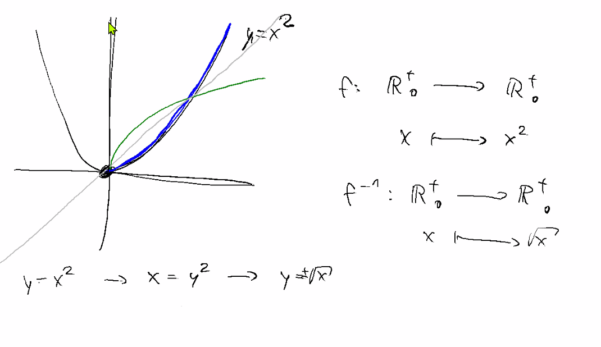
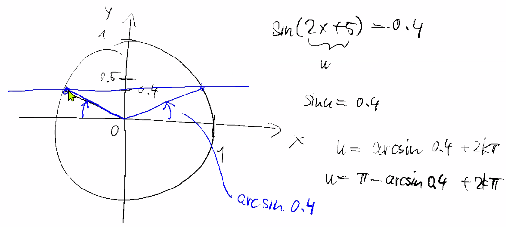
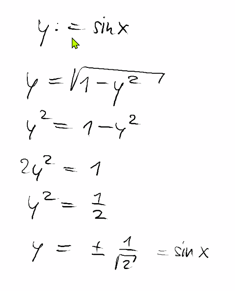
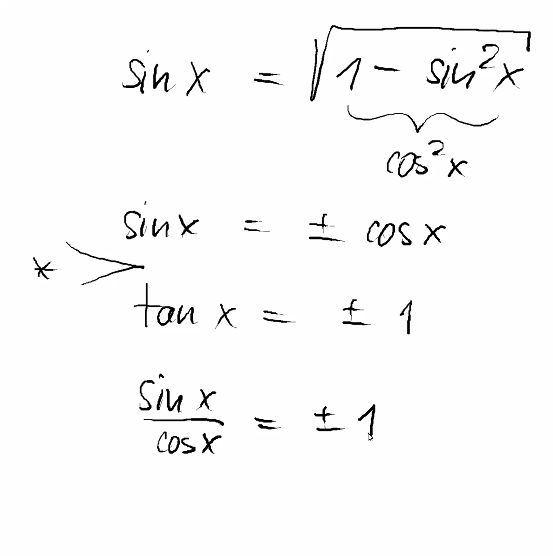
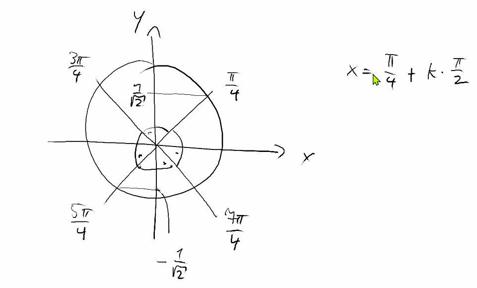

# Zusammenfassung Woche 01 – Trigonometrie

**Modul:** Fortgeschrittene Analysis (ANA-F)  
**Dozenten:** Ron Porath, Joachim Wirth  
**Quelle:** Papula Band 1, Teil III, Kap. 9, 10, 10.5

---

## Lernziele

- Sicherer Umgang mit sin, cos, tan, cot und deren Umkehrfunktionen
- Ableitungen der trigonometrischen Funktionen und ihrer Umkehrfunktionen berechnen
- Lösen trigonometrischer Gleichungen

---

# 1. Trigonometrische Funktionen

> Papula Band 1, Kap. 9, Seiten 243–258

## 1.1 Grundlagen

### Definitionen am rechtwinkligen Dreieck

| Funktion | Formel |
|---|---|
| sin(α) | Gegenkathete / Hypotenuse |
| cos(α) | Ankathete / Hypotenuse |
| tan(α) | Gegenkathete / Ankathete = sin(α) / cos(α) |
| cot(α) | Ankathete / Gegenkathete = cos(α) / sin(α) = 1 / tan(α) |

### Einheitskreis

| Grad | 0° | 30° | 45° | 60° | 90° | 135° | 180° | 225° | 270° | 315° | 360° |
|---|---|---|---|---|---|---|---|---|---|---|---|
| Radiant | 0 | π/6 | π/4 | π/3 | π/2 | 3π/4 | π | 5π/4 | 3π/2 | 7π/4 | 2π |
| sin | 0 | 1/2 | √2/2 | √3/2 | 1 | √2/2 | 0 | −√2/2 | −1 | −√2/2 | 0 |
| cos | 1 | √3/2 | √2/2 | 1/2 | 0 | −√2/2 | −1 | −√2/2 | 0 | √2/2 | 1 |

### Intuition am Einheitskreis

- **Sinus** = projizierte Distanz vom Punkt auf dem Einheitskreis auf die **X-Achse** (Ordinate)
- **Kosinus** = projizierte Distanz vom Punkt auf dem Einheitskreis auf die **Y-Achse** (Abszisse)
- **Bei 45°:** Gleichschenkliges Dreieck → x = y, mit x² + y² = 1 → x = y = 1/√2 = **√2/2**
- **Merke:** √2/2 = 1/√2 (gleicher Wert, andere Schreibweise)
- **Kosinus-Herkunft:** cos(α) = sin(Komplementärwinkel) = sin(90° − α)

### Umrechnung Grad ↔ Radiant

Grundgleichung: φ / 360 = s / 2π

- **Grad → Radiant:** s = φ · π / 180
- **Radiant → Grad:** φ = s · 180 / π

## 1.2 Wichtige Formeln

### Trigonometrischer Pythagoras

$$\sin^2(x) + \cos^2(x) = 1$$

### Additionstheoreme

$$\sin(x \pm y) = \sin(x)\cos(y) \pm \cos(x)\sin(y)$$

$$\cos(x \pm y) = \cos(x)\cos(y) \mp \sin(x)\sin(y)$$

$$\tan(x \pm y) = \frac{\tan(x) \pm \tan(y)}{1 \mp \tan(x)\tan(y)}$$

### Doppelwinkelformeln (aus Additionstheoremen mit x₁ = x₂ = x)

$$\sin(2x) = 2 \cdot \sin(x) \cdot \cos(x)$$

$$\cos(2x) = \cos^2(x) - \sin^2(x)$$

### Halbwinkelformeln

$$\sin^2(x) = \frac{1}{2}[1 - \cos(2x)]$$

$$\cos^2(x) = \frac{1}{2}[1 + \cos(2x)]$$

### Beziehung Sinus ↔ Kosinus

$$\cos(x) = \sin\left(x + \frac{\pi}{2}\right)$$

$$\sin(x) = \cos\left(x - \frac{\pi}{2}\right)$$

## 1.3 Eigenschaften von sin und cos

| Eigenschaft | y = sin(x) | y = cos(x) |
|---|---|---|
| Definitionsbereich | −∞ < x < ∞ | −∞ < x < ∞ |
| Wertebereich | −1 ≤ y ≤ 1 | −1 ≤ y ≤ 1 |
| Periode | 2π | 2π |
| Symmetrie | ungerade | gerade |
| Nullstellen | x_k = k·π | x_k = π/2 + k·π |

## 1.4 Eigenschaften von tan und cot

| Eigenschaft | y = tan(x) | y = cot(x) |
|---|---|---|
| Definitionsbereich | x ≠ π/2 + k·π | x ≠ k·π |
| Wertebereich | −∞ < y < ∞ | −∞ < y < ∞ |
| Periode | π | π |
| Symmetrie | ungerade | ungerade |
| Nullstellen | x_k = k·π | x_k = π/2 + k·π |
| Pole | x_k = π/2 + k·π | x_k = k·π |

## 1.5 Allgemeine Sinusfunktion

$$y = a \cdot \sin(bx + c)$$

| Parameter | Wirkung | Formel |
|---|---|---|
| a > 0 | Amplitude (Dehnung/Stauchung in y-Richtung) | Wertebereich: −a ≤ y ≤ a |
| b > 0 | Frequenz (Dehnung/Stauchung in x-Richtung) | Periode: p = 2π/b |
| c | Phasenverschiebung | 1. Nullstelle: x₀ = −c/b |

## 1.6 Aufgabentypen

1. **Umrechnung Grad ↔ Bogenmaß** (Aufg. 1)
2. **Funktionswerte berechnen** mit Taschenrechner (Aufg. 2)
3. **Parabelannäherung** an Sinuskurve (Aufg. 4)
4. **Allgemeine Sinusfunktion analysieren**: Amplitude, Periode, Phasenverschiebung bestimmen und skizzieren (Aufg. 5, 6)
5. **Schwingungen beschreiben**: Physikalische Anwendungen als Sinusfunktionen formulieren (Aufg. 7, 8, 9)

---

# 2. Arkusfunktionen (Umkehrfunktionen)

> Papula Band 1, Kap. 10, Seiten 271–277

## 2.1 Das Problem

> **Begriffliche Klarstellung:** *Abbildung* und *Funktion* sind **dasselbe** — beide beschreiben eine Zuordnung f: A → B, die jedem Element aus A genau ein Element aus B zuweist. In der Analysis wird meist "Funktion" verwendet, in der Linearen Algebra eher "Abbildung".

Trigonometrische Funktionen sind **nicht umkehrbar** (fehlende Monotonie durch Periodizität). Lösung: Einschränkung auf ein **monotones Intervall**.

### Prinzip der Umkehrung

Bei einer Umkehrung werden **Definitionsbereich und Wertebereich vertauscht**. Graphisch entsteht die Umkehrfunktion durch **Spiegelung an der Winkelhalbierenden y = x**.

**Beispiel:** y = x² → x = y² → **y = √x** (nur positive Wurzel)



- **Blau:** Originalfunktion f: ℝ₀⁺ → ℝ₀⁺, x ↦ x²
- **Grün:** Umkehrfunktion f⁻¹: ℝ₀⁺ → ℝ₀⁺, x ↦ √x
- **Grau:** Spiegelachse y = x

## 2.2 Übersicht Arkusfunktionen

| Funktion | Einschränkungsintervall | Definitionsbereich | Wertebereich | Monotonie |
|---|---|---|---|---|
| y = arcsin(x) | −π/2 ≤ x ≤ π/2 | −1 ≤ x ≤ 1 | −π/2 ≤ y ≤ π/2 | steigend |
| y = arccos(x) | 0 ≤ x ≤ π | −1 ≤ x ≤ 1 | 0 ≤ y ≤ π | fallend |
| y = arctan(x) | −π/2 < x < π/2 | −∞ < x < ∞ | −π/2 < y < π/2 | steigend |
| y = arccot(x) | 0 < x < π | −∞ < x < ∞ | 0 < y < π | fallend |

### Wichtige Quadranten

| Funktion | Liefert Winkel aus... |
|---|---|
| arcsin | 1. und 4. Quadrant |
| arccos | 1. und 2. Quadrant |
| arctan | 1. und 4. Quadrant |
| arccot | 1. und 2. Quadrant |

### Nützliche Beziehung

$$\text{arccot}(x) = \frac{\pi}{2} - \arctan(x)$$

## 2.3 Wichtige Werte

| x | arcsin(x) | arccos(x) |
|---|---|---|
| 0 | 0 | π/2 |
| 0.5 | π/6 (30°) | π/3 (60°) |
| 1 | π/2 (90°) | 0 |

arctan(1) = π/4 (45°)

## 2.4 Ableitungen der trigonometrischen Funktionen und Arkusfunktionen

> Lernziel: "Ableitungen der trigonometrischen Funktionen und ihrer Umkehrfunktionen berechnen"

### Ableitungen der trig. Funktionen

| Funktion | Ableitung |
|---|---|
| sin(x) | cos(x) |
| cos(x) | −sin(x) |
| tan(x) | 1/cos²(x) = 1 + tan²(x) |
| cot(x) | −1/sin²(x) |

### Allgemeine Formel: Ableitung einer Umkehrfunktion

Aus f⁻¹(f(x)) = x und f(f⁻¹(x)) = x folgt durch Ableiten (Kettenregel):

$$f'(f^{-1}(x)) \cdot (f^{-1}(x))' = 1$$

$$\boxed{(f^{-1}(x))' = \frac{1}{f'(f^{-1}(x))}}$$


### Anwendung auf arcsin(x) – Schritt für Schritt

Wir setzen: f(x) = sin(x), also f⁻¹(x) = arcsin(x), und f'(x) = cos(x)


**Schritt 1:** Allgemeine Formel anwenden:

$$(arcsin(x))' = \frac{1}{f'(f^{-1}(x))} = \frac{1}{\cos(\arcsin(x))}$$

**Schritt 2:** cos(arcsin(x)) vereinfachen mit trig. Pythagoras:

$$\sin^2(x) + \cos^2(x) = 1 \quad \Rightarrow \quad \cos(x) = \pm\sqrt{1 - \sin^2(x)}$$


**Schritt 3:** Einsetzen → sin(arcsin(x)) = x:

$$\frac{1}{\pm\sqrt{1 - (\sin(\arcsin(x)))^2}} = \frac{1}{\pm\sqrt{1 - x^2}}$$

**Schritt 4:** Warum **+** und nicht ±?

> **Entscheidend:** arcsin(x) liefert nur Winkel y ∈ [−π/2, π/2].
> In diesem Intervall ist **cos(y) immer ≥ 0** (Kosinus ist im 1. und 4. Quadranten positiv).
> Deshalb fällt das ± weg und es bleibt **nur +√**.

$$\boxed{\frac{d}{dx}\arcsin(x) = \frac{1}{\sqrt{1 - x^2}}}$$

### Ableitungen aller Arkusfunktionen

| Funktion | Ableitung |
|---|---|
| arcsin(x) | 1/√(1 − x²) |
| arccos(x) | −1/√(1 − x²) |
| arctan(x) | 1/(1 + x²) |
| arccot(x) | −1/(1 + x²) |

**Merke:** arcsin und arccos haben die gleiche Ableitung mit umgekehrtem Vorzeichen (ebenso arctan und arccot).

## 2.5 Aufgabentypen

1. **Arkusfunktionswerte berechnen** mit Taschenrechner (Aufg. 13)
2. **Schwingungsüberlagerung**: Amplitude und Phase aus Zeigerdiagramm bestimmen (Aufg. 14, 15)

---

# 3. Trigonometrische Gleichungen

> Papula Band 1, Kap. 10.5, Seiten 278–279

## 3.1 Lösungsstrategie

Es gibt **kein allgemeines Lösungsverfahren** — der Weg ist von Fall zu Fall verschieden. Typische Schritte:

1. **Argumente vereinheitlichen** (z.B. sin(2x) = 2·sin(x)·cos(x) verwenden)
2. **Faktorisieren** (Produkt = 0 → mindestens ein Faktor = 0)
3. **Nicht durch trig. Funktionen dividieren** (Lösungen gehen verloren!)
4. **Hauptwert** mit Arkusfunktion bestimmen
5. **Alle Lösungen** durch Periodizität angeben (+ k·2π bzw. + k·π)

## 3.2 Beispiel: sin(2x) = 1.5·cos(x)

**Schritt 1:** Doppelwinkelformel anwenden:
$$2\sin(x)\cos(x) = 1.5\cos(x)$$

**Schritt 2:** Umstellen und faktorisieren:
$$\cos(x)(2\sin(x) - 1.5) = 0$$

**Schritt 3:** Fälle lösen:

**Fall 1:** cos(x) = 0
→ x₁ₖ = π/2 + k·π (k ∈ ℤ)

**Fall 2:** sin(x) = 0.75
→ x₂ₖ = arcsin(0.75) + k·2π = 0.848 + k·2π
→ x₃ₖ = π − arcsin(0.75) + k·2π = 2.294 + k·2π

## 3.3 Lösungsmuster für Standardgleichungen

| Gleichung | Hauptwert | Alle Lösungen |
|---|---|---|
| sin(x) = a | x₀ = arcsin(a) | x = x₀ + k·2π **und** x = π − x₀ + k·2π |
| cos(x) = a | x₀ = arccos(a) | x = ±x₀ + k·2π |
| tan(x) = a | x₀ = arctan(a) | x = x₀ + k·π |

## 3.4 Aufgabentypen

1. **Trigonometrische Gleichungen lösen**: Substitution + Arkusfunktion + Periodizität (Aufg. 16)

---

# 4. Empfohlene Übungsaufgaben

> Papula Band 1, Teil III, Seiten 317–320 | Lösungen: Seiten 756–761

| Aufgabe | Thema | Beschreibung |
|---|---|---|
| **1** | Umrechnung | Grad ↔ Bogenmaß umrechnen |
| **4** | Parabelapproximation | Sinuskurve durch Parabel annähern |
| **5** | Allgemeine Sinusfunktion | Amplitude, Periode, Phase bestimmen (sin/cos) |
| **13** | Arkusfunktionen | Werte berechnen |
| **16** | Trig. Gleichungen | Gleichungen lösen mit Substitution |

---

# 5. Lösungen der empfohlenen Aufgaben

## Aufgabe 1 – Umrechnung Grad ↔ Bogenmaß

| Grad | 40.36° | 81.19° | −322.08° | 278.19° | −78.46° | 4.83° | 118.6° |
|---|---|---|---|---|---|---|---|
| Bogenmaß | 0.7044 | 1.4171 | −5.6213 | 4.8553 | −1.3694 | 0.0843 | 2.0700 |

## Aufgabe 4 – Parabelapproximation

Nullstellen: x₁ = 0, x₂ = π → Produktansatz: y = a·x·(x − π)

Maximum bei x = π/2: y(π/2) = 1 → a = −4/π²

**Ergebnis:** y = −(4/π²)·x² + (4/π)·x

### Visualisierung (Fragerunde)

![Aufgabe 4 – Parabelapproximation an sin(x): Die grüne Parabel nähert die Sinuskurve im Intervall [0, π] an](Aufgabe4_Papula_Lösung_Visualisiert.png)

> **Erläuterung:** Die Skizze zeigt den Lösungsweg grafisch:
> - **Ansatz:** y = ax² + bx + c mit den drei Bedingungen y(0)=0, y(π)=0, y(π/2)=1
> - Aus y(0)=0 folgt sofort c=0
> - Der Produktansatz y = a·x·(x − π) nutzt die bekannten Nullstellen direkt
> - Einsetzen des Maximums y(π/2)=1 liefert a = −4/π²
> - Die **grüne Kurve** (Parabel) liegt eng an der **schwarzen Kurve** (sin(x)) im ersten Halbwellen-Intervall [0, π]

## Aufgabe 5 – Allgemeine Sinusfunktion

Für y = A·sin(bx + c) bzw. y = A·cos(bx + c): Bestimme A, p = 2π/b, x₀ = −c/b

| Teil | A | Periode p | x₀ |
|---|---|---|---|
| a) | 2 | 2π/3 | π/18 |
| b) | 5 | π | −2.1 |
| c) | 10 | 2 | 3 |
| d) | 2.4 | π/2 | π/8 |

## Aufgabe 13 – Arkusfunktionen

| Teil | Wert |
|---|---|
| a) | 0.5980 |
| b) | −1.2614 |
| c) | 1.0781 |
| d) | 4.4304 |
| e) | 0.8084 |
| f) | 0.3082 |
| g) | 1.1837 |
| h) | 2.8198 |

## Aufgabe 16 – Trigonometrische Gleichungen

### a) sin(2x + 5) = 0.4

Substitution u = 2x + 5 → sin(u) = 0.4

- u₁ₖ = arcsin(0.4) + k·2π = 0.4115 + k·2π
- u₂ₖ = (π − arcsin(0.4)) + k·2π = 2.7301 + k·2π

Rücksubstitution x = 0.5·(u − 5):
- x₁ₖ = −2.2943 + k·π
- x₂ₖ = −1.1350 + k·π

#### Visualisierung am Einheitskreis (Fragerunde)



> **Erläuterung:** Der Einheitskreis zeigt, wie man die **zwei Lösungen pro Periode** findet:
> - Die horizontale Linie bei y = 0.4 schneidet den Einheitskreis an **zwei Stellen**
> - **Hauptwert:** u₁ = arcsin(0.4) ≈ 0.4115 (1. Quadrant)
> - **Symmetrielösung:** u₂ = π − arcsin(0.4) ≈ 2.7301 (2. Quadrant, Spiegelung an der y-Achse)
> - Die Periodizität +k·2π liefert dann alle weiteren Lösungen


> **Ergänzende Erläuterung (erweiterte Darstellung):**
> - Diese Skizze zeigt zusätzlich die Winkel **arccos(0.4)** und **π − arccos(0.4)** (rot markiert)
> - **Blau:** Die arcsin-basierten Lösungen (oben, y = 0.4)
> - **Rot:** Die arccos-Winkel als Ergänzung → Zusammenhang: arcsin(a) + arccos(a) = π/2
> - Unten: Weitere Lösungsfamilien bei **−arccos(0.4)** und **π + arccos(0.4)** (negative Sinuswerte)
> - Dies verdeutlicht, warum man bei sin(x)=a **zwei verschiedene Lösungsfamilien** angeben muss

### b) tan(2(x + 1)) = 1

Substitution u = 2(x + 1) → tan(u) = 1

- uₖ = π/4 + k·π

Rücksubstitution: x = 0.5·(u − 2)
- xₖ = −0.6073 + k·π/2

### c) √(1 − sin²(x)) = cos(x − 1) → cos(x) = 0.5

Substitution u = x − 1 → cos(u) = 0.5

- x₁ₖ = 2.0472 + k·2π (arccos(0.5) + 1)
- x₂ₖ = −0.0472 + k·2π (−arccos(0.5) + 1)

### d) sin(x) = √(1 − sin²(x))

Quadrieren: sin²(x) = cos²(x) → tan²(x) = 1 → tan(x) = ±1

Da sin(x) ≥ 0 (Wurzel!), nur 1./2. Quadrant:
- x₁ₖ = π/4 + k·2π
- x₂ₖ = 3π/4 + k·2π

#### Schritt-für-Schritt-Herleitung (Fragerunde)

**Schritt 1: Algebraische Umformung**



> **Erläuterung:** Mit der Substitution y := sin(x) wird die Gleichung zu:
> - y = √(1 − y²) → Quadrieren: y² = 1 − y² → 2y² = 1 → y² = 1/2
> - Also: y = ±1/√2 = sin(x)
> - **Wichtig:** Da die linke Seite eine Wurzel ist (≥ 0), muss sin(x) ≥ 0 gelten → nur positive Lösung relevant für die Einschränkung

**Schritt 2: Rückführung auf tan(x)**



> **Erläuterung:** Alternativ direkt ohne Substitution:
> - sin(x) = √(1 − sin²(x)) = √(cos²(x)) = |cos(x)|
> - Da unter der Wurzel cos²(x) steht: sin(x) = ±cos(x)
> - Division durch cos(x): **tan(x) = ±1** bzw. sin(x)/cos(x) = ±1
> - Der Stern (*) markiert die entscheidende Umformungsstelle

**Schritt 3: Lösungen am Einheitskreis**



> **Erläuterung:** Der Einheitskreis zeigt alle Kandidaten-Winkel:
> - **tan(x) = +1:** x = π/4 (1. Quadrant) und x = 5π/4 (3. Quadrant)
> - **tan(x) = −1:** x = 3π/4 (2. Quadrant) und x = 7π/4 (4. Quadrant)
> - **Einschränkung sin(x) ≥ 0** (wegen der Wurzel): Nur Quadranten 1 und 2 sind gültig!
> - ✅ **x₁ = π/4 + k·2π** (1. Quadrant, sin > 0)
> - ✅ **x₂ = 3π/4 + k·2π** (2. Quadrant, sin > 0)
> - ❌ x = 5π/4, 7π/4 entfallen (sin < 0 im 3./4. Quadrant)
> - Die allgemeine Lösung x = π/4 + k·π/2 wird durch die Nebenbedingung eingeschränkt

---

# 6. Python / NumPy – Trigonometrie in der Praxis

> NumPy bietet alle trigonometrischen Funktionen und Arkusfunktionen direkt an. Alle Funktionen arbeiten standardmässig im **Bogenmaß (Radiant)**.

## 6.1 Grundfunktionen – Übersicht

| Mathematik | NumPy | Beschreibung |
|---|---|---|
| sin(x) | `np.sin(x)` | Sinus |
| cos(x) | `np.cos(x)` | Kosinus |
| tan(x) | `np.tan(x)` | Tangens |
| arcsin(x) | `np.arcsin(x)` | Arkussinus |
| arccos(x) | `np.arccos(x)` | Arkuskosinus |
| arctan(x) | `np.arctan(x)` | Arkustangens |
| Grad → Rad | `np.deg2rad(x)` oder `np.radians(x)` | Umrechnung |
| Rad → Grad | `np.rad2deg(x)` oder `np.degrees(x)` | Umrechnung |
| π | `np.pi` | Kreiszahl |

## 6.2 Umrechnung Grad ↔ Radiant (→ Aufg. 1)

```python
import numpy as np

# Einzelwert
grad = 45
rad = np.deg2rad(grad)          # 0.7854 (= π/4)
zurueck = np.rad2deg(rad)       # 45.0

# Array (wie Aufgabe 1)
grade = np.array([40.36, 81.19, -322.08, 278.19, -78.46, 4.83, 118.6])
bogenmass = np.deg2rad(grade)
print(np.round(bogenmass, 4))
# [ 0.7044  1.4171 -5.6213  4.8553 -1.3694  0.0843  2.07  ]
```

## 6.3 Wertetabelle & Einheitskreis (→ Lernziel: Sicherer Umgang)

```python
import numpy as np

# Spezielle Winkel
winkel_grad = np.array([0, 30, 45, 60, 90, 180, 270, 360])
winkel_rad = np.deg2rad(winkel_grad)

# Alle trig. Funktionen auf einmal
print("sin:", np.round(np.sin(winkel_rad), 4))
print("cos:", np.round(np.cos(winkel_rad), 4))

# Trigonometrischer Pythagoras prüfen
x = np.linspace(0, 2*np.pi, 100)
check = np.sin(x)**2 + np.cos(x)**2   # Immer 1.0!
print("sin²+cos² =", np.allclose(check, 1))  # True
```

## 6.4 Allgemeine Sinusfunktion analysieren (→ Aufg. 5)

```python
import numpy as np

# y = A * sin(b*x + c)
# Aufgabe 5a: y = 2*sin(3x + π/6)
A, b, c = 2, 3, np.pi/6
periode = 2 * np.pi / b          # 2π/3 ≈ 2.094
x0 = -c / b                      # -π/18 ≈ -0.1745
print(f"Amplitude: {A}, Periode: {periode:.4f}, 1. Nullstelle: {x0:.4f}")

# Funktionswerte berechnen
x = np.linspace(-np.pi, 2*np.pi, 500)
y = A * np.sin(b * x + c)
```

## 6.5 Arkusfunktionen (→ Aufg. 13)

```python
import numpy as np

# arcsin, arccos, arctan liefern Radiant
print(np.arcsin(0.5))            # π/6 = 0.5236
print(np.arccos(0.5))            # π/3 = 1.0472
print(np.arctan(1))              # π/4 = 0.7854

# In Grad umrechnen
print(np.rad2deg(np.arcsin(0.5)))  # 30°
print(np.rad2deg(np.arccos(0.5)))  # 60°

# arccot(x) = π/2 - arctan(x)
def arccot(x):
    return np.pi/2 - np.arctan(x)

print(arccot(1))                 # π/4 = 0.7854
```

## 6.6 Ableitung von arcsin – Zusammenhang mit trig. Pythagoras

```python
import numpy as np

# === HERLEITUNG ===
# y = arcsin(x)  →  sin(y) = x
# Ableiten (Kettenregel): cos(y) · y' = 1  →  y' = 1/cos(y)
#
# HIER kommt der trig. Pythagoras ins Spiel:
#   sin²(y) + cos²(y) = 1
#   cos²(y) = 1 - sin²(y)
#   cos(y)  = √(1 - sin²(y))
#
# Da sin(y) = x:
#   cos(y)  = √(1 - x²)
#   y'      = 1/√(1 - x²)

# === NUMERISCHE VERIFIKATION ===
x = 0.6

# Analytische Ableitung: 1/√(1 - x²)
ableitung_analytisch = 1 / np.sqrt(1 - x**2)

# Numerische Ableitung (Differenzenquotient)
h = 1e-8
ableitung_numerisch = (np.arcsin(x + h) - np.arcsin(x)) / h

print(f"Analytisch:  {ableitung_analytisch:.8f}")   # 1.25000000
print(f"Numerisch:   {ableitung_numerisch:.8f}")     # 1.25000001
print(f"Stimmt überein: {np.isclose(ableitung_analytisch, ableitung_numerisch)}")  # True

# === WARUM trig. Pythagoras? ===
# Ohne sin²+cos²=1 könnten wir cos(arcsin(x)) nicht vereinfachen!
y = np.arcsin(x)                    # y = arcsin(0.6) = 0.6435 rad
print(f"\nsin(y) = {np.sin(y):.4f}")          # 0.6 = x  ✓
print(f"cos(y) = {np.cos(y):.4f}")            # 0.8
print(f"√(1-x²) = {np.sqrt(1-x**2):.4f}")    # 0.8  ← gleich! (trig. Pythagoras)
print(f"sin²+cos² = {np.sin(y)**2 + np.cos(y)**2:.1f}")  # 1.0 ✓
```

## 6.7 Trigonometrische Gleichungen lösen (→ Aufg. 16)

```python
import numpy as np

# Aufgabe 16a: sin(2x + 5) = 0.4
# Substitution: u = 2x + 5, sin(u) = 0.4
u1 = np.arcsin(0.4)              # Hauptwert: 0.4115
u2 = np.pi - np.arcsin(0.4)     # Symmetrielösung: 2.7301

# Rücksubstitution: x = (u - 5) / 2
x1 = (u1 - 5) / 2               # -2.2943
x2 = (u2 - 5) / 2               # -1.1350
print(f"x1 = {x1:.4f} + k·π")
print(f"x2 = {x2:.4f} + k·π")

# Alle Lösungen im Intervall [0, 4π] generieren
loesungen = []
for k in range(-5, 6):
    for x_base in [x1, x2]:
        x_val = x_base + k * np.pi
        if 0 <= x_val <= 4 * np.pi:
            loesungen.append(round(x_val, 4))
print("Lösungen in [0, 4π]:", sorted(loesungen))
```

## 6.7 Additionstheoreme verifizieren

```python
import numpy as np

x, y = np.pi/6, np.pi/4

# sin(x+y) = sin(x)*cos(y) + cos(x)*sin(y)
links = np.sin(x + y)
rechts = np.sin(x)*np.cos(y) + np.cos(x)*np.sin(y)
print(f"sin(x+y) = {links:.6f} == {rechts:.6f}? {np.isclose(links, rechts)}")

# Doppelwinkelformel: sin(2x) = 2*sin(x)*cos(x)
print(np.isclose(np.sin(2*x), 2*np.sin(x)*np.cos(x)))  # True
```
