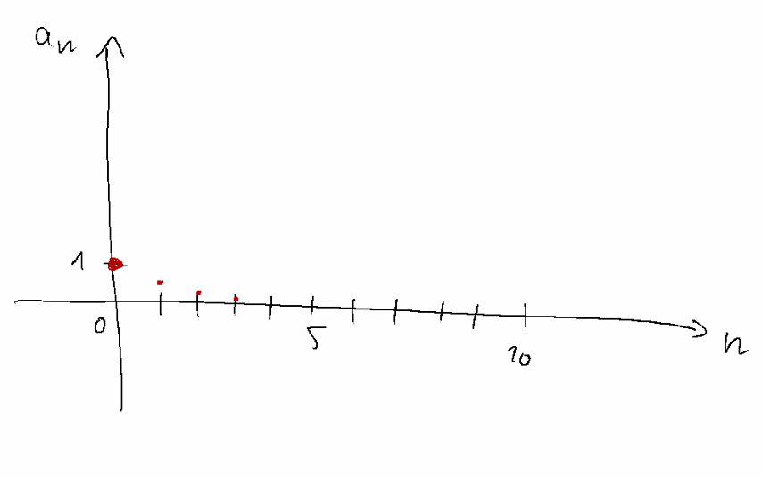
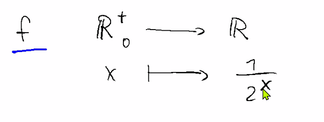
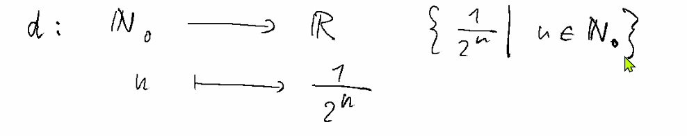
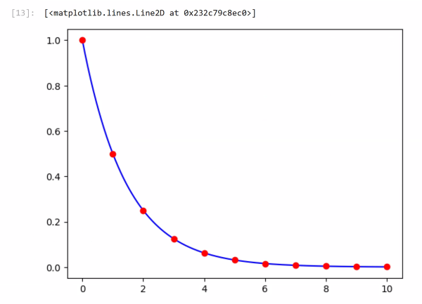
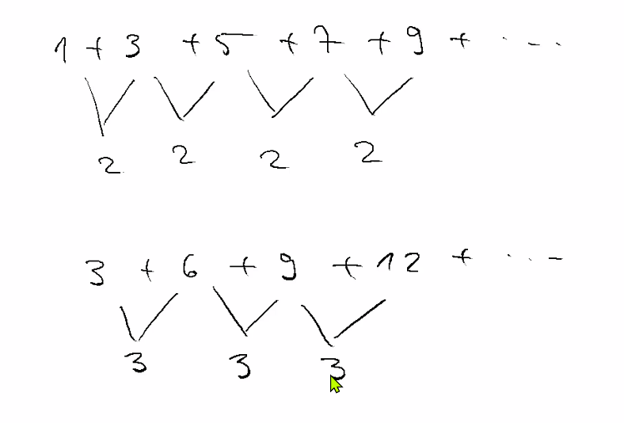
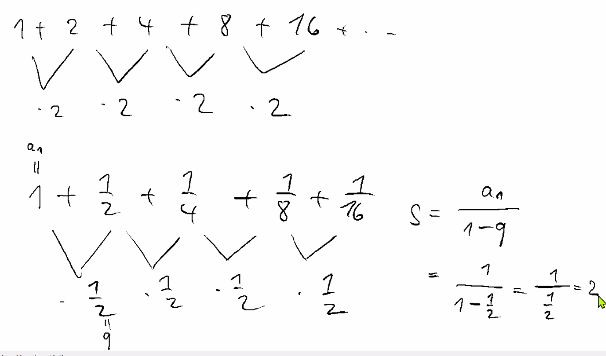
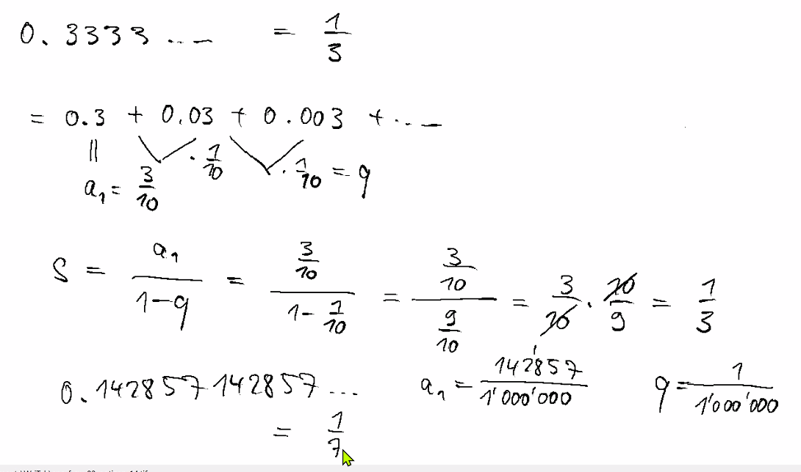
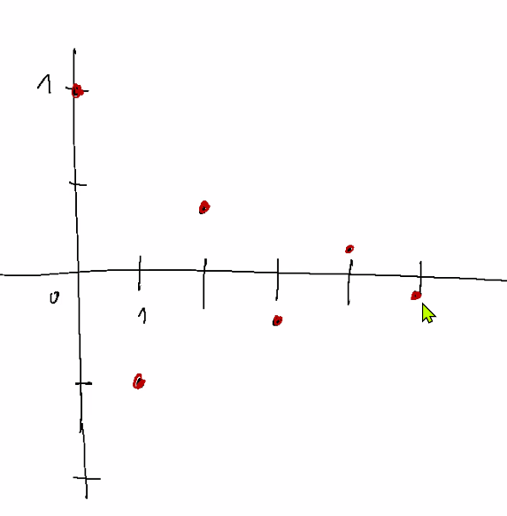
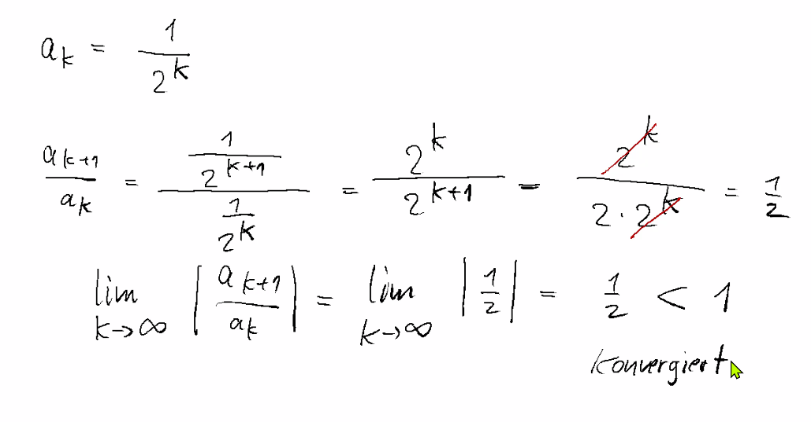
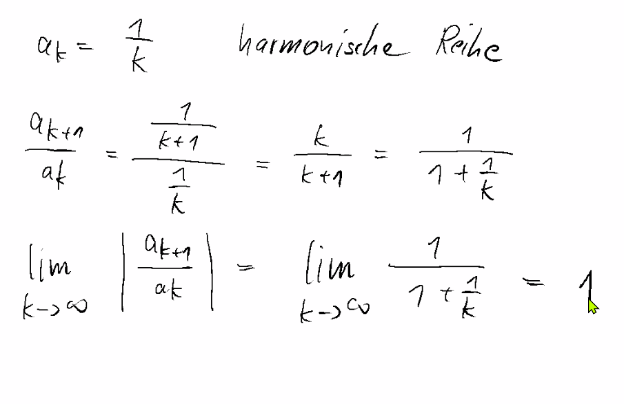

# Zusammenfassung Woche 02 – Folgen, Reihen und Grenzwerte

**Modul:** Fortgeschrittene Analysis (ANA-F)  
**Dozenten:** Ron Porath, Joachim Wirth  
**Quelle:** Papula Band 1, Kap. III 4.1–4.2 (Seiten 173–185); Kap. VI 1 (Seiten 570–589)

---

## Lernziele

- Bildungsgesetz einer Folge erkennen und anwenden
- Grenzwerte von Folgen und Funktionen berechnen
- Grenzwerte von Reihen bestimmen (geometrische, harmonische Reihe)
- Konvergenzkriterien anwenden (Quotienten-, Wurzel-, Leibniz-Kriterium)

---

# 1. Folgen

> Papula Band 1, Kap. III, Abschnitt 4.1, Seiten 173–177

## 1.1 Definition

Eine **Folge** ist eine Funktion, deren Definitionsbereich die natürlichen Zahlen $\mathbb{N}$ sind:

$$a_n = f(n), \quad n \in \mathbb{N}^*$$

Die Zuordnungsvorschrift $a_n = f(n)$ heisst **Bildungsgesetz** der Folge.

### Folge vs. Funktion (Notizen aus der Vorlesung)

Eine **Folge** ist formal eine Abbildung von $\mathbb{N}_0$ nach $\mathbb{R}$ – der Definitionsbereich ist **diskret** (nur ganze Zahlen):



Im Gegensatz dazu kann eine **Funktion** auch auf einem kontinuierlichen Definitionsbereich definiert sein, z.B. $f: \mathbb{R}_0^+ \to \mathbb{R}$ mit $x \mapsto \frac{1}{2^x}$:



> **Kernunterschied:** Eine Folge hat nur für $n \in \mathbb{N}$ Funktionswerte (diskrete Punkte), während eine Funktion für alle $x$ im Definitionsbereich Werte hat (durchgezogene Kurve).

### Funktionsbegriff: Injektiv, Surjektiv, Bijektiv (Exkurs)

In der Vorlesung wurde auch der allgemeine Funktionsbegriff diskutiert – wann ist eine Zuordnung überhaupt eine Funktion, und welche Eigenschaften kann sie haben:



- **Surjektiv**: Jedes Element im Zielbereich wird getroffen
- **Injektiv**: Verschiedene Urbilder haben verschiedene Bilder
- **Bijektiv**: Sowohl surjektiv als auch injektiv → die Funktion ist **umkehrbar**

### Schreibweisen

| Schreibweise | Bedeutung |
|---|---|
| $\langle a_n \rangle$ | Die gesamte Folge (alle Glieder) |
| $a_n$ | Das $n$-te Glied der Folge |
| $a_1, a_2, a_3, \ldots$ | Aufzählung der Folgenglieder |

## 1.2 Beispiele von Folgen

| Folge | Bildungsgesetz | Glieder |
|---|---|---|
| $\langle \frac{1}{n} \rangle$ | $a_n = \frac{1}{n}$ | $1, \frac{1}{2}, \frac{1}{3}, \frac{1}{4}, \ldots$ |
| $\langle 1-\frac{1}{n} \rangle$ | $a_n = 1 - \frac{1}{n}$ | $0, \frac{1}{2}, \frac{2}{3}, \frac{3}{4}, \ldots$ |
| $\langle -\frac{1}{2n} \rangle$ | $a_n = -\frac{1}{2n}$ | $-\frac{1}{2}, -\frac{1}{4}, -\frac{1}{6}, \ldots$ |
| $\langle n^3 \rangle$ | $a_n = n^3$ | $1, 8, 27, 64, \ldots$ |
| $\langle (-1)^n \rangle$ | $a_n = (-1)^n$ | $-1, 1, -1, 1, \ldots$ |

## 1.3 Darstellung

Folgen lassen sich auch als **Graph** darstellen (diskrete Punkte auf einem Koordinatensystem). Dabei interpretiert man $\langle a_n \rangle$ als diskrete Funktion und ordnet jedem Wertepaar $(n, a_n)$ einen Punkt $P_n$ zu.

> **Folgen sind Punkte – sie sind diskret!** Im Gegensatz zu Funktionen, die durchgezogene Kurven bilden, bestehen Folgen aus **einzelnen, isolierten Punkten**.



### Python-Beispiel (aus Notebook)

```python
import numpy as np
import matplotlib.pyplot as plt

def a(n):
    return -1 / (2 * n)

N = 10
nn = np.arange(1, N + 1)
aa = a(nn)
plt.plot(nn, aa, 'o')
plt.xlabel('n')
plt.ylabel('a_n')
plt.title('Folge a_n = -1/(2n)')
plt.grid(True)
plt.show()
```

---

# 2. Grenzwerte von Folgen

> Papula Band 1, Kap. III, Abschnitt 4.1.2, Seiten 175–177

## 2.1 Informelle Erklärung

Wenn sich die Glieder einer Folge für wachsendes $n$ einer bestimmten Zahl $g$ immer mehr **annähern**, so heisst $g$ der **Grenzwert** (oder **Limes**) der Folge.

## 2.2 Formale Definition (ε-Definition)

> **Der kürzeste Mathe-Witz: „Sei ε < 0"**  
> Warum ist das ein Witz? Weil **ε per Definition immer ε > 0** ist! Epsilon (ε) steht in der Analysis für eine **beliebig kleine, aber stets positive** reelle Zahl. Es dient als Mass für „wie nah" Folgenglieder am Grenzwert liegen müssen. Die Aussage „ε < 0" ist deshalb sinnlos und widersprüchlich – daher der Witz.

**Definition:** Die reelle Zahl $g$ heisst **Grenzwert** der Folge $\langle a_n \rangle$, wenn es zu jedem $\varepsilon > 0$ eine natürliche Zahl $n_0 > 0$ gibt, so dass für alle $n \geq n_0$ stets gilt:

$$|a_n - g| < \varepsilon$$

**Symbolische Schreibweise:**

$$\lim_{n \to \infty} a_n = g$$

(gelesen: „Limes von $a_n$ für $n$ gegen Unendlich gleich $g$")

### Anschauliche Bedeutung

- Ab einem Index $n_0$ liegen **alle** Folgenglieder innerhalb der **ε-Umgebung** um $g$, d.h. im Intervall $(g - \varepsilon, \; g + \varepsilon)$.
- Egal wie klein man ε wählt (solange ε > 0), es gibt immer ein $n_0$, ab dem alle Glieder im ε-Schlauch liegen.
- Die endlich vielen Glieder $a_1, a_2, \ldots, a_{n_0 - 1}$ dürfen auch **ausserhalb** liegen.

### ε-Streifen (Konvergenz-Visualisierung)

Die Bedingung $|a_n - a| < \varepsilon$ lässt sich algebraisch umformen:

$$|a_n - a| < \varepsilon$$

$$\Leftrightarrow \quad -\varepsilon < a_n - a < \varepsilon$$

$$\Leftrightarrow \quad \boxed{a - \varepsilon < a_n < a + \varepsilon}$$

**Grafische Bedeutung:** Man zeichnet um den Grenzwert $a$ einen **horizontalen Streifen** mit den Grenzen $a - \varepsilon$ (untere Linie) und $a + \varepsilon$ (obere Linie). Ab dem Index $n_0$ müssen **alle** Folgenglieder $a_n$ **innerhalb** dieses Streifens liegen.


- Die **Breite** des Streifens ist $2\varepsilon$
- Je kleiner ε gewählt wird, desto **enger** wird der Streifen
- Es darf immer nur **endlich viele** Glieder ausserhalb des Streifens geben
- Die ersten Glieder (vor $n_0$) können wild herumspringen — entscheidend ist nur, was "ab $n_0$" passiert

## 2.3 Konvergenz, Divergenz und Alternierende Folgen

> ⚠️ **Wichtiger Unterschied – prüfungsrelevant!**

| Begriff | Definition | Beispiel |
|---|---|---|
| **Konvergent** | Die Folge besitzt einen (endlichen) Grenzwert $g$ | $\langle \frac{1}{n} \rangle \to 0$ |
| **Divergent** | Die Folge besitzt **keinen** (endlichen) Grenzwert | $\langle n^3 \rangle \to \infty$ |
| **Bestimmt divergent** | Die Folge strebt gegen $+\infty$ oder $-\infty$ (uneigentlicher Grenzwert) | $\langle n^2 \rangle \to \infty$ |
| **Unbestimmt divergent** | Die Folge springt ohne sich einem Wert zu nähern | $\langle (-1)^n \rangle$: springt zwischen $-1$ und $1$ |

### Wichtige Beispiele

**1. Nullfolge** $\langle \frac{1}{n} \rangle$: konvergent mit Grenzwert $g = 0$

$$\lim_{n \to \infty} \frac{1}{n} = 0$$

**2. Folge** $\langle 1 - \frac{1}{n} \rangle$: konvergent mit Grenzwert $g = 1$

$$\lim_{n \to \infty} \left(1 - \frac{1}{n}\right) = 1$$

**3. Euler-Folge** $\langle (1 + \frac{1}{n})^n \rangle$: konvergent mit Grenzwert $g = e$

$$\lim_{n \to \infty} \left(1 + \frac{1}{n}\right)^n = e \approx 2{,}71828\ldots$$

**4.** $\langle n^3 \rangle$: **bestimmt divergent** (geht gegen $\infty$)

$$\lim_{n \to \infty} n^3 = \infty \quad \text{(uneigentlicher Grenzwert)}$$

**5. Folge** $h_n = \langle (-1)^n \rangle$: **unbestimmt divergent / alternierend**

$$\langle (-1)^n \rangle = -1, 1, -1, 1, -1, \ldots$$

Diese Folge ist **alternierend** (die Vorzeichen wechseln ständig). Sie ist **weder konvergent** (kein fester Grenzwert) **noch bestimmt divergent** (geht nicht gegen $\pm\infty$). Man nennt sie **unbestimmt divergent**: Die Folge springt für immer zwischen $-1$ und $1$ hin und her, ohne sich einem Wert anzunähern.

> **Merke:** „divergent" bedeutet **nicht** immer „geht gegen unendlich"! Alternierende Folgen wie $\langle (-1)^n \rangle$ divergieren, obwohl sie beschränkt sind.

## 2.4 Aufgabentypen

1. **Bildungsgesetz erkennen**: Aus den ersten Gliedern einer Folge das Bildungsgesetz $a_n = f(n)$ ableiten
2. **Grenzwert bestimmen**: Durch Umformen den Grenzwert $\lim_{n \to \infty} a_n$ berechnen (z.B. höchste Potenz ausklammern)
3. **Konvergenz/Divergenz entscheiden**: Verhält sich die Folge konvergent, bestimmt divergent oder unbestimmt divergent?
4. **ε-Umgebung anwenden**: Zu gegebenem ε das passende $n_0$ bestimmen

---

# 3. Grenzwerte von Funktionen

> Papula Band 1, Kap. III, Abschnitt 4.2, Seiten 178–185

## 3.1 Definition

**Definition:** Eine Funktion $y = f(x)$ sei in einer Umgebung von $x_0$ definiert. Gilt für **jede** konvergierende Zahlenfolge $\langle x_n \rangle$ mit $x_n \neq x_0$, die gegen $x_0$ strebt:

$$\lim_{n \to \infty} f(x_n) = g$$

so heisst $g$ der **Grenzwert** von $f(x)$ an der Stelle $x_0$:

$$\lim_{x \to x_0} f(x) = g$$

### Links- und rechtsseitiger Grenzwert

| Typ | Schreibweise | Bedeutung |
|---|---|---|
| Linksseitiger Grenzwert | $\lim_{x \to x_0^-} f(x) = g_l$ | Annäherung von **links** ($x < x_0$) |
| Rechtsseitiger Grenzwert | $\lim_{x \to x_0^+} f(x) = g_r$ | Annäherung von **rechts** ($x > x_0$) |

Der Grenzwert $\lim_{x \to x_0} f(x) = g$ existiert nur, wenn $g_l = g_r = g$.

## 3.2 Grenzwert für $x \to \pm\infty$

$$\lim_{x \to \infty} f(x) = g \quad \text{bzw.} \quad \lim_{x \to -\infty} f(x) = g$$

**Beispiel:**

$$\lim_{x \to \infty} \frac{1}{x} = 0$$

## 3.3 Rechenregeln für Grenzwerte

Seien $\lim_{x \to x_0} f(x) = F$ und $\lim_{x \to x_0} g(x) = G$, dann gilt:

| Regel | Formel |
|---|---|
| Summe | $\lim(f + g) = F + G$ |
| Differenz | $\lim(f - g) = F - G$ |
| Produkt | $\lim(f \cdot g) = F \cdot G$ |
| Quotient | $\lim\left(\frac{f}{g}\right) = \frac{F}{G}$ (falls $G \neq 0$) |
| Konstanter Faktor | $\lim(c \cdot f) = c \cdot F$ |

### Beispiele der Grenzwertberechnung

**Kürzen des Faktors, der die „0/0"-Form verursacht:**

$$\lim_{x \to -1} \frac{3(x^2 - 1)}{x + 1} = \lim_{x \to -1} \frac{3(x+1)(x-1)}{x+1} = 3 \cdot \lim_{x \to -1}(x - 1) = 3 \cdot (-2) = -6$$

**Auslagern der höchsten Potenz:**

$$\lim_{x \to 0} \frac{x^2 - 2x + 5}{\cos x} = \frac{5}{\cos 0} = \frac{5}{1} = 5$$

## 3.4 Aufgabentypen

1. **Grenzwert bei Annäherung an $x_0$**: Direkt einsetzen oder $\frac{0}{0}$-Form durch Kürzen auflösen
2. **Links- und rechtsseitiger Grenzwert**: Getrennt berechnen und vergleichen (Existenz des Grenzwerts prüfen)
3. **Grenzwert für $x \to \pm\infty$**: Höchste Potenz im Zähler/Nenner ausklammern
4. **Definitionslücken erkennen**: Stellen finden, an denen der Funktionswert nicht existiert, aber der Grenzwert ggf. schon

---

# 4. Reihen

> Papula Band 1, Kap. VI, Abschnitt 1, Seiten 570–589

## 4.1 Definition

Eine (unendliche) **Reihe** ist die Summe der Glieder einer Folge $\langle a_k \rangle$:

$$S = \sum_{k=0}^{\infty} a_k = a_0 + a_1 + a_2 + a_3 + \ldots$$

Die **Partialsumme** (Teilsumme) der ersten $n$ Glieder:

$$S_n = \sum_{k=0}^{n} a_k = a_0 + a_1 + \ldots + a_n$$

Die Reihe **konvergiert**, wenn die Folge der Partialsummen $\langle S_n \rangle$ einen endlichen Grenzwert besitzt:

$$S = \lim_{n \to \infty} S_n$$

### Partialsummen visualisiert (Notizen aus der Vorlesung)

Die Partialsummen sind das, **was in den Klammern summiert** wird. Am Beispiel $1 + \frac{1}{2} + \frac{1}{4} + \frac{1}{8} + \ldots$:


> **Anschauung:** Jedes neue Glied wird immer kleiner (hier jeweils halb so gross). Die Partialsummen wachsen immer langsamer und nähern sich dem Grenzwert $S = \frac{1}{1-\frac{1}{2}} = 2$ an.

### Notwendige Bedingung für Konvergenz

> Die Reihenglieder müssen gegen 0 konvergieren: $\lim_{k \to \infty} a_k = 0$

⚠️ Diese Bedingung ist **notwendig**, aber **nicht hinreichend** (siehe harmonische Reihe unten)!

## 4.2 Arithmetische Reihe

Bei einer **arithmetischen Reihe** ist die Differenz zweier aufeinanderfolgender Glieder konstant:

$$a_{k+1} - a_k = d = \text{const.} \quad \Longrightarrow \quad a_k = a_1 + (k-1) \cdot d$$

**Partialsumme:**

$$S_n = \sum_{k=1}^{n} a_k = \frac{n}{2} \cdot (a_1 + a_n) = \frac{n}{2} \cdot (2a_1 + (n-1) \cdot d)$$

**Gauss'sche Summenformel** (Spezialfall $a_k = k$):

$$\sum_{k=1}^{n} k = 1 + 2 + 3 + \ldots + n = \frac{n(n+1)}{2}$$

> **Merke:** Arithmetische Reihen **divergieren immer** (ausser der trivialen mit $d = 0$ und $a_1 = 0$), da ihre Glieder nicht gegen 0 gehen.

### Beispiel aus der Vorlesung

Zwei arithmetische Reihen mit konstantem Differenzglied:



- Erste Reihe: $1 + 3 + 5 + 7 + 9 + \ldots$ → Differenz $d = 2$ (ungerade Zahlen)
- Zweite Reihe: $3 + 6 + 9 + 12 + \ldots$ → Differenz $d = 3$ (Vielfache von 3)

## 4.3 Geometrische Reihe

Bei einer **geometrischen Reihe** ist der Quotient zweier aufeinanderfolgender Glieder konstant:

$$\frac{a_{k+1}}{a_k} = q = \text{const.} \quad \Longrightarrow \quad a_k = a_1 \cdot q^{k-1}$$

**Partialsumme (Herleitung über Differenzmethode):**

$$S_n = a_1 + a_1 q + a_1 q^2 + \ldots + a_1 q^{n-1}$$

$$S_n - q \cdot S_n = a_1 - a_1 q^n$$

$$\boxed{S_n = a_1 \cdot \frac{1 - q^n}{1 - q}} \quad (q \neq 1)$$

**Summe der unendlichen geometrischen Reihe (falls $|q| < 1$):**

$$S = \lim_{n \to \infty} S_n = a_1 \cdot \frac{1}{1 - q} = \frac{a_1}{1 - q}$$

| Bedingung | Verhalten |
|---|---|
| $\|q\| < 1$ | Reihe **konvergiert** gegen $\frac{a_1}{1-q}$ |
| $\|q\| \geq 1$ | Reihe **divergiert** |
| $q = 1$ | Summe undefiniert (Division durch 0) |

### Beispiel: Divergent vs. Konvergent (Notizen aus der Vorlesung)



> **Erkenntnis:** Bei $q = 2$ verdoppelt sich jedes Glied → die Reihe explodiert. Bei $q = \frac{1}{2}$ halbiert sich jedes Glied → die Reihe konvergiert gegen $S = 2$.

### Anwendung: Periodische Dezimalzahlen als geometrische Reihen

Geometrische Reihen erklären, warum periodische Dezimalzahlen rationale Brüche sind:



> **Überraschende Konsequenz:** $0.\overline{9} = 0.9999\ldots = 1$


## 4.4 Harmonische Reihe

Die **harmonische Reihe** ist:

$$H = \sum_{k=1}^{\infty} \frac{1}{k} = 1 + \frac{1}{2} + \frac{1}{3} + \frac{1}{4} + \ldots \quad \text{divergiert!}$$

**Beweis der Divergenz** (durch Gruppenabschätzung):

$$H = 1 + \frac{1}{2} + \underbrace{\frac{1}{3} + \frac{1}{4}}_{\geq 2 \cdot \frac{1}{4} = \frac{1}{2}} + \underbrace{\frac{1}{5} + \frac{1}{6} + \frac{1}{7} + \frac{1}{8}}_{\geq 4 \cdot \frac{1}{8} = \frac{1}{2}} + \underbrace{\frac{1}{9} + \ldots + \frac{1}{16}}_{\geq 8 \cdot \frac{1}{16} = \frac{1}{2}} + \ldots$$

$$\geq 1 + \frac{1}{2} + \frac{1}{2} + \frac{1}{2} + \ldots = \infty$$

> **Merke:** Obwohl die Glieder $\frac{1}{k} \to 0$ gehen (notwendige Bedingung erfüllt!), divergiert die harmonische Reihe trotzdem. Darum ist $a_k \to 0$ **nicht hinreichend** für Konvergenz.

### Alternierende harmonische Reihe

Hingegen **konvergiert** die alternierende harmonische Reihe:

$$\sum_{k=1}^{\infty} \frac{(-1)^{k+1}}{k} = 1 - \frac{1}{2} + \frac{1}{3} - \frac{1}{4} + \frac{1}{5} - \ldots = \ln 2$$



> **Beobachtung:** Die Partialsummen $S_1 = 1$, $S_2 = 0.5$, $S_3 = 0.833\ldots$, $S_4 = 0.583\ldots$ oszillieren um den Grenzwert $\ln 2$ und nähern sich ihm immer enger an.

---

# 5. Konvergenzkriterien

> Papula Band 1, Kap. VI, Abschnitt 1.3, Seiten 602–612

Wann konvergiert die Reihe $S = \sum_{k=0}^{\infty} a_k$?

## 5.1 Quotientenkriterium (Ratio Test)

$$q = \lim_{k \to \infty} \left| \frac{a_{k+1}}{a_k} \right|$$

| Ergebnis | Folgerung |
|---|---|
| $q < 1$ | Reihe $S$ **konvergiert** |
| $q > 1$ | Reihe $S$ **divergiert** |
| $q = 1$ | **Keine Aussage möglich** |

### Beispiel 1: $a_k = \frac{1}{2^k}$ → konvergiert (Notizen)



### Beispiel 2: Harmonische Reihe $a_k = \frac{1}{k}$ → $q = 1$ (Notizen)



> ⚠️ **Wichtig:** Bei $q = 1$ versagen die Konvergenzkriterien — man braucht andere Methoden (z.B. Gruppenabschätzung wie bei der harmonischen Reihe).

## 5.2 Wurzelkriterium (Root Test)

$$q = \lim_{k \to \infty} \sqrt[k]{|a_k|}$$

| Ergebnis | Folgerung |
|---|---|
| $q < 1$ | Reihe $S$ **konvergiert** |
| $q > 1$ | Reihe $S$ **divergiert** |
| $q = 1$ | **Keine Aussage möglich** |

## 5.3 Leibniz-Kriterium (für alternierende Reihen)

Bilden die Glieder einer alternierenden Reihe

$$\sum_{k=0}^{\infty} (-1)^k \cdot a_k = a_0 - a_1 + a_2 - a_3 + \ldots$$

eine **monoton fallende Nullfolge** (d.h. $a_k > 0$, $a_{k+1} \leq a_k$ und $\lim a_k = 0$), so **konvergiert** die Reihe.

> **Anwendung:** So zeigt man z.B. die Konvergenz der alternierenden harmonischen Reihe $\sum \frac{(-1)^{k+1}}{k}$.

## 5.4 Aufgabentypen

1. **Art der Reihe erkennen**: Arithmetisch, geometrisch, harmonisch oder andere?
2. **Partialsumme berechnen**: $S_n$ für gegebenes $n$ bestimmen
3. **Konvergenzkriterium wählen und anwenden**: Quotienten- oder Wurzelkriterium → $q$ berechnen → Schlussfolgerung
4. **Summe einer konvergenten Reihe bestimmen**: Bei geometrischer Reihe mit $|q| < 1$ die Formel $S = \frac{a_1}{1-q}$ anwenden
5. **Alternierende Reihe**: Leibniz-Kriterium (monoton fallende Nullfolge?) prüfen

---

# 6. Zusammenfassung: Konvergenz vs. Divergenz

| | Konvergent | Bestimmt divergent | Unbestimmt divergent |
|---|---|---|---|
| **Definition** | Grenzwert $g$ existiert (endlich) | $\lim = \pm\infty$ | Kein Grenzwert, kein $\pm\infty$ |
| **Beispiel (Folge)** | $\langle \frac{1}{n} \rangle \to 0$ | $\langle n^2 \rangle \to \infty$ | $\langle (-1)^n \rangle$ springt |
| **Beispiel (Reihe)** | Geom. Reihe ($\|q\|<1$) | Harmonische Reihe | – |
| **Verhalten** | Nähert sich $g$ | Wächst unbeschränkt | Springt hin und her |

---

# 7. Empfohlene Übungsaufgaben

> Papula Band 1, Seiten 312–313 (III.4) und 633–634 (VI.1) | Lösungen: S. 747–749 und S. 807–810

### III.4 – Grenzwerte von Folgen und Funktionen (S. 312–313)

| Aufgabe | Thema | Beschreibung |
|---|---|---|
| **1** | Bildungsgesetz | Bildungsgesetz der unendlichen Folgen bestimmen |
| **2** | Graph einer Folge | Zahlenfolge $\langle \frac{n^2}{n^2+10} \rangle$ zeichnen |
| **3** | Grenzwerte von Folgen | $\lim_{n\to\infty}$ berechnen (3 Teilaufgaben) |
| **4** | Grenzwerte von Funktionen | $\lim_{x\to x_0} f(x)$ berechnen, inkl. 0/0-Formen (8 Teilaufgaben) |
| **5** | Grenzwert mit Wurzel | $\lim_{x\to 1} \frac{1-x}{1-\sqrt{x}}$ |
| **6** | Grenzwert mit Wurzel | $\lim_{x\to\infty} (\sqrt{x+2} - \sqrt{x})$ |
| **7** | Definitionslücken | Nullstellen des Nenners bestimmen |
| **8** | Stetigkeit | Unstetigkeit einer stückweisen Funktion zeigen |
| **9** | Stetigkeit | Stetigkeit an $x_0 = 1$ zeigen |
| **10** | Definitionslücke beheben | $\frac{x^2-x}{x^3-x^2+x-1}$ stetig ergänzen |

### VI.1 – Unendliche Reihen (S. 633–634)

| Aufgabe | Thema | Beschreibung |
|---|---|---|
| **5** | Notwendige Bedingung | Divergenz zeigen: $\lim a_n \neq 0$ |
| **6** | Quotientenkriterium | 6 Reihen auf Konvergenz prüfen |
| **7** | Wurzelkriterium | 3 Reihen auf Konvergenz prüfen |
| **10** | Leibniz-Kriterium | Alternierende Reihen untersuchen (4 Teilaufgaben) |

---

# 8. Lösungen der empfohlenen Aufgaben

## Aufgabe 1 – Bildungsgesetz

| Teil | Folge | Bildungsgesetz |
|---|---|---|
| a) | 0,2; 0,04; 0,008; ... | $a_n = \frac{2}{10^n}$ |
| b) | $\frac{1}{2}; \frac{4}{3}; \frac{9}{4}; \ldots$ | $a_n = \frac{n^2}{n+1}$ |
| c) | $\frac{1}{2}; \frac{2}{4}; \frac{3}{8}; \ldots$ | $a_n = \frac{n}{2^n}$ |

## Aufgabe 2 – Graph der Folge

Graph der Folge $\langle a_n \rangle = \langle \frac{n^2}{n^2 + 10} \rangle$ (siehe Bild A-29 im Papula).

Die Folgenglieder nähern sich dem Grenzwert $g = 1$ von unten an.

## Aufgabe 3 – Grenzwerte von Folgen

**a)** $\displaystyle\lim_{n\to\infty} \frac{2n+1}{4n} = \lim_{n\to\infty} \left(\frac{1}{2} + \frac{1}{4n}\right) = \frac{1}{2}$

**b)** $\displaystyle\lim_{n\to\infty} \frac{n^2+4}{n} = \lim_{n\to\infty} \left(n + \frac{4}{n}\right) = \infty$

**c)** Höchste Potenz ($n^2$) ausklammern:

$$\lim_{n\to\infty} \frac{n^2 + 4n - 1}{n^2 - 3n} = \lim_{n\to\infty} \frac{1 + \frac{4}{n} - \frac{1}{n^2}}{1 - \frac{3}{n}} = \frac{1}{1} = 1$$

## Aufgabe 4 – Grenzwerte von Funktionen

**a)** $\displaystyle\lim_{x\to 1} \frac{x^2-1}{x^2+1} = \frac{0}{2} = 0$

**b)** Faktorisieren: $x^2 - x - 12 = (x-4)(x+3)$

$$\lim_{x\to -3} \frac{x^2-x-12}{x+3} = \lim_{x\to -3} \frac{(x-4)\cancel{(x+3)}}{\cancel{x+3}} = \lim_{x\to -3}(x-4) = -7$$

**c)** $\displaystyle\lim_{x\to 0} \frac{\sin(2x)}{\sin x} = \lim_{x\to 0} \frac{2\cdot\cancel{\sin x}\cdot\cos x}{\cancel{\sin x}} = 2\cos 0 = 2$

**d)** Faktorisieren: $(x-2)(3x+1)$, Nenner $4x-8 = 4(x-2)$

$$\lim_{x\to 2} \frac{\cancel{(x-2)}(3x+1)}{4\cancel{(x-2)}} = \frac{3\cdot 2 + 1}{4} = \frac{7}{4}$$

**e)** Höchste Potenz $x^3$ ausklammern → $\lim_{x\to\infty} = \infty$

**f)** Erweitern mit $(\sqrt{1+x} + 1)$ (3. Binom):

$$\lim_{x\to 0} \frac{\sqrt{1+x}-1}{x} = \lim_{x\to 0} \frac{1}{\sqrt{1+x}+1} = \frac{1}{1+1} = \frac{1}{2}$$

**g)** $\displaystyle\lim_{x\to\infty} \frac{x^2}{x^2 - 4x + 1} = \lim_{x\to\infty} \frac{1}{1 - \frac{4}{x} + \frac{1}{x^2}} = 1$

**h)** Polynomdivision: $x^4 - 1 = (x-1)(x^3 + x^2 + x + 1)$

$$\lim_{x\to 1} \frac{x^4-1}{x-1} = \lim_{x\to 1}(x^3 + x^2 + x + 1) = 4$$

## Aufgabe 5 – Grenzwert mit Wurzel

Erweitern mit $(1 + \sqrt{x})$:

$$\lim_{x\to 1} \frac{1-x}{1-\sqrt{x}} = \lim_{x\to 1} \frac{(1-\sqrt{x})(1+\sqrt{x})}{(1-\sqrt{x})} = \lim_{x\to 1}(1 + \sqrt{x}) = 2$$

## Aufgabe 6 – Grenzwert mit Wurzeldifferenz

Erweitern mit $(\sqrt{x+2} + \sqrt{x})$ (3. Binom):

$$\lim_{x\to\infty} (\sqrt{x+2} - \sqrt{x}) = \lim_{x\to\infty} \frac{(x+2) - x}{\sqrt{x+2} + \sqrt{x}} = \lim_{x\to\infty} \frac{2}{\sqrt{x+2} + \sqrt{x}} = 0$$

## Aufgabe 7 – Definitionslücken

Definitionslücken = Nullstellen des Nenners:

| Teil | Ergebnis |
|---|---|
| a) | $x_1 = 4$ |
| b) | $x_1 = -2$; $x_2 = -1$ |
| c) | $x_1 = 0$ |
| d) | $x_k = k \cdot \pi$ ($k \in \mathbb{Z}$) |
| e) | $x_1 = 1$; $x_2 = -1$; $x_3 = 8$ |

## Aufgabe 8 – Unstetigkeit

Der linksseitige Grenzwert $g_l = \lim_{x\to 0^-} x = 0$ und der rechtsseitige Grenzwert $g_r = \lim_{x\to 0^+}(x-2) = -2$ sind verschieden.

Da $g_l \neq g_r$ ist die Funktion an $x_0 = 0$ **unstetig** (Sprungstelle).

## Aufgabe 9 – Stetigkeit

Der Grenzwert an $x_0 = 1$ existiert:

$$\lim_{x\to 1} \frac{x^2-1}{x-1} = \lim_{x\to 1} \frac{\cancel{(x-1)}(x+1)}{\cancel{(x-1)}} = \lim_{x\to 1}(x+1) = 2 = f(1)$$

Der Grenzwert stimmt mit dem Funktionswert $f(1) = 2$ überein → **stetig**.

## Aufgabe 10 – Definitionslücke beheben

Faktorisieren: $x^2 - x = x(x-1)$ und $x^3 - x^2 + x - 1 = (x-1)(x^2+1)$

$$\lim_{x\to 1} \frac{x\cancel{(x-1)}}{\cancel{(x-1)}(x^2+1)} = \frac{1}{1+1} = \frac{1}{2}$$

Setzen wir $f(1) = \frac{1}{2}$, so ist die Funktion überall definiert und stetig.

---

## Aufgabe VI.1/5 – Notwendige Bedingung

Reihenglieder $a_n$ konvergieren nicht gegen 0 → Reihe **divergiert**.

**a)** $a_n = \left(\frac{n+1}{n}\right)^{-n} \to \frac{1}{e} > 0$ → divergent

**b)** $a_n = \ln\left(3 + \frac{1}{2n}\right) \to \ln 3 > 0$ → divergent

## Aufgabe VI.1/6 – Quotientenkriterium

| Teil | $a_n$ | $q = \lim \left|\frac{a_{n+1}}{a_n}\right|$ | Ergebnis |
|---|---|---|---|
| a) | $\frac{1}{10^n+1}$ | $\frac{1}{10}$ | **konvergent** |
| b) | $\frac{n}{5^n}$ | $\frac{1}{5}$ | **konvergent** |
| c) | $\frac{1}{2^{2n-2}}$ | $\frac{1}{4}$ | **konvergent** |
| d) | $n\left(\frac{1}{2}\right)^{n-1}$ | $\frac{1}{2}$ | **konvergent** |
| e) | $(-1)^{n+1}\cdot\frac{2^n}{n}$ | $2 > 1$ | **divergent** |
| f) | $\frac{3^{2n}}{(2n)!}$ | $0 < 1$ | **konvergent** |

## Aufgabe VI.1/7 – Wurzelkriterium

| Teil | $a_n$ | $q = \lim \sqrt[n]{|a_n|}$ | Ergebnis |
|---|---|---|---|
| a) | $\frac{n}{(n+1)^n}$ | $0 < 1$ | **konvergent** |
| b) | $\frac{5^n}{4^n \cdot n^2}$ | $1{,}25 > 1$ | **divergent** |
| c) | $\left(\frac{n+1}{n}\right)^{-n^2}$ | $\frac{1}{e} < 1$ | **konvergent** |

## Aufgabe VI.1/10 – Leibniz-Kriterium (alternierende Reihen)

Prüfung: Bilden $|a_n|$ eine monoton fallende Nullfolge?

| Teil | Reihe | Monoton fallend? | $\lim = 0$? | Ergebnis |
|---|---|---|---|---|
| a) | $\sum \frac{(-1)^{n+1}}{n!}$ | Ja | Ja | **konvergent** |
| b) | $\sum \frac{(-1)^{n+1}}{2n-1}$ | Ja | Ja | **konvergent** |
| c) | $\sum (-1)^{n+1} \cdot \frac{1}{n^2}$ | Ja | Ja | **konvergent** |
| d) | $\sum (-1)^{n+1} \cdot \frac{1}{n\cdot 5^{2n-1}}$ | Ja | Ja | **konvergent** |

---

# 9. Maxima & Python – Elektronische Hilfsmittel (MEP Teil 2)

> Prüfungsrelevant: Maxima und Python können an der Prüfung als Hilfsmittel eingesetzt werden. Die folgenden Befehle decken die wichtigsten Aufgabentypen zu Folgen, Reihen und Grenzwerten ab.

## 9.1 Maxima

### Grenzwerte von Folgen und Funktionen

```maxima
/* Grenzwert einer Folge a_n fuer n -> inf */
limit((2*n+1)/(3*n-5), n, inf);
/* Ergebnis: 2/3 */

limit((1 + 1/n)^n, n, inf);
/* Ergebnis: %e (Euler'sche Zahl) */

/* Einseitige Grenzwerte */
limit(1/x, x, 0, plus);   /* von rechts: +inf */
limit(1/x, x, 0, minus);  /* von links: -inf */

/* Grenzwert einer Funktion */
limit(sin(x)/x, x, 0);
/* Ergebnis: 1 */
```

### Reihen berechnen

```maxima
/* Endliche Summe */
sum(k, k, 1, 100);
/* Ergebnis: 5050 */

/* Unendliche Reihe (symbolisch vereinfachen) */
sum(1/k^2, k, 1, inf), simpsum;
/* Ergebnis: %pi^2/6 (Basel-Problem) */

/* Geometrische Reihe */
sum((1/2)^k, k, 0, inf), simpsum;
/* Ergebnis: 2 */

/* Geschlossene Form mit nusum */
nusum(k^2, k, 1, n);
/* Ergebnis: n*(n+1)*(2*n+1)/6 */

nusum(1/k/(k+1), k, 1, n);
/* Teleskopsumme: Ergebnis: n/(n+1) */
```

### Konvergenz ueberpruefen

```maxima
/* Quotientenkriterium: limit(|a_(n+1)/a_n|, n, inf) */
a(n) := 1/n!;
limit(abs(a(n+1)/a(n)), n, inf);
/* Ergebnis: 0 < 1 → konvergent */

/* Wurzelkriterium: limit(|a_n|^(1/n), n, inf) */
a(n) := (2/3)^n;
limit(abs(a(n))^(1/n), n, inf);
/* Ergebnis: 2/3 < 1 → konvergent */
```

### Folgen und Konvergenz plotten

```maxima
/* Folge als Punkte visualisieren */
punkte: makelist([k, (2*k+1)/(3*k-5)], k, 1, 50)$
plot2d([discrete, punkte], [style, points],
       [xlabel, "n"], [ylabel, "a_n"],
       [title, "Konvergenz gegen 2/3"]);

/* Partialsummen der harmonischen Reihe */
partial(n) := sum(1/k, k, 1, n);
punkte: makelist([k, partial(k)], k, 1, 30)$
plot2d([discrete, punkte], [style, points],
       [title, "Harmonische Reihe (divergent)"]);
```

## 9.2 Python (NumPy + SymPy + Matplotlib)

### Grenzwerte berechnen

```python
from sympy import *

n, x = symbols('n x')

# Grenzwert einer Folge
limit((2*n + 1) / (3*n - 5), n, oo)
# Ergebnis: 2/3

limit((1 + 1/n)**n, n, oo)
# Ergebnis: E (Euler'sche Zahl)

# Grenzwert einer Funktion
limit(sin(x)/x, x, 0)
# Ergebnis: 1

# Einseitige Grenzwerte
limit(1/x, x, 0, '+')  # von rechts: oo
limit(1/x, x, 0, '-')  # von links: -oo
```

### Partialsummen und Reihen

```python
import numpy as np

# Partialsummen mit numpy cumsum
n = 100
terms = 1 / np.arange(1, n+1)**2       # Terme 1/k^2
partial_sums = np.cumsum(terms)
print(f"S_100 = {partial_sums[-1]:.6f}")
print(f"pi^2/6 = {np.pi**2/6:.6f}")
# Vergleich: Numerisch vs. exakter Wert

# Geometrische Reihe
q = 0.5
terms = q ** np.arange(0, 30)
partial_sums = np.cumsum(terms)
print(f"S_30 = {partial_sums[-1]:.10f}, exakt = {1/(1-q)}")
```

### Symbolische Reihen mit SymPy

```python
from sympy import *

k, n = symbols('k n', positive=True, integer=True)

# Unendliche Reihe
summation(1/k**2, (k, 1, oo))
# Ergebnis: pi**2/6

# Endliche Summe (geschlossene Form)
summation(k**2, (k, 1, n))
# Ergebnis: n*(n+1)*(2*n+1)/6

# Teleskopsumme
summation(1/(k*(k+1)), (k, 1, oo))
# Ergebnis: 1
```

### Konvergenz visualisieren

```python
import numpy as np
import matplotlib.pyplot as plt

# Folge und Grenzwert plotten
n_vals = np.arange(1, 51)
a_n = (2*n_vals + 1) / (3*n_vals - 5)

plt.figure(figsize=(10, 4))
plt.subplot(1, 2, 1)
plt.scatter(n_vals, a_n, s=15, color='blue')
plt.axhline(y=2/3, color='red', linestyle='--', label='Grenzwert 2/3')
plt.xlabel('n')
plt.ylabel('$a_n$')
plt.title('Konvergenz der Folge')
plt.legend()
plt.grid(True)

# Partialsummen vergleichen: harmonisch vs. geometrisch
plt.subplot(1, 2, 2)
N = 30
harm = np.cumsum(1 / np.arange(1, N+1))          # divergent
geom = np.cumsum(0.5 ** np.arange(0, N))          # konvergent gegen 2

plt.plot(range(1, N+1), harm, 'o-', markersize=3, label='Harmonische Reihe')
plt.plot(range(1, N+1), geom, 's-', markersize=3, label='Geom. Reihe (q=0.5)')
plt.axhline(y=2, color='green', linestyle='--', alpha=0.5, label='Grenzwert 2')
plt.xlabel('N (Anzahl Terme)')
plt.ylabel('Partialsumme $S_N$')
plt.title('Konvergent vs. Divergent')
plt.legend()
plt.grid(True)

plt.tight_layout()
plt.show()
```

### Konvergenzkriterien numerisch pruefen

```python
import numpy as np

# Quotientenkriterium numerisch: |a_(n+1) / a_n| fuer grosse n
def check_ratio_test(a, n_max=50):
    """Prueft das Quotientenkriterium numerisch."""
    ratios = [abs(a(n+1) / a(n)) for n in range(1, n_max) if a(n) != 0]
    q = ratios[-1]
    print(f"q ≈ {q:.6f} → {'konvergent' if q < 1 else 'divergent' if q > 1 else 'keine Aussage'}")

check_ratio_test(lambda n: 1 / np.math.factorial(n))  # 1/n! → konvergent
check_ratio_test(lambda n: 1 / n)                      # 1/n → keine Aussage
```

---

# 10. Wichtige Formeln auf einen Blick

| Formel | Beschreibung |
|---|---|
| $a_n = f(n)$ | Bildungsgesetz einer Folge |
| $\lim_{n\to\infty} a_n = g$ | Grenzwert einer Folge |
| $|a_n - g| < \varepsilon$ für alle $n \geq n_0$ | ε-Definition des Grenzwerts ($\varepsilon > 0$) |
| $a - \varepsilon < a_n < a + \varepsilon$ | ε-Streifen um den Grenzwert |
| $S_n = \frac{n}{2}(a_1 + a_n)$ | Partialsumme arithmetische Reihe |
| $\sum_{k=1}^{n} k = \frac{n(n+1)}{2}$ | Gauss'sche Summenformel |
| $S_n = a_1 \cdot \frac{1-q^n}{1-q}$ | Partialsumme geometrische Reihe |
| $S = \frac{a_1}{1-q}$ (falls $|q| < 1$) | Summe unendliche geom. Reihe |
| $\lim \left|\frac{a_{k+1}}{a_k}\right| < 1$ | Quotientenkriterium → konvergent |
| $\lim \sqrt[k]{|a_k|} < 1$ | Wurzelkriterium → konvergent |
| $e = \lim_{n\to\infty} \left(1+\frac{1}{n}\right)^n$ | Euler'sche Zahl |
