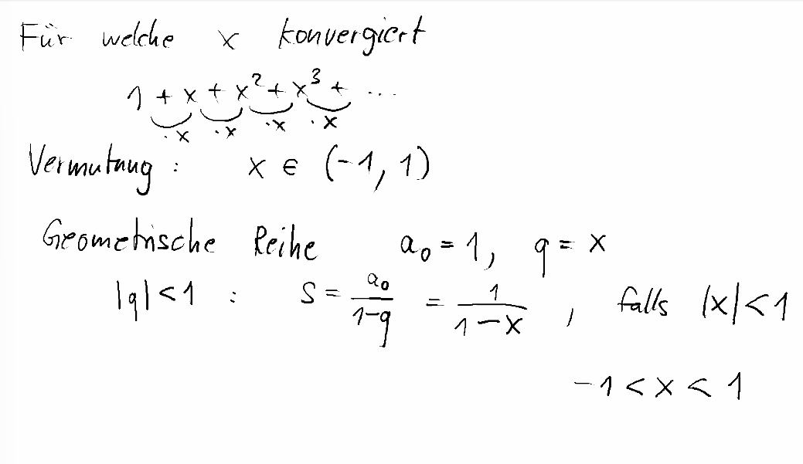
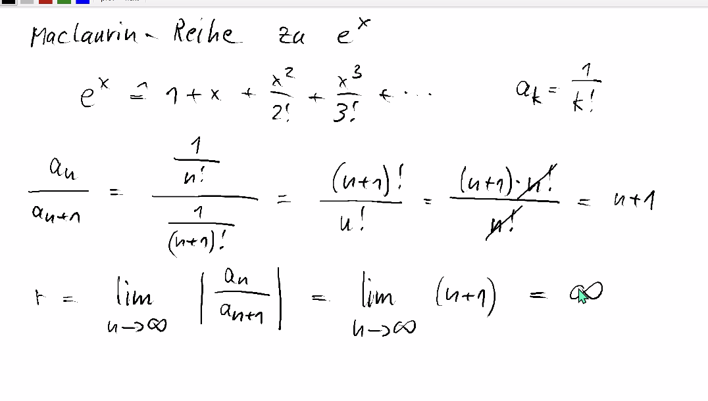
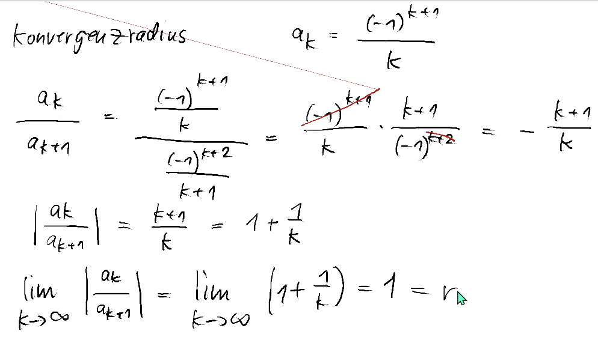
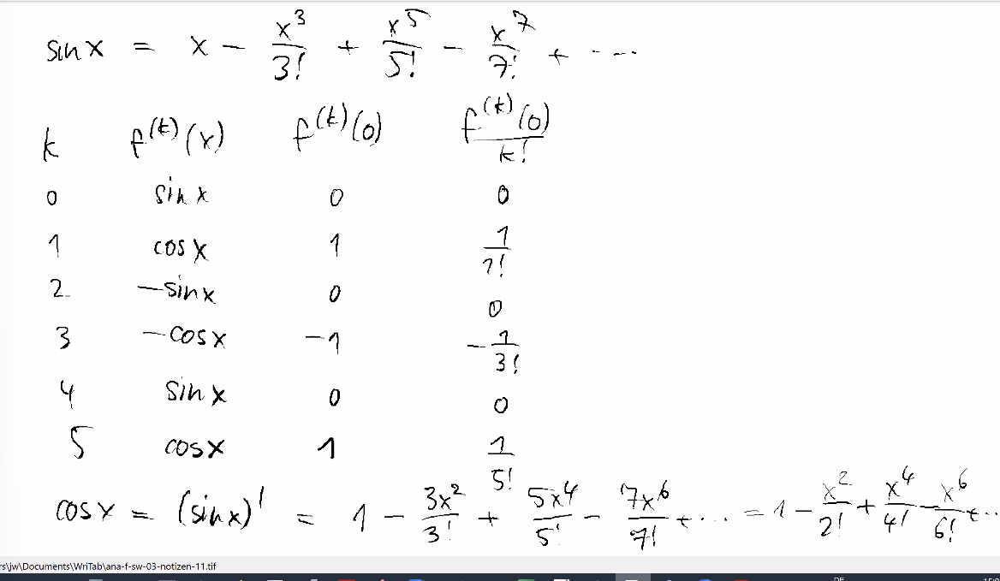
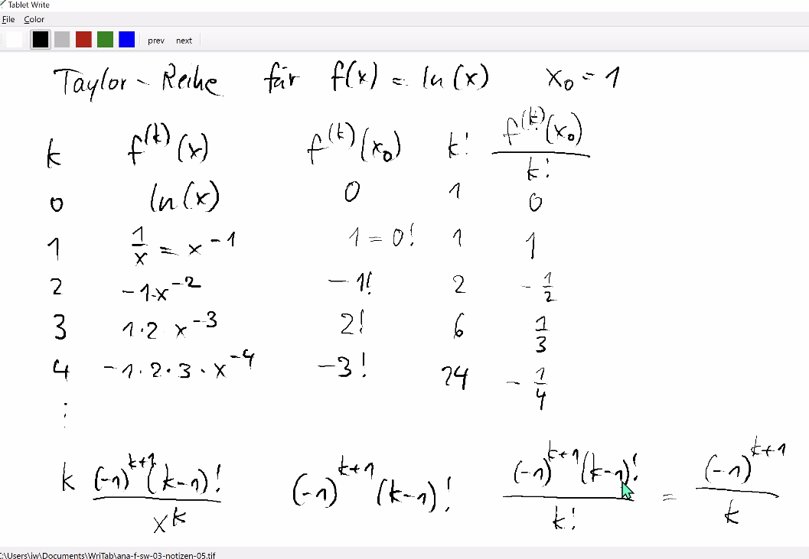
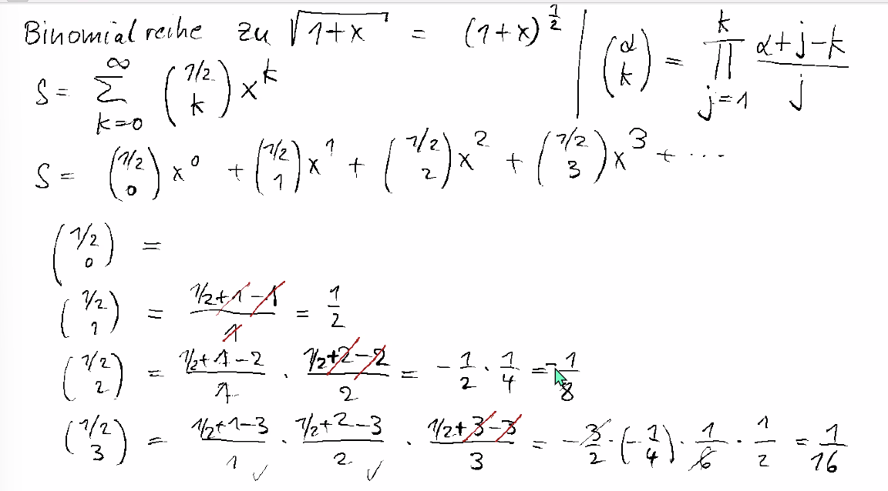
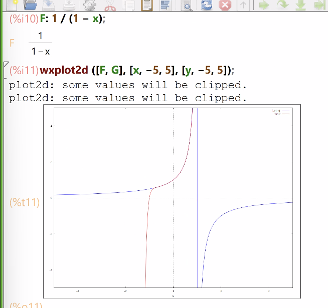
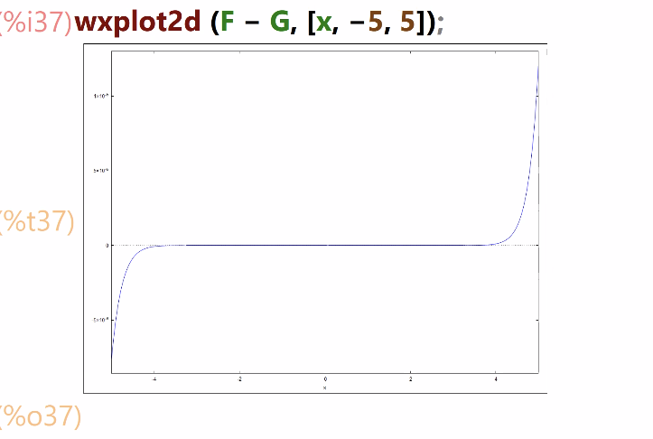

# Zusammenfassung Woche 03 – Potenzreihen

**Modul:** Fortgeschrittene Analysis (ANA-F)  
**Dozenten:** Ron Porath, Joachim Wirth  
**Quelle:** Papula Band 1, Kap. VI, Abschnitt 2–3 (Seiten 590–632)

---

## Lernziele

- Potenzreihen als Darstellung von Funktionen verstehen und anwenden
- Den Konvergenzradius einer Potenzreihe berechnen (Quotientenkriterium)
- Die Mac Laurinsche Reihe einer Funktion herleiten
- Die Taylor-Reihe einer Funktion um einen beliebigen Entwicklungspunkt bestimmen
- Die Binomialreihe verstehen und anwenden
- Wichtige Potenzreihenentwicklungen kennen und einsetzen

---

# 1. Potenzreihen

> Papula Band 1, Kap. VI, Abschnitt 2.1, Seiten 590–591

## 1.1 Definition

Eine **Potenzreihe** ist eine unendliche Reihe vom Typ:

$$P(x) = \sum_{n=0}^{\infty} a_n x^n = a_0 + a_1 x + a_2 x^2 + \ldots + a_n x^n + \ldots$$

Die reellen Zahlen $a_0, a_1, a_2, \ldots$ heissen **Koeffizienten** der Potenzreihe.

### Allgemeine Form (mit Entwicklungspunkt)

$$P(x) = \sum_{n=0}^{\infty} a_n (x - x_0)^n = a_0 + a_1(x - x_0) + a_2(x - x_0)^2 + \ldots$$

Die Stelle $x_0$ heisst **Entwicklungspunkt** oder **Entwicklungszentrum**. Für $x_0 = 0$ erhält man die spezielle Form $\sum a_n x^n$.

### Beispiele

| Nr. | Potenzreihe | Funktion | Konvergenzbereich |
|-----|------------|----------|-------------------|
| 1 | $\sum_{n=0}^{\infty} x^n = 1 + x + x^2 + x^3 + \ldots$ | $\frac{1}{1-x}$ | $\|x\| < 1$ |
| 2 | $\sum_{n=0}^{\infty} \frac{x^n}{n!} = 1 + \frac{x}{1!} + \frac{x^2}{2!} + \ldots$ | $e^x$ | $\|x\| < \infty$ |
| 3 | $\sum_{n=1}^{\infty} (-1)^{n+1} \cdot \frac{(x-1)^n}{n}$ | $\ln(x)$ | $0 < x \leq 2$ |

### Notizen aus der Vorlesung: Geometrische Reihe als Potenzreihe

Die geometrische Reihe $1 + x + x^2 + x^3 + \ldots$ ist die einfachste und wichtigste Potenzreihe – man erkennt sofort, dass sie nur für $|x| < 1$ konvergiert (Summenformel der geometrischen Reihe mit $q = x$):

> **Kernidee:** Die geometrische Reihe dient als Ausgangspunkt für viele weitere Potenzreihen – durch Substitution und gliedweise Integration lassen sich daraus z.B. $\ln(1+x)$ und $\arctan(x)$ herleiten.

---

# 2. Konvergenzverhalten von Potenzreihen

> Papula Band 1, Kap. VI, Abschnitt 2.2, Seiten 591–597

## 2.1 Konvergenzbereich

Die Menge aller $x$-Werte, für die eine Potenzreihe $\sum a_n x^n$ konvergiert, heisst **Konvergenzbereich** der Potenzreihe.

- Für $x = 0$ konvergiert **jede** Potenzreihe (Summenwert $P(0) = a_0$).
- Es gibt Potenzreihen, die **nur** für $x = 0$ konvergieren ($r = 0$).
- Es gibt Potenzreihen, die für **alle** $x \in \mathbb{R}$ konvergieren ($r = \infty$).

### Geometrische Deutung: Konvergenzkreis

Der Konvergenzbereich lässt sich geometrisch als **Konvergenzkreis** mit Radius $r$ um den Nullpunkt interpretieren:

- **Innerhalb** des Konvergenzkreises ($|x| < r$): Potenzreihe **konvergiert**
- **Ausserhalb** des Konvergenzkreises ($|x| > r$): Potenzreihe **divergiert**
- **Auf dem Rand** ($|x| = r$): **keine** allgemeingültige Aussage möglich

## 2.2 Konvergenzradius

> Papula Band 1, Kap. VI, Abschnitt 2.2, Seiten 592–593

Zu jeder Potenzreihe $\sum a_n x^n$ gibt es eine positive Zahl $r$, den **Konvergenzradius**, mit folgenden Eigenschaften:

1. Die Potenzreihe **konvergiert** überall im Intervall $|x| < r$
2. Die Potenzreihe **divergiert** für $|x| > r$
3. In den **Randpunkten** $|x| = r$ sind keine allgemeingültigen Aussagen möglich

### Berechnung des Konvergenzradius (Quotientenkriterium)

$$\boxed{r = \lim_{n \to \infty} \left| \frac{a_n}{a_{n+1}} \right|}$$

> **Voraussetzung:** Alle Koeffizienten $a_n \neq 0$ und der Grenzwert muss existieren.

### Sonderfälle

| Fall | Konvergenzradius | Bedeutung |
|------|-----------------|-----------|
| $r = 0$ | Reihe konvergiert nur für $x = 0$ | — |
| $r = \infty$ | Reihe konvergiert **beständig** (für alle $x \in \mathbb{R}$) | z.B. $e^x$, $\sin x$, $\cos x$ |

### Beispiel 1: Konvergenzradius von $e^x$

$$e^x = \sum_{n=0}^{\infty} \frac{x^n}{n!} \quad \Rightarrow \quad a_n = \frac{1}{n!}, \quad a_{n+1} = \frac{1}{(n+1)!}$$

$$r = \lim_{n \to \infty} \left| \frac{a_n}{a_{n+1}} \right| = \lim_{n \to \infty} \frac{(n+1)!}{n!} = \lim_{n \to \infty} (n+1) = \infty$$

→ Die Reihe konvergiert **beständig** für alle $x \in \mathbb{R}$.

#### Vorlesungsnotiz: Schritt-für-Schritt-Berechnung

### Beispiel 2: Konvergenzradius von $\ln(1+x)$

$$\ln(1+x) = \sum_{n=1}^{\infty} (-1)^{n+1} \frac{x^n}{n} \quad \Rightarrow \quad a_n = (-1)^{n+1} \cdot \frac{1}{n}$$

$$r = \lim_{n \to \infty} \left| \frac{a_n}{a_{n+1}} \right| = \lim_{n \to \infty} \frac{n+1}{n} = \lim_{n \to \infty} \left(1 + \frac{1}{n}\right) = 1$$

→ Konvergenzradius $r = 1$. Im Randpunkt $x = 1$: alternierende harmonische Reihe (konvergent). Im Randpunkt $x = -1$: harmonische Reihe (divergent). → Konvergenzbereich: $-1 < x \leq 1$.

#### Vorlesungsnotiz: Konvergenzradius von $\ln(x)$

Bei der Taylor-Reihe von $\ln(x)$ um $x_0 = 1$ ergibt sich der Konvergenzradius $r = 1$. Das Konvergenz**intervall** hat die Länge 2 und ist **symmetrisch** um den Entwicklungspunkt $x_0 = 1$, also $0 < x \leq 2$:

> **Prüfungshinweis:** Das Bestimmen des Konvergenzintervalls (inkl. Randpunkte) ist ein typischer Prüfungspunkt!

---

# 3. Eigenschaften der Potenzreihen

> Papula Band 1, Kap. VI, Abschnitt 2.3, Seiten 596–597

Eine Potenzreihe $P(x)$ kann im **Innern** ihres Konvergenzkreises als **Funktion** aufgefasst werden.

### Wichtige Eigenschaften

| Nr. | Eigenschaft |
|-----|------------|
| 1 | Eine Potenzreihe konvergiert innerhalb ihres Konvergenzbereiches **absolut** |
| 2 | Eine Potenzreihe darf innerhalb ihres Konvergenzbereiches beliebig oft **gliedweise differenziert** und **integriert** werden. Die neuen Potenzreihen besitzen den **gleichen** Konvergenzradius |
| 3 | Zwei Potenzreihen dürfen im **gemeinsamen** Konvergenzbereich gliedweise **addiert**, **subtrahiert** und **multipliziert** werden |

---

# 4. Potenzreihenentwicklung (Taylor-Reihen)

> Papula Band 1, Kap. VI, Abschnitt 3, Seiten 597–632

## 4.1 Mac Laurinsche Reihe (Entwicklung um $x_0 = 0$)

> Papula Band 1, Kap. VI, Abschnitt 3.1, Seiten 599–600

Unter bestimmten Voraussetzungen lässt sich eine Funktion $f(x)$ in eine Potenzreihe der Form entwickeln:

$$\boxed{f(x) = f(0) + \frac{f'(0)}{1!} x + \frac{f''(0)}{2!} x^2 + \frac{f'''(0)}{3!} x^3 + \ldots = \sum_{n=0}^{\infty} \frac{f^{(n)}(0)}{n!} x^n}$$

Dies ist die sog. **Mac Laurinsche Reihe** (Entwicklung um den Nullpunkt $x_0 = 0$).

Die Koeffizienten berechnen sich nach dem allgemeinen **Bildungsgesetz**:

$$a_n = \frac{f^{(n)}(0)}{n!} \qquad (n = 0, 1, 2, \ldots)$$

### Voraussetzungen

- $f(x)$ muss in der Umgebung von $x = 0$ beliebig oft differenzierbar sein
- Diese Bedingung ist **notwendig**, aber **nicht hinreichend**

### Anmerkungen

- Die **Symmetrieeigenschaften** einer Funktion spiegeln sich in ihrer Mac Laurinschen Reihe wider:
  - **Gerade** Funktion → nur **gerade** Potenzen ($x^0, x^2, x^4, \ldots$)
  - **Ungerade** Funktion → nur **ungerade** Potenzen ($x^1, x^3, x^5, \ldots$)

### Vorlesungsnotiz: Herleitung der Reihen für $\sin x$ und $\cos x$

Die folgende Tabelle zeigt das systematische Vorgehen zur Herleitung der Mac Laurinschen Reihe für $\sin x$: Man berechnet alle Ableitungen an der Stelle $x_0 = 0$ und erkennt den **Viererzyklus** ($0, 1, 0, -1, 0, 1, \ldots$). Daraus ergibt sich direkt die bekannte Reihe:

> **Trick:** Statt $\cos x$ separat herzuleiten, kann man einfach die Reihe für $\sin x$ **gliedweise differenzieren** – da $\cos x = (\sin x)'$.

## 4.2 Taylor-Reihe (Entwicklung um $x_0 \neq 0$)

> Papula Band 1, Kap. VI, Abschnitt 3.2, Seiten 605–608

Die **Taylor-Reihe** ist die allgemeine Form der Potenzreihenentwicklung um einen beliebigen Entwicklungspunkt $x_0$:

$$\boxed{f(x) = \sum_{n=0}^{\infty} \frac{f^{(n)}(x_0)}{n!} (x - x_0)^n}$$

$$= f(x_0) + \frac{f'(x_0)}{1!}(x - x_0) + \frac{f''(x_0)}{2!}(x - x_0)^2 + \ldots$$

> **Die Mac Laurinsche Reihe ist der Spezialfall der Taylor-Reihe mit $x_0 = 0$.**

### Beispiel: Taylor-Reihe von $\ln(x)$ um $x_0 = 1$

$$f(x) = \ln x, \quad f(1) = 0, \quad f'(x) = \frac{1}{x}, \quad f''(x) = -\frac{1}{x^2}, \ldots$$

$$\ln x = (x-1) - \frac{(x-1)^2}{2} + \frac{(x-1)^3}{3} - \frac{(x-1)^4}{4} + \ldots = \sum_{n=1}^{\infty} (-1)^{n+1} \frac{(x-1)^n}{n}$$

Konvergenzradius: $r = 1$, Konvergenzbereich: $0 < x \leq 2$.

#### Vorlesungsnotiz: Vollständige Ableitungstabelle

Die Herleitung erfolgt systematisch über eine Tabelle aller Ableitungen von $\ln(x)$ an der Stelle $x_0 = 1$. Man erkennt das Muster $f^{(k)}(1) = (-1)^{k+1}(k-1)!$, was zu den Koeffizienten $\frac{(-1)^{k+1}}{k}$ führt:

---

# 5. Binomialreihe

> Papula Band 1, Kap. VI, Abschnitt 3.2.1, Seiten 603–605

## 5.1 Verallgemeinerter Binomialkoeffizient

Für $n \in \mathbb{N}$ und $k \in \{0, 1, 2, \ldots, n\}$ ist der **Binomialkoeffizient**:

$$\binom{n}{k} = \frac{n!}{k!(n-k)!}$$

Eine alternative Berechnungsformel (aus den Folien):

$$\binom{n}{k} = \prod_{j=1}^{k} \frac{n + j - k}{j}$$

Diese erlaubt die **Verallgemeinerung** für reelle Zahlen $\alpha \in \mathbb{R}$ anstelle von $n \in \mathbb{N}$:

$$\binom{\alpha}{k} = \prod_{j=1}^{k} \frac{\alpha + j - k}{j} = \frac{\alpha(\alpha - 1)(\alpha - 2) \cdots (\alpha - k + 1)}{k!}$$

## 5.2 Die Binomialreihe

Die **Mac Laurinsche Reihe** von $f(x) = (1+x)^{\alpha}$ ist die **Binomialreihe**:

$$\boxed{(1+x)^{\alpha} = \sum_{k=0}^{\infty} \binom{\alpha}{k} x^k = 1 + \binom{\alpha}{1} x + \binom{\alpha}{2} x^2 + \binom{\alpha}{3} x^3 + \ldots}$$

### Konvergenz

| Fall | Konvergenz |
|------|-----------|
| $\alpha \in \mathbb{N}$ | Reihe bricht nach dem $(\alpha+1)$-ten Glied ab → Polynom, konvergiert für alle $x$ |
| $\alpha \notin \mathbb{N}$, $\alpha > 0$ | $\|x\| \leq 1$ |
| $\alpha \notin \mathbb{N}$, $\alpha < 0$ | $\|x\| < 1$ |

### Beispiel: Binomialreihe für $\sqrt{1+x}$ (d.h. $\alpha = 1/2$)

$$\binom{1/2}{0} = 1, \quad \binom{1/2}{1} = \frac{1}{2}, \quad \binom{1/2}{2} = -\frac{1}{8}, \quad \binom{1/2}{3} = \frac{1}{16}, \quad \binom{1/2}{4} = -\frac{5}{128}$$

$$\sqrt{1+x} = 1 + \frac{1}{2}x - \frac{1}{8}x^2 + \frac{1}{16}x^3 - \frac{5}{128}x^4 + \ldots \qquad (|x| \leq 1)$$

#### Vorlesungsnotiz: Schritt-für-Schritt-Berechnung der Binomialkoeffizienten

Die verallgemeinerten Binomialkoeffizienten $\binom{1/2}{k}$ werden mit der Produktformel $\prod_{j=1}^{k} \frac{\alpha+j-k}{j}$ berechnet. Jeder Koeffizient ergibt sich einzeln durch Einsetzen:

### Spezielle Binomische Reihen

| Funktion | Potenzreihe | Konvergenzbereich |
|----------|------------|-------------------|
| $(1 \pm x)^{1/2}$ | $1 \pm \frac{1}{2}x - \frac{1}{8}x^2 \pm \frac{1}{16}x^3 - \ldots$ | $\|x\| \leq 1$ |
| $(1 \pm x)^{-1/2}$ | $1 \mp \frac{1}{2}x + \frac{3}{8}x^2 \mp \frac{5}{16}x^3 + \ldots$ | $\|x\| < 1$ |
| $(1 \pm x)^{-1}$ | $1 \mp x + x^2 \mp x^3 + x^4 \mp \ldots$ | $\|x\| < 1$ |
| $(1 \pm x)^{-2}$ | $1 \mp 2x + 3x^2 \mp 4x^3 + 5x^4 \mp \ldots$ | $\|x\| < 1$ |

---

# 6. Tabelle wichtiger Potenzreihenentwicklungen

> Papula Band 1, Kap. VI, Abschnitt 3.2.3, Seiten 608–609

## Allgemeine Binomische Reihe

| Funktion | Potenzreihe | Konvergenzbereich |
|----------|------------|-------------------|
| $(1 \pm x)^n$ | $1 \pm \binom{n}{1}x + \binom{n}{2}x^2 \pm \binom{n}{3}x^3 + \ldots$ | $n > 0: \|x\| \leq 1;\ n < 0: \|x\| < 1$ |

## Trigonometrische Reihen

| Funktion | Mac Laurinsche Reihe | Konvergenzbereich |
|----------|---------------------|-------------------|
| $\sin x$ | $x - \frac{x^3}{3!} + \frac{x^5}{5!} - \frac{x^7}{7!} + \ldots = \sum_{n=0}^{\infty} (-1)^n \frac{x^{2n+1}}{(2n+1)!}$ | $\|x\| < \infty$ |
| $\cos x$ | $1 - \frac{x^2}{2!} + \frac{x^4}{4!} - \frac{x^6}{6!} + \ldots = \sum_{n=0}^{\infty} (-1)^n \frac{x^{2n}}{(2n)!}$ | $\|x\| < \infty$ |
| $\tan x$ | $x + \frac{1}{3}x^3 + \frac{2}{15}x^5 + \frac{17}{315}x^7 + \ldots$ | $\|x\| < \frac{\pi}{2}$ |

## Exponential- und logarithmische Reihen

| Funktion | Mac Laurinsche Reihe | Konvergenzbereich |
|----------|---------------------|-------------------|
| $e^x$ | $1 + \frac{x}{1!} + \frac{x^2}{2!} + \frac{x^3}{3!} + \ldots = \sum_{n=0}^{\infty} \frac{x^n}{n!}$ | $\|x\| < \infty$ |
| $\ln(1+x)$ | $x - \frac{x^2}{2} + \frac{x^3}{3} - \frac{x^4}{4} + \ldots = \sum_{n=1}^{\infty} (-1)^{n+1} \frac{x^n}{n}$ | $-1 < x \leq 1$ |
| $\ln x$ | $(x-1) - \frac{(x-1)^2}{2} + \frac{(x-1)^3}{3} - \ldots$ (Taylor um $x_0 = 1$) | $0 < x \leq 2$ |

## Reihen der Arkusfunktionen

| Funktion | Mac Laurinsche Reihe | Konvergenzbereich |
|----------|---------------------|-------------------|
| $\arcsin x$ | $x + \frac{1}{2 \cdot 3}x^3 + \frac{1 \cdot 3}{2 \cdot 4 \cdot 5}x^5 + \ldots$ | $\|x\| < 1$ |
| $\arccos x$ | $\frac{\pi}{2} - \left(x + \frac{1}{2 \cdot 3}x^3 + \frac{1 \cdot 3}{2 \cdot 4 \cdot 5}x^5 + \ldots \right)$ | $\|x\| < 1$ |
| $\arctan x$ | $x - \frac{x^3}{3} + \frac{x^5}{5} - \frac{x^7}{7} + \ldots = \sum_{n=0}^{\infty} (-1)^n \frac{x^{2n+1}}{2n+1}$ | $\|x\| \leq 1$ |

## Hyperbelfunktionen

| Funktion | Mac Laurinsche Reihe | Konvergenzbereich |
|----------|---------------------|-------------------|
| $\sinh x$ | $\frac{x}{1!} + \frac{x^3}{3!} + \frac{x^5}{5!} + \ldots$ | $\|x\| < \infty$ |
| $\cosh x$ | $1 + \frac{x^2}{2!} + \frac{x^4}{4!} + \frac{x^6}{6!} + \ldots$ | $\|x\| < \infty$ |

---

# 7. Visualisierung: Konvergenz in der Praxis (Maxima CAS)

> Notizen aus der Vorlesung – Maxima-Demonstrationen

In der Vorlesung wurde mit dem CAS **Maxima** gezeigt, wie Potenzreihen (**Polynomapproximationen**) die Originalfunktion innerhalb des Konvergenzbereichs immer besser annähern.

### Geometrische Reihe vs. $\frac{1}{1-x}$ – Polstelle und Konvergenz

Die Potenzreihe $G(x) = 1 + x + x^2 + \ldots + x^5$ approximiert $F(x) = \frac{1}{1-x}$ nur im Intervall $(-1, 1)$. An der **Polstelle** $x = 1$ versagt die Approximation vollständig:

![Maxima-Plot: F(x) = 1/(1-x) (blau, mit Polstelle bei x=1) vs. Polynom G(x) = 1+x+x²+x³+x⁴+x⁵ (rot). Im Bereich [-1,1] stimmen beide gut überein, ausserhalb divergiert das Polynom.](Maxima_polinom_mit_Polstelle_funktion_und_reihe_nur_bei_einer_übereinstehend.png)

### Konvergenzbereich: Nur im Intervall $(-1, 1)$

Bei eingeschränktem Darstellungsbereich $[-1, 1]$ sieht man die gute Übereinstimmung. Ausserhalb divergiert die Polynomapproximation:

![Maxima-Plot: Im eingeschränkten Bereich [-1,1] konvergiert die geometrische Reihe zum Polynom 5. Grades sehr gut gegen 1/(1-x). Die Reihe konvergiert nur innerhalb des offenen Intervalls.](Maxima_polinom_konvergiert bei null, von minus eins bis eins am konvergieren_offenes_intervall_vermuting geometrische_reihe.png)

### Exponentialreihe: Je mehr Glieder, desto besser

Für die **beständig konvergente** Reihe $e^x$ gilt: Je mehr Glieder verwendet werden, desto besser die Approximation über den **ganzen** Bereich:

### Differenz zwischen Funktion und Reihe

Die Differenz $F(x) - G(x)$ zeigt, wo die Approximation gut ist (nahe Null) und wo sie versagt. Für $e^x$ mit $n = 10$ ist der Fehler im Bereich $[-5, 3]$ nahezu null:

> **Kernaussage:** Die Qualität einer Polynomapproximation hängt von zwei Faktoren ab: (1) der **Anzahl der Glieder** und (2) der **Entfernung zum Entwicklungspunkt**. Innerhalb des Konvergenzradius konvergiert die Reihe, ausserhalb divergiert sie.

---

# 8. Anwendungen der Potenzreihenentwicklung

> Papula Band 1, Kap. VI, Abschnitt 3, Seiten 597–598 / Folien Slides 13–16

## 8.1 Herleitung von Potenzreihen durch gliedweise Integration

Die Potenzreihe für $\arctan(x)$ lässt sich durch **gliedweise Integration** der geometrischen Reihe herleiten (aus den Folien):

$$\frac{1}{1-x} = 1 + x + x^2 + x^3 + \ldots \qquad (|x| < 1)$$

Substitution $x \to -x$:

$$\frac{1}{1+x} = 1 - x + x^2 - x^3 + \ldots$$

Substitution $x \to t^2$:

$$\frac{1}{1+t^2} = 1 - t^2 + t^4 - t^6 + \ldots$$

Gliedweise Integration von $0$ bis $x$:

$$\arctan(x) = \int_0^x \frac{1}{1+t^2}\,dt = x - \frac{x^3}{3} + \frac{x^5}{5} - \frac{x^7}{7} + \ldots$$

## 8.2 Herleitung von $\ln(1+x)$ durch gliedweise Integration

Aus den Folien (Beispiel 3):

$$\ln(1+x) = \int_0^x \frac{1}{1+t}\,dt = \int_0^x (1 - t + t^2 - t^3 + \ldots)\,dt$$

$$= x - \frac{x^2}{2} + \frac{x^3}{3} - \frac{x^4}{4} + \ldots$$

#### Vorlesungsnotiz: Vollständige Herleitung

Die folgende Notiz zeigt den gesamten Ableitungsweg: Man startet mit der Taylor-Reihe $\ln x = (x-1) - \frac{(x-1)^2}{2} + \ldots$ und definiert $L(x) = \ln(x+1)$. Dann nutzt man $G(-t) = \frac{1}{1+t}$ und integriert gliedweise, um zu verifizieren, dass die Integration tatsächlich $L(x) = \ln(1+x)$ ergibt:

![Handschriftliche Herleitung: Von der geometrischen Reihe G(x) = 1/(1-x) über G(-t) = 1/(1+t) = 1-t+t²-t³+... zur gliedweisen Integration ∫₀ˣ G(-t)dt = [t - t²/2 + t³/3 - ...]₀ˣ = L(x) = ln(1+x).](Wenn_logarythmisch_undgeometrisch_dann_schön.png)

## 8.3 Näherungsweise Berechnung von Funktionswerten

Potenzreihen können zur **näherungsweisen Berechnung** von Funktionswerten verwendet werden, indem man die Reihe nach endlich vielen Gliedern abbricht.

**Beispiel:** Berechnung von $\sqrt{1.05}$ mit der Binomialreihe:

$$\sqrt{1+x}\bigg|_{x=0.05} \approx 1 + \frac{1}{2}(0.05) - \frac{1}{8}(0.05)^2 + \ldots \approx 1.02470$$

## 8.4 Gausssche Fehlerfunktion

Aus der Exponentialreihe lässt sich die **Gausssche Fehlerfunktion** herleiten (aus den Folien):

$$\text{erf}(x) = \frac{2}{\sqrt{\pi}} \int_0^x e^{-t^2}\,dt$$

Durch Einsetzen von $-t^2$ in die Exponentialreihe und gliedweise Integration erhält man eine Potenzreihe für $\text{erf}(x)$.

## 8.5 Berechnung von Grenzwerten

Potenzreihenentwicklungen können verwendet werden, um **unbestimmte Ausdrücke** vom Typ $\frac{0}{0}$ oder $\frac{\infty}{\infty}$ zu berechnen (Übungsaufgaben 18–21).

---

# 9. Aufgabentypen

## Typ 1: Konvergenzradius bestimmen
- Koeffizienten $a_n$ und $a_{n+1}$ identifizieren
- Formel $r = \lim_{n \to \infty} \left|\frac{a_n}{a_{n+1}}\right|$ anwenden
- Randpunkte separat untersuchen

## Typ 2: Mac Laurinsche Reihe herleiten
- Ableitungen $f(0), f'(0), f''(0), \ldots$ berechnen
- In die Formel $\sum \frac{f^{(n)}(0)}{n!} x^n$ einsetzen
- Muster erkennen und allgemeines Glied angeben

## Typ 3: Taylor-Reihe um $x_0 \neq 0$ herleiten
- Ableitungen $f(x_0), f'(x_0), f''(x_0), \ldots$ berechnen
- In die Formel $\sum \frac{f^{(n)}(x_0)}{n!} (x - x_0)^n$ einsetzen

## Typ 4: Binomialreihe anwenden
- Funktion auf die Form $(1+x)^\alpha$ bringen
- Verallgemeinerte Binomialkoeffizienten $\binom{\alpha}{k}$ berechnen
- Reihe aufschreiben

## Typ 5: Potenzreihen durch gliedweise Integration/Differentiation
- Bekannte Reihe als Ausgangspunkt
- Substitution, Integration oder Differentiation anwenden
- Konvergenzbereich der neuen Reihe bestimmen

## Typ 6: Funktionswerte näherungsweise berechnen
- Geeignete Potenzreihe wählen
- Nach endlich vielen Gliedern abbrechen
- Genauigkeit abschätzen

---

# 10. Empfohlene Übungsaufgaben

> Papula Band 1, Kap. VI, Übungsaufgaben, Seiten 633–639

## Zu Abschnitt 1 (Unendliche Reihen – Wiederholung/Vertiefung)

| Aufgabe | Thema | Beschreibung |
|---------|-------|-------------|
| 1a | Geometrische Reihe | Summenwert von $\sum (-1/8)^{n-1}$ berechnen |
| 1b | Geometrische Reihe | Summenwert von $\sum 0{,}3^{n-1}$ berechnen |
| 1c | Geometrische Reihe | Summenwert von $\sum 4 \cdot (-2/3)^{n-1}$ berechnen |
| 2a | Quotientenkriterium | Konvergenz/Divergenz von $1 + \frac{10}{1!} + \frac{100}{2!} + \ldots$ untersuchen |
| 2c | Quotientenkriterium | Konvergenz/Divergenz von $\frac{1}{2} + \frac{3}{2^2} + \frac{5}{2^3} + \ldots$ |
| 5a | Notwendiges Konvergenzkriterium | Divergenz von $\sum \left(\frac{n+1}{n}\right)^{-n}$ zeigen |
| 5b | Notwendiges Konvergenzkriterium | Divergenz von $\sum \ln(3 + \frac{1}{2n})$ zeigen |
| 7a | Wurzelkriterium | Konvergenz von $\frac{1}{2^1} + \frac{2}{3^2} + \frac{3}{4^3} + \ldots$ untersuchen |

## Zu Abschnitt 2 (Potenzreihen)

| Aufgabe | Thema | Beschreibung |
|---------|-------|-------------|
| 1a | Konvergenzradius | $P(x) = x + 2x^2 + 3x^3 + 4x^4 + \ldots$ |
| 1b | Konvergenzradius | $P(x) = \sum (-1)^n \cdot \frac{x^n}{n}$ |
| 2 | Konvergenzradius | $P(x) = 1 - x^2 + x^4 - x^6 + \ldots$ mit Substitution $z = x^2$ |

## Zu Abschnitt 3 (Taylor-Reihen)

| Aufgabe | Thema | Beschreibung |
|---------|-------|-------------|
| 3 | Mac Laurin | $f(x) = \frac{1}{\sqrt{1-x^3}}$ unter Verwendung der Binomialreihe |
| 4b | Mac Laurin (Multiplikation) | $f(x) = \sin^2 x$ (Glieder bis $x^6$) |
| 5a | Taylor-Reihe | $f(x) = \cos x$ um $x_0 = \pi/3$ (erste vier Glieder) |
| 5b | Taylor-Reihe | $f(x) = \sqrt{x}$ um $x_0 = 1$ (erste vier Glieder) |
| 8 | Mac Laurin | $\cos 8°$ mit Mac Laurinscher Reihe berechnen (vier Dezimalstellen) |
| 12a | Gliedweise Integration | $\int_0^{0,5} \cos(\sqrt{x})\,dx$ durch Potenzreihenentwicklung |
| 12c | Gliedweise Integration | $\int_0^{1} \frac{\sin x}{x}\,dx$ durch Potenzreihenentwicklung |

---

# 11. Lösungen der empfohlenen Aufgaben

> Papula Band 1, Kap. VI, Lösungen (am Ende des Buches)

## Zu Abschnitt 1

**Aufgabe 1a:** $\sum_{n=1}^{\infty} \left(-\frac{1}{8}\right)^{n-1} = \frac{1}{1-(-1/8)} = \frac{1}{9/8} = \frac{8}{9} \approx 0{,}889$

**Aufgabe 1b:** $\sum_{n=1}^{\infty} 0{,}3^{n-1} = \frac{1}{1-0{,}3} = \frac{1}{0{,}7} = \frac{10}{7} \approx 1{,}4286$

**Aufgabe 1c:** $\sum_{n=1}^{\infty} 4 \cdot \left(-\frac{2}{3}\right)^{n-1} = \frac{4}{1-(-2/3)} = \frac{4}{5/3} = \frac{12}{5} = 2{,}4$

**Aufgabe 2a:** Bildungsgesetz: $a_n = \frac{10^n}{n!}$. Quotientenkriterium:

$$\left|\frac{a_{n+1}}{a_n}\right| = \frac{10^{n+1}}{(n+1)!} \cdot \frac{n!}{10^n} = \frac{10}{n+1} \to 0 < 1 \quad \Rightarrow \quad \text{konvergent}$$

**Aufgabe 2c:** Bildungsgesetz: $a_n = \frac{2n-1}{2^n}$. Quotientenkriterium:

$$\left|\frac{a_{n+1}}{a_n}\right| = \frac{2n+1}{2^{n+1}} \cdot \frac{2^n}{2n-1} = \frac{2n+1}{2(2n-1)} \to \frac{1}{2} < 1 \quad \Rightarrow \quad \text{konvergent}$$

**Aufgabe 5a:** $a_n = \left(\frac{n+1}{n}\right)^{-n} = \left(\frac{n}{n+1}\right)^n = \frac{1}{\left(1+\frac{1}{n}\right)^n} \to \frac{1}{e} \neq 0$ → divergent (notwendiges Kriterium verletzt)

**Aufgabe 5b:** $a_n = \ln\left(3 + \frac{1}{2n}\right) \to \ln 3 \neq 0$ → divergent

## Zu Abschnitt 2

**Aufgabe 1a:** $P(x) = \sum_{n=1}^{\infty} n \cdot x^n$. Koeffizienten: $a_n = n$, $a_{n+1} = n+1$.

$$r = \lim_{n \to \infty} \left|\frac{a_n}{a_{n+1}}\right| = \lim_{n \to \infty} \frac{n}{n+1} = 1$$

Konvergenzbereich: $-1 < x < 1$ (an beiden Randpunkten divergent).

**Aufgabe 1b:** $P(x) = \sum_{n=1}^{\infty} (-1)^n \cdot \frac{x^n}{n}$. Koeffizienten: $|a_n| = \frac{1}{n}$.

$$r = \lim_{n \to \infty} \frac{1/n}{1/(n+1)} = \lim_{n \to \infty} \frac{n+1}{n} = 1$$

Konvergenzbereich: $-1 < x \leq 1$ (da für $x = 1$: alternierende harmonische Reihe → konvergent; für $x = -1$: harmonische Reihe → divergent).

**Aufgabe 2:** $P(x) = 1 - x^2 + x^4 - x^6 + \ldots$ Substitution $z = x^2$:

$$P(z) = 1 - z + z^2 - z^3 + \ldots = \frac{1}{1+z} \qquad (|z| < 1)$$

$$r_z = 1 \Rightarrow |x^2| < 1 \Rightarrow |x| < 1$$

Konvergenzradius: $r = 1$. Die Reihe stellt $\frac{1}{1+x^2}$ dar.

## Zu Abschnitt 3

**Aufgabe 3:** $f(x) = \frac{1}{\sqrt{1-x^3}} = (1-x^3)^{-1/2} = (1+u)^{-1/2}$ mit $u = -x^3$.

Binomialreihe mit $\alpha = -1/2$:

$$(1+u)^{-1/2} = 1 - \frac{1}{2}u + \frac{3}{8}u^2 - \frac{5}{16}u^3 + \ldots$$

Rücksubstitution $u = -x^3$:

$$\frac{1}{\sqrt{1-x^3}} = 1 + \frac{1}{2}x^3 + \frac{3}{8}x^6 + \frac{5}{16}x^9 + \ldots$$

Konvergenzbereich: $|x^3| < 1 \Rightarrow |x| < 1$.

**Aufgabe 5a:** Taylor-Reihe von $\cos x$ um $x_0 = \pi/3$:

$$f(x) = \cos x, \quad f(\pi/3) = \frac{1}{2}$$
$$f'(\pi/3) = -\sin(\pi/3) = -\frac{\sqrt{3}}{2}, \quad f''(\pi/3) = -\cos(\pi/3) = -\frac{1}{2}, \quad f'''(\pi/3) = \sin(\pi/3) = \frac{\sqrt{3}}{2}$$

$$\cos x = \frac{1}{2} - \frac{\sqrt{3}}{2}(x - \pi/3) - \frac{1}{4}(x-\pi/3)^2 + \frac{\sqrt{3}}{12}(x-\pi/3)^3 + \ldots$$

**Aufgabe 5b:** Taylor-Reihe von $\sqrt{x}$ um $x_0 = 1$:

$$f(x) = x^{1/2}, \quad f(1) = 1, \quad f'(1) = \frac{1}{2}, \quad f''(1) = -\frac{1}{4}, \quad f'''(1) = \frac{3}{8}$$

$$\sqrt{x} = 1 + \frac{1}{2}(x-1) - \frac{1}{8}(x-1)^2 + \frac{1}{16}(x-1)^3 - \ldots$$

**Aufgabe 8:** $\cos 8° = \cos\left(\frac{8\pi}{180}\right) = \cos(0{,}13963)$

Mac Laurinsche Reihe: $\cos x = 1 - \frac{x^2}{2!} + \frac{x^4}{4!} - \ldots$

$$\cos(0{,}13963) \approx 1 - \frac{0{,}13963^2}{2} + \frac{0{,}13963^4}{24} \approx 1 - 0{,}00975 + 0{,}00002 \approx 0{,}9903$$

**Aufgabe 12a:** $\int_0^{0,5} \cos(\sqrt{x})\,dx$

Substitution $\sqrt{x} = t$: $\cos(\sqrt{x}) = 1 - \frac{x}{2!} + \frac{x^2}{4!} - \frac{x^3}{6!} + \ldots$

$$\int_0^{0,5} \cos(\sqrt{x})\,dx = \left[x - \frac{x^2}{2 \cdot 2!} + \frac{x^3}{3 \cdot 4!} - \frac{x^4}{4 \cdot 6!} + \ldots \right]_0^{0,5}$$

$$\approx 0{,}5 - \frac{0{,}25}{4} + \frac{0{,}125}{72} - \ldots \approx 0{,}5 - 0{,}0625 + 0{,}0017 \approx 0{,}4392$$

**Aufgabe 12c:** $\int_0^{1} \frac{\sin x}{x}\,dx$

$$\frac{\sin x}{x} = \frac{1}{x}\left(x - \frac{x^3}{3!} + \frac{x^5}{5!} - \ldots\right) = 1 - \frac{x^2}{3!} + \frac{x^4}{5!} - \ldots$$

$$\int_0^{1} \frac{\sin x}{x}\,dx = \left[x - \frac{x^3}{3 \cdot 3!} + \frac{x^5}{5 \cdot 5!} - \ldots \right]_0^{1} = 1 - \frac{1}{18} + \frac{1}{600} - \ldots \approx 0{,}9461$$
