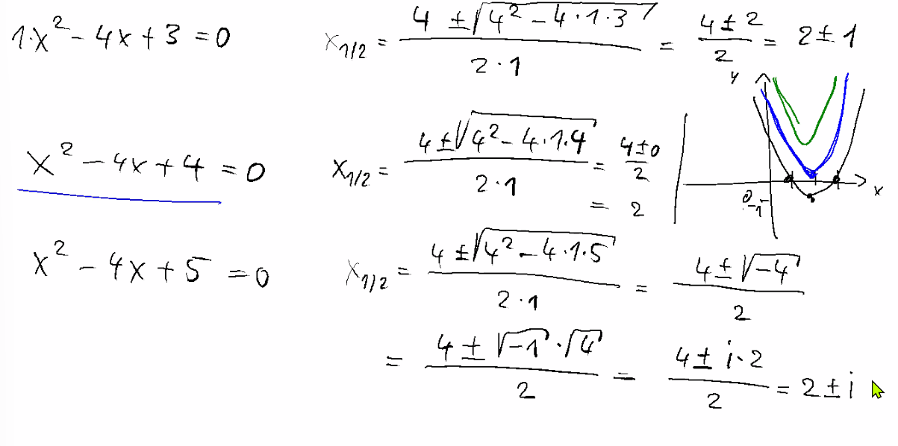

# Zusammenfassung Woche 04: Komplexe Zahlen

**Modul:** Fortgeschrittene Analysis (ANA-F)
**Dozenten:** Ron Porath und Joachim Wirth
**Quellen:**
- Folien: ana-f-sw-04-folien.pdf
- Lehrbuch: Papula, Band 1, Kapitel VII (Mathematik für Ingenieure und Naturwissenschaftler)

## Lernziele
- Alle Darstellungsformen komplexer Zahlen beherrschen und ineinander umrechnen können (Kartesische Form, Polarform/Trigonometrische Form, Exponentialform).
- Grundrechenarten (Addition, Subtraktion, Multiplikation und Division) sowie Potenzieren und Radizieren (Wurzeln ziehen) beherrschen.

---

## 1. Komplexe Zahlen (Einführung & Definition)
*Quelle: Papula Band 1, Kapitel VII, Abschnitt 1.1 -- 1.3 (S. 640 -- 648)*

### Anschauliche Herleitung
Komplexe Zahlen erweitern die reellen Zahlen $\mathbb{R}$, um Gleichungen der Form $x^2 = -1$ lösen zu können. Die folgende Skizze aus der Vorlesung zeigt, wie bei einer Parabel ohne Nullstellen (grün) im Reellen keine Lösung existiert, in den komplexen Zahlen jedoch zwei Lösungen gefunden werden können.



### Formeln & Definitionen

**Die imaginäre Einheit $j$ (bzw. $i$)**
In der Elektrotechnik wird oft $j$ statt $i$ verwendet, um Verwechslungen mit der Stromstärke zu vermeiden. Es gilt:
$$ j^2 = -1 $$
$$ j = \sqrt{-1} $$

**Definition einer komplexen Zahl (Kartesische Form / Normalform)**
Eine komplexe Zahl $z \in \mathbb{C}$ ist definiert durch:
$$ z = x + j y $$
- $x = \text{Re}(z)$ ist der **Realteil**.
- $y = \text{Im}(z)$ ist der **Imaginärteil**.
Zwei komplexe Zahlen sind genau dann gleich, wenn sie sowohl in ihrem Realteil als auch in ihrem Imaginärteil übereinstimmen.

**Betrag einer komplexen Zahl**
Der Abstand einer komplexen Zahl zum Ursprung in der Gaußschen Zahlenebene (Modulus):
$$ |z| = \sqrt{x^2 + y^2} $$

**Konjugiert komplexe Zahl**
Spiegelung an der reellen Achse (Vorzeichenwechsel des Imaginärteils):
$$ z^* = x - j y $$
*(Wichtige Eigenschaft: $z \cdot z^* = x^2 + y^2 = |z|^2$)*

### Aufgabentypen
- **Betrag und konjugierte Zahl bilden:** Identifikation von Real- und Imaginärteil und Anwendung der Basisformeln.
- **Zeigerdarstellung in der Gaußschen Ebene:** Komplexe Zahlen als Punkte oder Vektoren in einem 2D-Koordinatensystem einzeichnen. *(Siehe empfohlene Aufgaben Abschnitt 1)*

---

## 2. Komplexe Arithmetik
*Quelle: Papula Band 1, Kapitel VII, Abschnitt 2.1 -- 2.3 (S. 656 -- 663)*

### Formeln & Definitionen

Die Rechenregeln in der algebraischen (kartesischen) Form $z = x + j y$ verhalten sich wie bei reellen Binomen (unter Beachtung von $j^2 = -1$).

| Operation | Formel | Beschreibung |
| :--- | :--- | :--- |
| **Addition** | $z_1 + z_2 = (x_1 + x_2) + j (y_1 + y_2)$ | Komponentenweise (wie Vektoren). |
| **Subtraktion** | $z_1 - z_2 = (x_1 - x_2) + j (y_1 - y_2)$ | Komponentenweise. |
| **Multiplikation** | $z_1 \cdot z_2 = (x_1 x_2 - y_1 y_2) + j (x_1 y_2 + x_2 y_1)$ | Typisches Ausmultiplizieren von Klammern. |
| **Division** | $\frac{z_1}{z_2} = \frac{z_1 \cdot z_2^*}{z_2 \cdot z_2^*} = \frac{z_1 \cdot z_2^*}{|z_2|^2}$ | Bruch mit der konjugiert komplexen Zahl des Nenners erweitern, um den Nenner reell zu machen. |

### Aufgabentypen
- **Grundrechenarten anwenden:** Brüche mit komplexen Nennern durch Erweitern mit dem konjugiert Komplexen vereinfachen.
- **Gleichungen auflösen:** Lösungsverfahren für lineare und quadratische Gleichungen im Bereich $\mathbb{C}$. *(Siehe empfohlene Aufgaben Abschnitt 2)*

---

## 3. Polarkoordinaten (Trigonometrische Form)
*Quelle: Papula Band 1, Kapitel VII, Abschnitt 1.4.2 (S. 649 -- 651)*

### Formeln & Definitionen
Zusätzlich zur kartesischen Form kann eine komplexe Zahl durch ihren Abstand zum Ursprung $r$ und den Winkel $\varphi$ (Argument oder Phase) definiert werden.

**Trigonometrische Form**
$$ z = r (\cos \varphi + j \sin \varphi) $$
- $r = |z|$: Betrag von $z$
- $\varphi = \text{arg}(z)$: Winkel zur positiven reellen Achse, meist im Hauptwert $0 \leq \varphi < 2\pi$ oder $-\pi < \varphi \leq \pi$.

**Umrechnungen**

| Richtung | Formeln | Wichtige Hinweise |
| :--- | :--- | :--- |
| **Polar $\rightarrow$ Kartesisch** | $x = r \cos \varphi$<br>$y = r \sin \varphi$ | Einfach Werte in den Taschenrechner eingeben. Vorzeichen beachten. |
| **Kartesisch $\rightarrow$ Polar** | $r = \sqrt{x^2 + y^2}$<br>$\tan \varphi = \frac{y}{x}$ | Je nach Quadrant, in dem der Punkt liegt, muss $\pi$ (bzw. $180^\circ$) addiert werden. Taschenrechner (arctan) liefert nur den Hauptwert im 1. und 4. Quadranten! |

### Aufgabentypen
- **Umwandlung von Koordinatensystemen:** Gegebene komplexe Zahlen in der algebraischen in die trigonometrische Form überführen und umgekehrt.

---

## 4. Exponentialdarstellung
*Quelle: Papula Band 1, Kapitel VII, Abschnitt 1.4.3 (S. 652 -- 654) sowie Folien 13 -- 15*

### Formeln & Definitionen

**Die Eulersche Formel**
Zeigt den fundamentalen Zusammenhang zwischen der Exponentialfunktion und den trigonometrischen Funktionen:
$$ e^{j \varphi} = \cos \varphi + j \sin \varphi $$

Demzufolge lässt sich die trigonometrische Form kompakter als **Exponentialform** schreiben:
$$ z = r \cdot e^{j \varphi} $$

Diese Form eignet sich besonders gut für Multiplikation, Division, Potenzieren und Wurzelziehen (Radizieren).

| Operation | Formel | Beschreibung |
| :--- | :--- | :--- |
| **Multiplikation** | $z_1 \cdot z_2 = r_1 r_2 \, e^{j (\varphi_1 + \varphi_2)}$ | Beträge werden multipliziert, Winkel werden addiert. |
| **Division** | $\frac{z_1}{z_2} = \frac{r_1}{r_2} \, e^{j (\varphi_1 - \varphi_2)}$ | Beträge dividiert, Winkel subtrahiert. |
| **Potenzieren** | $z^n = r^n \, e^{j n \varphi}$ | Formel von **de Moivre**: $(\cos \varphi + j \sin \varphi)^n = \cos(n \varphi) + j \sin(n \varphi)$ |
| **Radizieren (Wurzelziehen)** | $w_k = \sqrt[n]{|z|} \cdot e^{j \frac{\varphi + k \cdot 2\pi}{n}}$ | Es gibt immer exakt $n$ verschiedene Lösungen für die $n$-te Wurzel. Diese bilden ein regelmäßiges $n$-Eck in der Zahlenebene. ($k \in \{0, 1, ..., n-1\}$) |

*(Zusatz: Die schönste Gleichung der Mathematik verknüpft die 5 wichtigsten Zahlen: $1 + e^{j \pi} = 0$)*

### Aufgabentypen
- **Komplexe Gleichungen ($z^n = a$):** Lösen von Wurzelgleichungen über die Exponentialdarstellung. Wichtig ist das Finden aller $n$ Lösungen.
- **Formel von de Moivre:** Anwendung, um hohe Potenzen schnell zu berechnen oder trigonometrische Identitäten zu beweisen.

---
## 5. Empfohlene Übungsaufgaben
*(Aus Papula Band 1, Kapitel VII, S. 714 -- 717)*

| Aufgabennummer | Abschnitt | Thema | Kurzbeschreibung | Seite |
| :--- | :--- | :--- | :--- | :--- |
| **1), 3)** | 1 | Darstellung in der Zahlenebene | Komplexe Zahlen als Punkte/Zeiger darstellen und ablesen. | S. 715 |
| **4), 5)** | 1 | Umrechnung Normal- $\leftrightarrow$ Polarform | Kartesische Form in Polarform umwandeln und umgekehrt. | S. 716 |
| **6)** | 1 | Betragsberechnung | Betrag verschiedener Formen von komplexen Zahlen berechnen. | S. 716 |
| **1)** | 2 | Grundrechenarten | Addition, Multiplikation und Division mit $z$ und $z^*$. | S. 716 |
| **2 a), 5 a), 5 b)** | 2 | Komplexe Multiplikation & Beweise | Ausmultiplizieren und Beweisen der Eigenschaften von $z$ und $z^*$. | S. 717 |
| **8 a), 8 c), 12 b)** | 2 | Geometrische Operationen & Gleichungen | Komplexe Wurzeln berechnen und Zeigeroperationen deuten. | S. 717 |

---

## 6. Maxima & Python -- Elektronische Hilfsmittel (MEP Teil 2)

### Maxima (wxMaxima)

```maxima
/* Komplexe Zahl definieren */
z: 3 + 4*%i;

/* Zwei komplexe Zahlen fuer Rechenoperationen */
z1: 3 + 4*%i;
z2: 1 - 2*%i;

/* Grundrechenarten */
z1 + z2;        /* Addition */
z1 - z2;        /* Subtraktion */
z1 * z2;        /* Multiplikation */
z1 / z2;        /* Division */

/* Realteil, Imaginaerteil, Betrag, Konjugierte */
realpart(z);     /* Realteil: 3 */
imagpart(z);     /* Imaginaerteil: 4 */
abs(z);          /* Betrag |z| = 5 */
conjugate(z);    /* Konjugiert komplexe Zahl: 3 - 4i */

/* Argument (Winkel) der komplexen Zahl */
carg(z);         /* Winkel in Radiant */

/* Polarform und zurueck */
polarform(z);    /* Umwandlung in Exponentialform r * e^(j*phi) */
rectform(z);     /* Zurueck in kartesische Form x + j*y */

/* Komplexe Gleichung loesen: z^3 = 8i */
solve(z^3 = 8*%i, z);

/* Formel von de Moivre anwenden */
demoivre(exp(%i * 3 * %pi / 4));
/* Wandelt e^(j*phi) in cos(phi) + j*sin(phi) um */
```

### Python (NumPy / Matplotlib)

```python
import numpy as np
import matplotlib.pyplot as plt

# Komplexe Zahlen definieren (j ist die imaginaere Einheit in Python)
z = 3 + 4j
z1 = 3 + 4j
z2 = 1 - 2j

# Grundrechenarten
print(z1 + z2)   # Addition
print(z1 - z2)   # Subtraktion
print(z1 * z2)   # Multiplikation
print(z1 / z2)   # Division

# Realteil, Imaginaerteil
print(z.real)     # Realteil: 3.0
print(z.imag)     # Imaginaerteil: 4.0

# Betrag, Argument (Winkel), Konjugierte
print(np.abs(z))        # Betrag |z| = 5.0
print(np.angle(z))      # Winkel in Radiant
print(np.angle(z, deg=True))  # Winkel in Grad
print(np.conj(z))       # Konjugiert komplexe Zahl: 3 - 4j

# Komplexe Gleichung z^3 = 8i -> z^3 - 8i = 0
# Koeffizienten: 1*z^3 + 0*z^2 + 0*z - 8j
wurzeln = np.roots([1, 0, 0, -8j])
print("Loesungen von z^3 = 8i:")
for k, w in enumerate(wurzeln):
    print(f"  z_{k} = {w:.4f}, |z| = {np.abs(w):.4f}, phi = {np.angle(w, deg=True):.2f}°")

# Komplexe Zahlen in der Gaussschen Zahlenebene darstellen
zahlen = [z1, z2, z1 + z2, z1 * z2]
namen = ["z1", "z2", "z1+z2", "z1*z2"]

fig, ax = plt.subplots(figsize=(6, 6))
for zi, name in zip(zahlen, namen):
    ax.plot(zi.real, zi.imag, 'o', markersize=8)
    ax.annotate(f"{name} = {zi}", (zi.real, zi.imag),
                textcoords="offset points", xytext=(10, 5))
    ax.plot([0, zi.real], [0, zi.imag], '--', alpha=0.5)

ax.axhline(0, color='k', linewidth=0.5)
ax.axvline(0, color='k', linewidth=0.5)
ax.set_xlabel("Realteil (Re)")
ax.set_ylabel("Imaginaerteil (Im)")
ax.set_title("Gausssche Zahlenebene")
ax.grid(True, alpha=0.3)
ax.set_aspect('equal')
plt.tight_layout()
plt.show()
```

---

## 7. Lösungen der empfohlenen Aufgaben
*(Lösungswege aus Papula Band 1, S. 822 -- 828)*

### Abschnitt 1

**Aufgaben 1) und 3):**
*(Bildliche Darstellungen, siehe Papula S. 822)*
Bei 3) liest man Real- und Imaginärteil direkt am Koordinatensystem ab und wandelt diese nach den Formeln in die Polarform um. Beispielsweise liegt $z_1$ bei $1 + 4j$, was $\approx 4.12 \cdot e^{j 75.96^\circ}$ entspricht.

**Aufgabe 4) Umrechnung in Polarform:**
- $z_1 = 2 + \pi j \implies r = \sqrt{2^2 + \pi^2} = 3.72, \quad \varphi = \arctan(\frac{\pi}{2}) = 57.52^\circ$
- $z_4 = -6 \implies r = 6, \quad \varphi = 180^\circ$ (liegt auf der negativen reellen Achse)

**Aufgabe 5) Umrechnung in Kartesische Form:**
- $z_2 = 3 e^{j 30^\circ} = 3(\cos 30^\circ + j \sin 30^\circ) = 3(\frac{\sqrt{3}}{2} + j \frac{1}{2}) = 2.60 + 1.50 j$
- $z_6 = e^{j 240^\circ} = \cos 240^\circ + j \sin 240^\circ = -0.5 - 0.866 j$

**Aufgabe 6) Beträge:**
- $z_1 = 4 - 3j \implies |z| = \sqrt{4^2 + (-3)^2} = \sqrt{25} = 5$ 
- $z_3 = 3 (\cos 60^\circ - j \sin 60^\circ) \implies |z| = 3$ (Betrag steht direkt ablesbar vor der Klammer)

### Abschnitt 2

**Aufgabe 1) Einsetzen und Ausrechnen:**
Gegeben: $z_1 = -4j, z_2 = 3-2j, z_3 = -1+j$
- **a)** $z_1 - 2z_2 + 3z_3 = -4j - 2(3-2j) + 3(-1+j) = -4j - 6 + 4j - 3 + 3j = -9 + 3j$
- **b)** $2z_1 - z_2^* = 2(-4j) - (3+2j) = -8j - 3 - 2j = -3 - 10j$

**Aufgabe 2 a) Multiplikation:**
- $(3-2j)(4+2j) = 12 + 6j - 8j - 4j^2$
Da $j^2 = -1 \implies 12 - 2j + 4 = 16 - 2j$

**Aufgaben 5 a) und 5 b) Beweise:**
Sei $z = x + jy$ und $z^* = x - jy$.
- **a)** $z + z^* = (x+jy) + (x-jy) = 2x = 2\text{Re}(z)$
- **b)** $z - z^* = (x+jy) - (x-jy) = 2jy = 2j\cdot\text{Im}(z)$

**Aufgaben 8 a), 8 c) Wurzelgleichungen:**
*Die allgemeine Formel für die n-te Wurzel liefert n Lösungen.*
- **8 a)** $z^3 = j = 1 \cdot e^{j 90^\circ}$
  $\Rightarrow r = \sqrt[3]{1} = 1$
  $\Rightarrow \varphi_k = \frac{90^\circ + k \cdot 360^\circ}{3}$ für $k = 0, 1, 2$
  $z_0 = e^{j 30^\circ}, z_1 = e^{j 150^\circ}, z_2 = e^{j 270^\circ}$

- **8 c)** $z^5 = 3 - 4j = 5 \cdot e^{j 306.87^\circ}$
  $\Rightarrow r = \sqrt[5]{5} \approx 1.38$
  $\Rightarrow \varphi_k = \frac{306.87^\circ + k \cdot 360^\circ}{5}$ für $k = 0, 1, 2, 3, 4$
  $z_0 = 1.38 e^{j 61.37^\circ}, z_1 = 1.38 e^{j 133.37^\circ}, \dots$

**(Weitere Details zu Aufgabe 12b befinden sich im Lösungskapitel des Papula S. 828 f.)**
