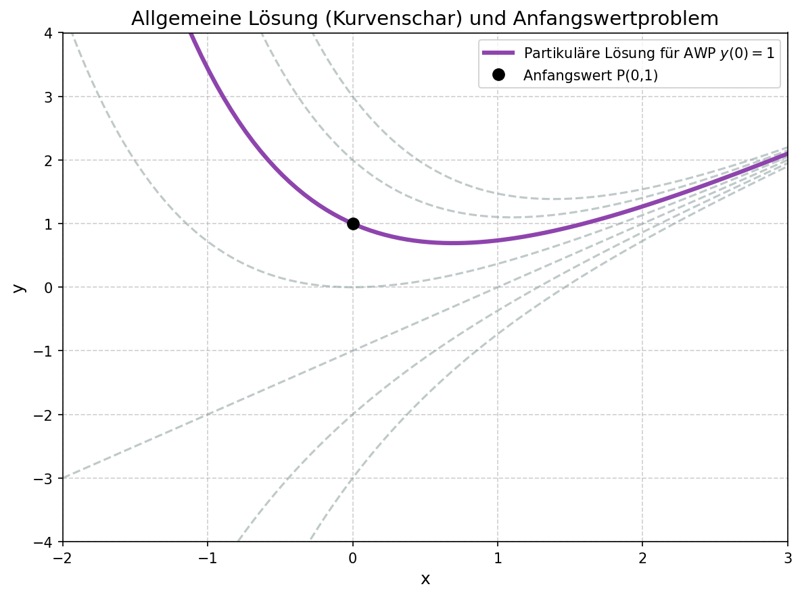
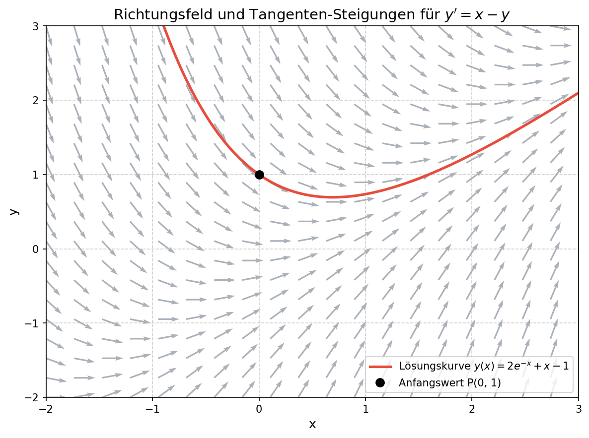
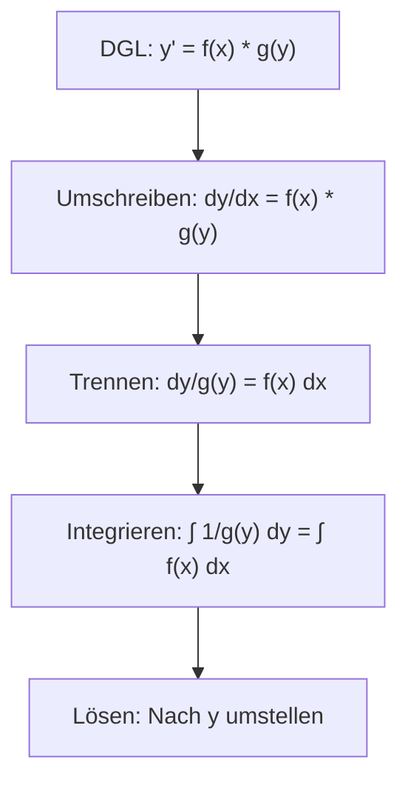
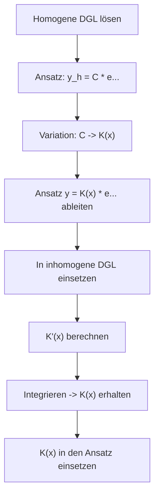
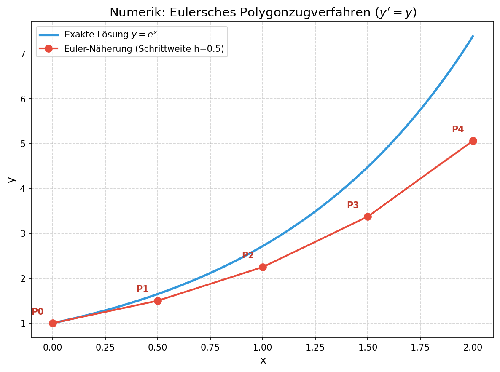

# Zusammenfassung Woche 06: Differentialgleichungen I

## Aufbau

### Header
- **Modulname:** ANAF (Analysis und Algebra für Ingenieure)
- **Quellenangabe:** Papula Band 2 (Kapitel IV: Gewöhnliche Differentialgleichungen)

### Lernziele (aus den Folien)
- Sie wissen, was eine gewöhnliche Differentialgleichung ist und können ihre Ordnung angeben.
- Sie können das Richtungsfeld einer Differentialgleichung 1. Ordnung erklären und einfache Richtungsfelder skizzieren.
- Sie können den Begriff Anfangswertproblem (AWP) anhand von Beispielen erklären.
- Sie erklären und lösen Differentialgleichungen 1. Ordnung mit Separation der Variablen und Variation der Konstanten.
- Sie erklären das Eulersche Polygonzugverfahren und das Runge-Kutta-Verfahren und wenden diese zur numerischen Lösung von Anfangswertproblemen an.

---

### 1. Grundlagen Gewöhnliche Differentialgleichungen
- **Quellenangabe:** Papula Band 2, Kapitel IV, Abschnitt 1, Seiten 343 – 352

#### Formeln & Definitionen
- **Definition:** Eine Gleichung, in der Ableitungen einer unbekannten Funktion $y = y(x)$ bis zur $n$-ten Ordnung auftreten, heisst *gewöhnliche Differentialgleichung $n$-ter Ordnung*.
- **Implizite Form:** $F(x; y; y'; y''; \dots; y^{(n)}) = 0$
- **Explizite Form:** $y^{(n)} = f(x; y; y'; y''; \dots; y^{(n-1)})$
- **Lösung:** Eine Funktion $y = y(x)$ heisst *Lösung* der Differentialgleichung, wenn sie mit ihren Ableitungen die Differentialgleichung identisch erfüllt.
- **Allgemeine Lösung:** Die *allgemeine Lösung* einer Differentialgleichung 1. Ordnung enthält eine freie Integrationskonstante $C$. Sie stellt eine Kurvenschar dar (Lösungskurven).
- **Partikuläre Lösung / Spezielle Lösung (Anfangswertproblem AWP):** Wird durch Vorgabe von Anfangsbedingungen aus der allgemeinen Lösung die Konstante $C$ eindeutig bestimmt, so erhält man eine *spezielle Lösung* der DGL.

*Beispiel: Die allgemeine Lösung (Kurvenschar) und eine hervorgehobene partikuläre Lösung für ein spezifisches Anfangswertproblem.*

#### Aufgabentypen
- **Aufstellen und Klassifizieren:** DGL anhand von Aufgabenstellung aufstellen und Ordnung sowie Linearität/Homogenität bestimmen.
- **Lösungen verifizieren:** Eine gegebene Funktion $y=f(x)$ durch Ableiten und Einsetzen in die DGL als Lösung bestätigen (Probe).

---

### 2. Geometrische Betrachtungen: Richtungsfelder und Isoklinen
- **Quellenangabe:** Papula Band 2, Kapitel IV, Abschnitt 2.1, Seiten 355 – 356

#### Formeln & Definitionen
- **Richtungsfeld:** Die Differentialgleichung $y'=f(x;y)$ ordnet jedem Punkt $P=(x;y)$ aus dem Definitionsbereich einen Steigungswert $m=f(x;y)$ zu (Linienelement). Die Gesamtheit dieser Linienelemente bildet das *Richtungsfeld*.
- **Isoklinen:** Kurven definiter konstanter Steigung. Die Isoklinen der DGL $y' = f(x; y)$ sind durch die Gleichung $f(x; y) = \text{const.}$ definiert. In den Schnittpunkten mit Isoklinen haben Lösungskurven die gleiche Steigung.

#### Aufgabentypen
- **Skizzieren:** Zeichnen von Isoklinen für gegebene DGL $\rightarrow$ Richtungsfeld ableiten $\rightarrow$ Lösungskurve einzeichnen. (z.B. $y' = 2x$ $\rightarrow$ Isoklinen $2x=C$).

*Visuelle Darstellung: Ein Richtungsfeld ordnet jedem Punkt eine Tangentensteigung zu. Die Lösungskurve schmiegt sich tangential an diese Steigungen an.*

---

### 3. Separation der Variablen (Trennung der Variablen)
- **Quellenangabe:** Papula Band 2, Kapitel IV, Abschnitt 2.2, Seiten 358 – 359

#### Formeln & Definitionen
- **Typ:** DGL 1. Ordnung der Form $y' = f(x) \cdot g(y)$
- **Vorgehen:**
  1. DGL umstellen in die Form: $\frac{dy}{dx} = f(x) \cdot g(y)$
  2. Trennen (Variablen auf verschiedene Seiten der Gleichung bringen): $\frac{dy}{g(y)} = f(x) \, dx \quad (\text{für } g(y) \neq 0)$
  3. Unbestimmt integrieren auf beiden Seiten: $\int \frac{1}{g(y)} \, dy = \int f(x) \, dx$
  4. Nach der Variablen $y$ auflösen, um die allgemeine Lösung der Differentialgleichung in der expliziten Form $y = y(x)$ zu erhalten.

#### Aufgabentypen
- **Direktes Lösen:** Gegebene DGL trennen, integrieren und auflösen. Oft verbunden mit einem AWP (Einsetzen der Anfangsbedingung zur Bestimmung der Konstante $C$).

---

### 4. Variation der Konstanten (Homogene und Inhomogene DGL)
- **Quellenangabe:** Vorlesungsfolien / Handschriftliche Notizen und Übungen

#### Formeln & Definitionen
- Betrifft lineare DGL 1. Ordnung der Form: $y' + a(x)y = s(x)$
- **Homogene DGL ($s(x) = 0$):** $y_0' + a(x)y_0 = 0$. Wird durch Trennung der Variablen gelöst und ergibt $y_0(x) = C \cdot e^{-\int a(x) \, dx}$.
- **Inhomogene DGL ($s(x) \neq 0$):** Der Ansatz der "Variation der Konstanten" beruht darauf, die Konstante $C$ in der homogenen Lösung durch eine Funktion $K(x)$ zu ersetzen:
  $y = K(x) \cdot e^{-\int a(x) \, dx}$
- **Vorgehen:**
  1. Ansatz $y$ ableiten: $y' = K'(x)e^{-\dots} + K(x)(\dots)$
  2. $y$ und $y'$ in die inhomogene DGL einsetzen. Die Terme mit $K(x)$ heben sich gegenseitig auf.
  3. Nach $K'(x)$ auflösen und einmal integrieren, um $K(x)$ zu erhalten (mit neuer Integrationskonstante).
  4. Das berechnete $K(x)$ zurück in den Lösungsansatz einsetzen.

#### Demonstration aus der Vorlesung
Ein anschauliches Vorlesungsbeispiel zur DGL: $y' = x - y$ bzw. $y' + y = x$

**Schritt 1: Homogene Lösung finden**
*(Trennung der Variablen)*

*Erklärung:* Die DGL wird zunächst als homogene Gleichung ($y'_0 + y_0 = 0$) betrachtet. Durch Separation der Variablen $\int \frac{dy_0}{y_0} = -\int 1 \, dx$ und Integration erhält man unter Verwendung von Exponentialfunktionen die allgemeine Lösung der homogenen DGL: $y_0 = C \cdot e^{-x}$.

**Schritt 2: Inhomogene Lösung (Variation der Konstanten)**

*Erklärung:* Es wird der Ansatz $y = k(x)e^{-x}$ gemacht. Ableiten und Einsetzen in die Ursprungs-DGL liefert nach dem Wegkürzen $k'(x)e^{-x} = x \Rightarrow k'(x) = xe^x$. Die anschliessende Integration (mittels partieller Integration) ergibt $k(x) = (x-1)e^x + C$. Einsetzen in den Ursprungsansatz führt zur endgültigen Lösung $y = C e^{-x} + x - 1$.

#### Aufgabentypen
- **Inhomogene DGL auflösen:** Homogene Lösung berechnen und anschliessend mittels Variation der Konstanten den Störterm integrieren. Häufig kombiniert mit Startwerten für $C$.

---

### 5. Numerische Lösung: Euler- und Runge-Kutta-Verfahren
- **Quellenangabe:** Vorlesungsfolien (Ergänzung zum Papula)

#### Formeln & Definitionen
- **Polygonzugverfahren von Euler:**
  - Start beim bekannten Punkt $P_0(x_0; y_0)$
  - Bestimmung des nächsten Auswertungspunktes: $x_{n+1} = x_n + h$ (für eine feste Schrittweite $h$)
  - Funktionswert abschätzen mit Tangentengleichung: $y_{n+1} = y_n + h \cdot y'(x_n, y_n)$ mit $y' = f(x_n, y_n)$
- **Runge-Kutta-Verfahren 4. Ordnung (RK4-Verfahren):**
  - Verbesserte Genauigkeit durch gewichtetes Mitteln von vier Teststeigungen im aktuellen Intervallauswertungsschritt.
  - $k_1 = f(x_n, y_n)$
  - $k_2 = f(x_n + \frac{h}{2}, y_n + \frac{h}{2}k_1)$
  - $k_3 = f(x_n + \frac{h}{2}, y_n + \frac{h}{2}k_2)$
  - $k_4 = f(x_n + h, y_n + hk_3)$
  - $y_{n+1} = y_n + \frac{h}{6} (k_1 + 2k_2 + 2k_3 + k_4)$

*Das Euler-Verfahren nähert sich der exakten Lösung schrittweise in Tangentenrichtung.*

#### Aufgabentypen
- **Schrittweise ausführen:** Ein oder zwei Iterationen des Euler- oder RK4-Verfahrens von Hand für ein einfaches Anfangswertproblem berechnen. Fehler zum tatsächlichen analytischen Wert bestimmen.

---

### Nach allen Themenblöcken:

### 4. Empfohlene Übungsaufgaben

| Aufgabennummer | Thema | Kurzbeschreibung | Papula Seite |
| :--- | :--- | :--- | :--- |
| **Abschnitt 1: Aufg. 1** | Lösungsverifikation (Probe) | Durch beidseitiges Differenzieren beweisen, dass $y = \frac{Cx}{1+x}$ die allg. Lösung von $x(1+x)y' - y = 0$ ist. Lösungskurve für P=(1;8) ermitteln. | S. 523 |
| **Abschnitt 1: Aufg. 2** | Probe Differentialgleichung | Zeigen, dass $y = C_1 e^{5x} + C_2 e^{-x}$ die homogene DGL 2. Ordnung $y'' - 4y' - 5y = 0$ löst. | S. 523 |
| **Abschnitt 2: Aufg. 1a** | Isoklinen und Trennung der Variablen | Isoklinen parallel/halbgerade skizzieren, Richtungsfeld ableiten und durch Trennen der Variablen $dy/y = dx/(2x)$ exakt auflösen. | S. 523 |
| **Abschnitt 2: Aufg. 4** | Trennung und Substitution | Längere Differentialausdrücke durch Trennung oder Substitution nach $y$ umformen (z.B. Brüche oder Umkehrfunktionen formen). | S. 524 |

---

### 5. Lösungen der empfohlenen Aufgaben

**Lösung zu Abschnitt 1, Aufgabe 1:**
- Funktion: $y = \frac{Cx}{1+x}$
- Ableitung (Quotientenregel): $y' = \frac{C \cdot (1+x) - Cx \cdot 1}{(1+x)^2} = \frac{C}{(1+x)^2}$
- Einsetzen in DGL $x(1+x)y' - y = 0$:
  $x(1+x)\frac{C}{(1+x)^2} - \frac{Cx}{1+x} = \frac{Cx}{1+x} - \frac{Cx}{1+x} = 0$. Die Identität ist erfüllt.
- Spezielle Lösung (Anfangswertproblem): Punkt $P = (1; 8) \Rightarrow x=1, y=8 \Rightarrow 8 = \frac{C\cdot 1}{1+1} \Rightarrow 8 = \frac{C}{2} \Rightarrow C = 16$.
- Abschliessendes Ergebnis: $y = \frac{16x}{1+x}$

**Lösung zu Abschnitt 1, Aufgabe 2:**
- Gegebene Lösungsfunktion: $y = C_1 e^{5x} + C_2 e^{-x}$
- Erste Ableitung: $y' = 5C_1 e^{5x} - C_2 e^{-x}$
- Zweite Ableitung: $y'' = 25C_1 e^{5x} + C_2 e^{-x}$
- Einsetzen in $y'' - 4y' - 5y = 0$:
  $(25C_1 e^{5x} + C_2 e^{-x}) - 4(5C_1 e^{5x} - C_2 e^{-x}) - 5(C_1 e^{5x} + C_2 e^{-x})$
  $= C_1 e^{5x} (25 - 20 - 5) + C_2 e^{-x} (1 + 4 - 5) = 0$. Die Identität ist erfüllt und die Gleichung belegt.

**Lösung zu Abschnitt 2, Aufgabe 1a:**
- DGL-Konstrukt: $y' = \frac{y}{2x}$ (Beachte: Die Angabe im Bild IV-12 bzw. Lösung A-21 verwendet diese Definition für die Lösung $y = C\sqrt{x}$)
- Isoklinen: $y' = a \Rightarrow a = \frac{y}{2x} \Rightarrow y = 2a \cdot x$ (für $a \in \mathbb{R}$, Halbgeraden durch den Nullpunkt, Steigung ist abhängig von $x,y$)
- Exakte Lösung mittels Trennung der Variablen:
  $\frac{dy}{dx} = \frac{y}{2x}$
  $\Rightarrow \frac{1}{y} \, dy = \frac{1}{2x} \, dx$
  $\Rightarrow \int \frac{1}{y} \, dy = \frac{1}{2}\int \frac{1}{x} \, dx$
  $\Rightarrow \ln|y| = \frac{1}{2}\ln x + \ln|C'|$   (für $x > 0$)
  $\Rightarrow \ln|y| = \ln\sqrt{x} + \ln|C'| = \ln(|C'|\sqrt{x})$
  $\Rightarrow y = C\sqrt{x}$ (mit Konstante $C$, allgemeine Lösung)

**Lösung zu Abschnitt 2, Aufgabe 4 (beispielhafter Aufgabentyp):**
DGL durch vollständige Integration und gegebenenfalls Rücksubstitution auflösen:
- Startgleichung (analog Referenzlösungen S. 753): z.B. $y' = \frac{x}{y^2} \dots \Rightarrow$ Integration beidseitig über $\int y^2 \, dy = \int x \, dx$ führt dann oft auf kubische Terme, die umgestellt werden zu Ausdrücken wie $y = \frac{x}{1-Cx}$ oder transzendenten Funktionen wie Tangens oder Arcussinus gemäss den Integraltafeln.
