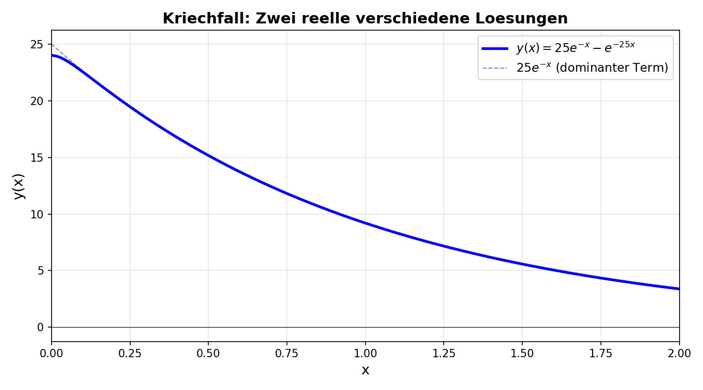
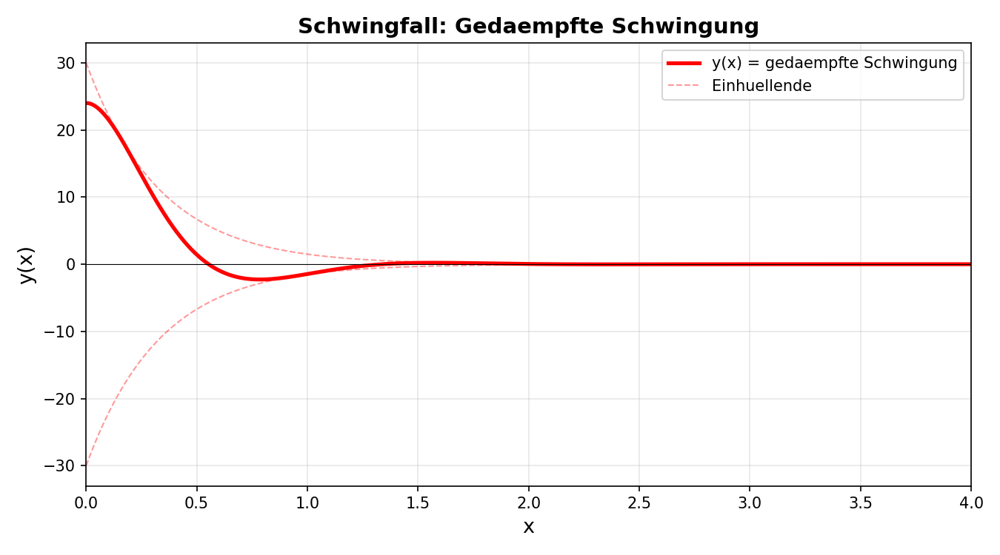
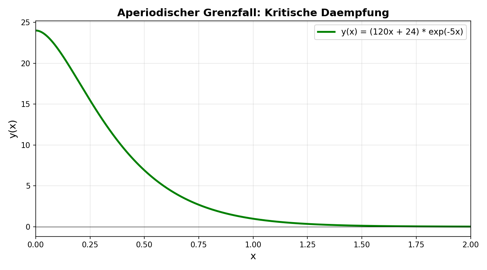
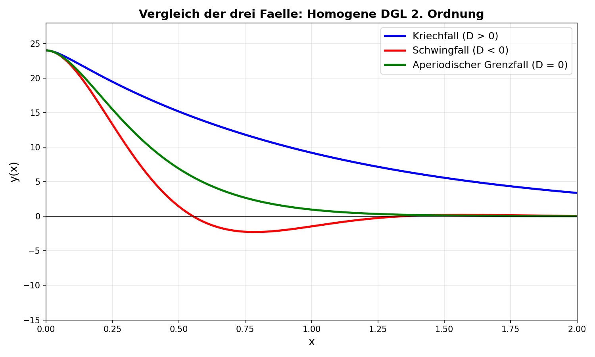
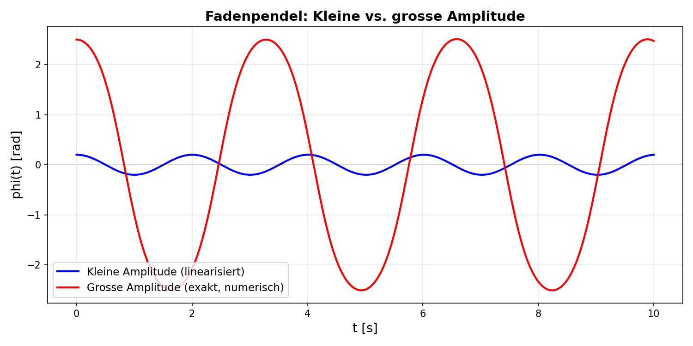
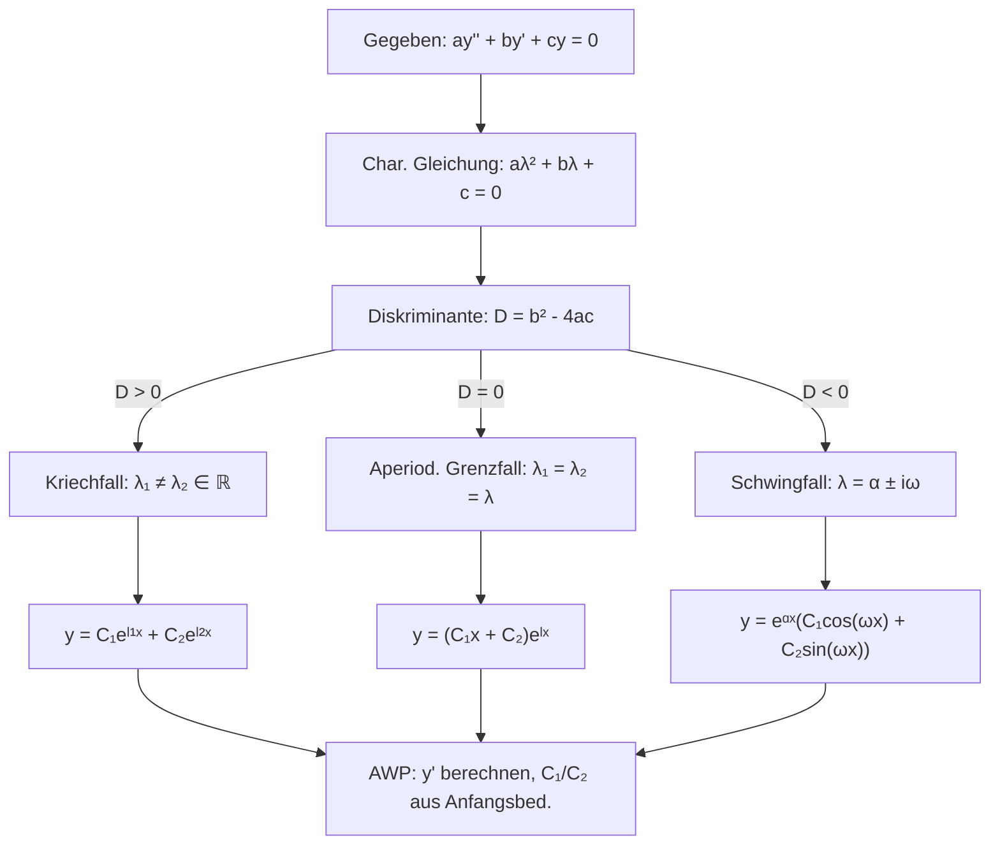

# Zusammenfassung Woche 07 – Differentialgleichungen II

**Modul:** Fortgeschrittene Analysis (ANA-F)
**Dozenten:** Ron Porath, Joachim Wirth
**Quelle:** Papula Band 2, Kapitel IV, Abschnitt 3, Seiten 392–396 und 400–406
**Übungen:** Papula Band 2, Kapitel IV, Abschnitt 3, Aufgaben 6) und 7), Seite 529

---

## Lernziele (aus den Folien)

- Sie können zu **homogenen linearen Differentialgleichungen zweiter Ordnung mit konstanten Koeffizienten** die **allgemeine Lösung** bestimmen.
- Sie können eine **spezielle Lösung** als Anfangswertproblem bestimmen.
- Sie verstehen die **charakteristische Gleichung** und die **Fundamentalbasis**.
- (Sie können Anfangswertprobleme **numerisch** lösen – Euler/Runge-Kutta, Repetition aus SW06.)

---

# 0. Refresher: Komplexe Zahlen (aus SW04)

> Dieses Kapitel ist ein Crashkurs für alle, die den Schwingfall (Abschnitt 3.2) nachvollziehen wollen. Detaillierte Theorie → siehe `Zusammenfassung_Woche_04.md`.

## 0.1 Was ist eine komplexe Zahl?

Eine komplexe Zahl hat einen **Realteil** und einen **Imaginärteil**:

$$z = \underbrace{x}_{\text{Realteil}} + \underbrace{y}_{\text{Imaginärteil}} \cdot i$$

wobei $i = \sqrt{-1}$ die **imaginäre Einheit** ist. Die entscheidende Eigenschaft:

$$\boxed{i^2 = -1}$$

Das ist der ganze Trick! Immer wenn beim Rechnen $i^2$ auftaucht, ersetze es durch $-1$.

## 0.2 Rechenoperationen – Schritt für Schritt

### Addition / Subtraktion (komponentenweise, wie Vektoren)

$$\boxed{(a + bi) \pm (c + di) = (a \pm c) + (b \pm d) \, i}$$

**Beispiel:** $(3 + 2i) + (1 - 5i) = (3+1) + (2-5)i = 4 - 3i$

### Multiplikation (ausmultiplizieren, dann $i^2 = -1$)

$$\boxed{(a + bi)(c + di) = (ac - bd) + (ad + bc) \, i}$$

Man muss sich die Formel **nicht** merken – einfach wie ein Binom ausmultiplizieren:

$$(a + bi)(c + di) = ac + adi + bci + bdi^2$$
$$= ac + adi + bci + bd \cdot (-1)$$
$$= (ac - bd) + (ad + bc) \, i$$

**Beispiel:** $(3 - 2i)(4 + 2i) = 12 + 6i - 8i - 4i^2 = 12 - 2i + 4 = 16 - 2i$

### Division (Trick: mit konjugiert Komplexem erweitern)

Die **konjugiert komplexe Zahl** $z^* = a - bi$ (Vorzeichenwechsel beim Imaginärteil).

$$\boxed{\frac{z_1}{z_2} = \frac{z_1 \cdot z_2^*}{z_2 \cdot z_2^*} = \frac{z_1 \cdot z_2^*}{|z_2|^2}}$$

Warum? Weil $z \cdot z^* = (a+bi)(a-bi) = a^2 + b^2$ → der Nenner wird **reell**!

**Beispiel:**
$$\frac{3 + i}{1 - 2i} = \frac{(3+i)(1+2i)}{(1-2i)(1+2i)} = \frac{3 + 6i + i + 2i^2}{1 + 4} = \frac{3 + 7i - 2}{5} = \frac{1 + 7i}{5} = 0.2 + 1.4i$$

### Betrag (Abstand zum Ursprung)

$$\boxed{|z| = |a + bi| = \sqrt{a^2 + b^2}}$$

**Beispiel:** $|3 + 4i| = \sqrt{9 + 16} = \sqrt{25} = 5$

## 0.3 Polarform und Euler-Formel (ZENTRAL für den Schwingfall!)

Jede komplexe Zahl kann statt $z = x + yi$ auch als **Zeiger** mit Länge $r$ und Winkel $\varphi$ dargestellt werden:

$$\boxed{z = r \cdot e^{i\varphi} = r(\cos\varphi + i\sin\varphi)}$$

Das ist die **Euler-Formel** – sie verbindet $e$-Funktion mit Sinus und Kosinus!

**Umrechnung:**

| Richtung | Formel |
|---|---|
| Kartesisch → Polar | $r = \sqrt{x^2 + y^2}$, $\varphi = \arctan(y/x)$ (Quadrant beachten!) |
| Polar → Kartesisch | $x = r\cos\varphi$, $y = r\sin\varphi$ |

### Rechnen in Polarform (viel einfacher für $\cdot$, $/$, Potenzen, Wurzeln!)

| Operation | Formel | Merkhilfe |
|---|---|---|
| **Multiplikation** | $r_1 e^{i\varphi_1} \cdot r_2 e^{i\varphi_2} = r_1 r_2 \cdot e^{i(\varphi_1 + \varphi_2)}$ | Beträge mal, Winkel plus |
| **Division** | $\frac{r_1 e^{i\varphi_1}}{r_2 e^{i\varphi_2}} = \frac{r_1}{r_2} \cdot e^{i(\varphi_1 - \varphi_2)}$ | Beträge geteilt, Winkel minus |
| **Potenz** | $(r e^{i\varphi})^n = r^n \cdot e^{in\varphi}$ | Betrag hoch $n$, Winkel mal $n$ |
| **$n$-te Wurzel** | $\sqrt[n]{r} \cdot e^{i \frac{\varphi + 2k\pi}{n}}$, $k = 0, 1, \ldots, n-1$ | $n$ gleichverteilte Lösungen auf einem Kreis |

## 0.4 Warum braucht man das für den Schwingfall?

Beim Schwingfall liefert die charakteristische Gleichung **komplexe** Lösungen:

$$\lambda_{1/2} = \alpha \pm i\omega$$

Die Lösung der DGL enthält dann $e^{(\alpha + i\omega)x}$. Mit der Euler-Formel wird das zu:

$$e^{(\alpha + i\omega)x} = e^{\alpha x} \cdot e^{i\omega x} = e^{\alpha x} \cdot \left(\cos(\omega x) + i\sin(\omega x)\right)$$

So kommt man von der komplexen Exponentialform zur **reellen** Sinus-Cosinus-Lösung!

**Das ist die Schlüsselstelle:** Ohne Euler-Formel könnte man den Schwingfall nicht in eine reelle Lösung umwandeln.

### Kurzbeispiel (Rechnung Schritt für Schritt)

Gegeben: $\lambda = -3 + 4i$

$$e^{\lambda x} = e^{(-3 + 4i)x} = e^{-3x} \cdot e^{4ix}$$

Euler-Formel auf $e^{4ix}$ anwenden:

$$= e^{-3x} \cdot (\cos(4x) + i\sin(4x))$$

Fertig! $e^{-3x}$ ist der **Dämpfungsfaktor** (reell), $\cos(4x)$ und $\sin(4x)$ machen die **Schwingung**.

---

# 1. Repetition aus SW06

> Vorlesungsnotizen (Seiten 1, 3, 4 der Unterrichtsnotizen)

Zu Beginn der Vorlesung wurden zwei Themen aus Woche 06 repetiert:

### 1.1 Fourier-Reihe (Kurzwiederholung)

Für eine periodische Funktion $f(x)$ mit Periode $T = 2\pi$:

$$F(x) = \frac{a_0}{2} + \sum_{k=1}^{\infty} \left( a_k \cos(kx) + b_k \sin(kx) \right)$$

Die Fourier-Koeffizienten:

$$a_0 = \frac{1}{\pi} \int_0^{2\pi} f(x) \, dx$$

$$a_n = \frac{1}{\pi} \int_0^{2\pi} f(x) \cos(nx) \, dx$$

$$b_n = \frac{1}{\pi} \int_0^{2\pi} f(x) \sin(nx) \, dx$$

### 1.2 Inhomogene DGL 1. Ordnung – Variation der Konstanten (Kurzwiederholung)

**Beispiel aus der Vorlesung:**

$$y' + y = x^2$$

**Schritt 1:** Lösung der homogenen Gleichung $y' + y = 0$ (Separation der Variablen):

$$y' = -y \quad \Rightarrow \quad \frac{y'}{y} = -1 \quad \Rightarrow \quad y_H = C e^{-x}$$

**Schritt 2:** Partikuläre Lösung durch Variation der Konstanten – Ansatz $y_P = K(x) e^{-x}$:

$$y_P' = K' e^{-x} + K e^{-x} \cdot (-1) = K' e^{-x} - K e^{-x}$$

Einsetzen in $y_P' + y_P = x^2$:

$$K' e^{-x} - K e^{-x} + K e^{-x} = x^2$$

$$K' e^{-x} = x^2 \quad \Rightarrow \quad K' = x^2 e^{x}$$

$$K = \int x^2 e^{x} \, dx = (x^2 - 2x + 2) e^{x} + C$$

**Allgemeine Lösung:**

$$\boxed{y = y_H + y_P = C e^{-x} + x^2 - 2x + 2}$$

### 1.3 Euler-Verfahren (Kurzwiederholung)

Numerische Lösung eines AWP $y' = f(x, y)$, $y(x_0) = y_0$ auf dem Intervall $[a, b]$:

- Schrittweite: $h = \frac{b - a}{n}$
- Stützstellen: $x_k = x_0 + k \cdot h$
- **Iterationsformel:**

$$\boxed{y_{k+1} = y_k + h \cdot f(x_k, y_k)}$$

---

# 2. Homogene DGL 2. Ordnung mit konstanten Koeffizienten

> Papula Band 2, Kap. IV, Abschnitt 3, Seiten 392–396 und 400–406

## 2.1 Allgemeine Form und Anwendung

Die allgemeine Form einer **homogenen linearen DGL 2. Ordnung mit konstanten Koeffizienten**:

$$\boxed{a \, y''(x) + b \, y'(x) + c \, y(x) = 0}$$

mit $a, b, c \in \mathbb{R}$.

**Physikalische Interpretation (freie Schwingung):**

| Parameter | Bedeutung | Einheit |
|---|---|---|
| $a > 0$ | **Masse** | kg |
| $b \geq 0$ | **Dämpfung** ($b = 0$: ungedämpft) | Ns/m |
| $c > 0$ | **Federkonstante** | N/m |

**Klassifizierung:**
- **Homogen:** Rechte Seite ist $0$ (keine äussere Kraft)
- **Linear:** Nur Linearkombinationen von $y'', y', y$ (keine Produkte wie $y \cdot y'$, keine Potenzen wie $y^2$)
- **Konstante Koeffizienten:** $a, b, c$ sind Konstanten (keine Funktionen von $x$)

> ⚠️ **Abgrenzung aus der Vorlesung:**
> Homogen, linear: $y'' + x^2 y = 0$ → linear, aber **nicht** konstante Koeffizienten
> Inhomogen, nicht linear: $y \cdot y'' + y = \cos(x)$ → nicht linear wegen $y \cdot y''$

## 2.2 Lösungsansatz und Charakteristische Gleichung

**Exponentialansatz:**

$$y(x) = e^{\lambda x}$$

Ableitungen:

$$y'(x) = \lambda e^{\lambda x}, \qquad y''(x) = \lambda^2 e^{\lambda x}$$

Einsetzen in $a y'' + b y' + c y = 0$:

$$a \lambda^2 e^{\lambda x} + b \lambda e^{\lambda x} + c e^{\lambda x} = 0$$

$$e^{\lambda x} \left( a \lambda^2 + b \lambda + c \right) = 0$$

Da $e^{\lambda x} \neq 0$ für alle $x$, folgt die **charakteristische Gleichung**:

$$\boxed{a \lambda^2 + b \lambda + c = 0}$$

**Lösung mit der Lösungsformel:**

$$\boxed{\lambda_{1/2} = \frac{-b \pm \sqrt{b^2 - 4ac}}{2a}}$$

Die **Diskriminante** $D = b^2 - 4ac$ bestimmt den Fall:

| Diskriminante | Fall | Art der Lösung |
|---|---|---|
| $D > 0$ ($b^2 > 4ac$) | **Kriechfall** | Zwei reelle verschiedene $\lambda_1 \neq \lambda_2$ |
| $D = 0$ ($b^2 = 4ac$) | **Aperiodischer Grenzfall** | Eine reelle Doppellösung $\lambda_1 = \lambda_2 = \lambda$ |
| $D < 0$ ($b^2 < 4ac$) | **Schwingfall** | Zwei konjugiert komplexe $\lambda_{1/2} = \alpha \pm i\omega$ |

## 2.3 Fundamentalbasis

Die beiden linear unabhängigen Lösungen $y_1(x)$ und $y_2(x)$ der charakteristischen Gleichung bilden die **Fundamentalbasis**. Die allgemeine Lösung ist eine Linearkombination:

$$y(x) = C_1 \cdot y_1(x) + C_2 \cdot y_2(x)$$

**Probe-Methode:** Man kann verifizieren, dass $y_1$ eine Lösung ist, indem man $y_1, y_1', y_1''$ in die DGL einsetzt und prüft, ob $0$ herauskommt.

---

# 3. Die drei Fälle im Detail

## 3.1 Kriechfall (zwei reelle verschiedene Lösungen)

> $D > 0$: $\lambda_1 \neq \lambda_2 \in \mathbb{R}$

**Fundamentalbasis:** $y_1 = e^{\lambda_1 x}$, $y_2 = e^{\lambda_2 x}$

**Allgemeine Lösung:**

$$\boxed{y(x) = C_1 \, e^{\lambda_1 x} + C_2 \, e^{\lambda_2 x}}$$

### Vollständiges Beispiel (aus den Folien)

**AWP:**

$$2y''(x) + 52y'(x) + 50y(x) = 0, \quad y(0) = 24, \quad y'(0) = 0$$

**Schritt 1 – Charakteristische Gleichung:**

$$2\lambda^2 + 52\lambda + 50 = 0$$

**Schritt 2 – Lösung:**

$$\lambda_{1/2} = \frac{-52 \pm \sqrt{52^2 - 4 \cdot 2 \cdot 50}}{2 \cdot 2} = \frac{-52 \pm \sqrt{2304}}{4} = \frac{-52 \pm 48}{4} = -13 \pm 12$$

$$\lambda_1 = -1, \quad \lambda_2 = -25$$

**Schritt 3 – Allgemeine Lösung:**

$$y(x) = C_1 e^{-x} + C_2 e^{-25x}$$

**Schritt 4 – Spezielle Lösung (AWP):**

$$y'(x) = -C_1 e^{-x} - 25 C_2 e^{-25x}$$

Anfangsbedingungen einsetzen:

$$y(0) = C_1 + C_2 = 24$$
$$y'(0) = -C_1 - 25 C_2 = 0$$

Aus der zweiten Gleichung: $C_1 = -25 C_2$. Einsetzen:

$$-25 C_2 + C_2 = 24 \quad \Rightarrow \quad -24 C_2 = 24 \quad \Rightarrow \quad C_2 = -1$$

$$C_1 = 24 - C_2 = 25$$

$$\boxed{y(x) = 25 e^{-x} - e^{-25x}}$$


*Kriechfall: Die Lösung fällt exponentiell ohne Schwingung gegen 0. Der gestrichelte Term $25e^{-x}$ dominiert für grosse $x$.*

### Beispiel aus den Unterrichtsnotizen

**DGL:** $y'' + 4y' + 3y = 0$

**Charakteristische Gleichung:** $a^2 + 4a + 3 = 0$

$$a_{1/2} = \frac{-4 \pm \sqrt{16 - 12}}{2} = -2 \pm 1 \quad \Rightarrow \quad a_1 = -3, \; a_2 = -1$$

**Fundamentalbasis:** $y_1 = e^{-3x}$, $y_2 = e^{-x}$

**Probe** für $y_1 = e^{-3x}$: $y_1' = -3e^{-3x}$, $y_1'' = 9e^{-3x}$

$$9e^{-3x} + 4(-3e^{-3x}) + 3e^{-3x} = 9e^{-3x} - 12e^{-3x} + 3e^{-3x} = 0 \quad ✓$$

**Allgemeine Lösung:** $y = C_1 e^{-3x} + C_2 e^{-x}$

**AWP:** $y(0) = 5$, $y'(0) = 0$:

$$C_1 + C_2 = 5$$
$$-3C_1 - C_2 = 0 \quad \Rightarrow \quad C_2 = -3C_1$$

$$C_1 - 3C_1 = 5 \quad \Rightarrow \quad -2C_2 = 5 \quad \Rightarrow \quad C_2 = \frac{15}{2}, \; C_1 = -\frac{5}{2}$$

$$\boxed{y = -\frac{5}{2} e^{-3x} + \frac{15}{2} e^{-x}}$$

---

## 3.2 Schwingfall (zwei konjugiert komplexe Lösungen)

> $D < 0$: $\lambda_{1/2} = \alpha \pm i\omega \in \mathbb{C} \setminus \mathbb{R}$

Dabei ist $\alpha = \text{Re}(\lambda) = \frac{-b}{2a}$ (Dämpfung) und $\omega = \text{Im}(\lambda) = \frac{\sqrt{4ac - b^2}}{2a}$ (Kreisfrequenz).

**Herleitung der reellen Form:**

$$y(x) = C_1 e^{(\alpha + i\omega)x} + C_2 e^{(\alpha - i\omega)x}$$

$$= e^{\alpha x} \left( C_1 e^{i\omega x} + C_2 e^{-i\omega x} \right)$$

Mit Euler-Formel $e^{i\varphi} = \cos\varphi + i\sin\varphi$:

$$= e^{\alpha x} \left( C_1 (\cos(\omega x) + i\sin(\omega x)) + C_2 (\cos(\omega x) - i\sin(\omega x)) \right)$$

Umbenennen: $C_3 = C_1 + C_2$, $C_4 = i(C_1 - C_2)$:

$$= e^{\alpha x} \left( C_3 \frac{e^{i\omega x} + e^{-i\omega x}}{2} + C_4 \frac{e^{i\omega x} - e^{-i\omega x}}{2} \right)$$

**Fundamentalbasis:** $\tilde{y}_1 = e^{\alpha x} \cos(\omega x)$, $\tilde{y}_2 = e^{\alpha x} \sin(\omega x)$

**Allgemeine Lösung:**

$$\boxed{y(x) = e^{\alpha x} \left( C_1 \cos(\omega x) + C_2 \sin(\omega x) \right)}$$

### Vollständiges Beispiel (aus den Folien)

**AWP:**

$$2y''(x) + 12y'(x) + 50y(x) = 0, \quad y(0) = 24, \quad y'(0) = 0$$

**Charakteristische Gleichung:**

$$2\lambda^2 + 12\lambda + 50 = 0$$

$$\lambda_{1/2} = \frac{-12 \pm \sqrt{144 - 400}}{4} = \frac{-12 \pm \sqrt{-256}}{4} = \frac{-12 \pm 16i}{4} = -3 \pm 4i$$

Also $\alpha = -3$, $\omega = 4$.

**Allgemeine Lösung:**

$$y(x) = e^{-3x} \left( C_3 \cos(4x) + C_4 \sin(4x) \right)$$

**Spezielle Lösung (AWP):**

$$y'(x) = -3 e^{-3x}(C_3 \cos(4x) + C_4 \sin(4x)) + e^{-3x}(-4C_3 \sin(4x) + 4C_4 \cos(4x))$$

$$y(0) = e^0 (C_3 \cdot 1 + C_4 \cdot 0) = C_3 = 24$$

$$y'(0) = -3C_3 + 4C_4 = 0 \quad \Rightarrow \quad C_4 = \frac{3}{4} C_3 = \frac{3}{4} \cdot 24 = 18$$

$$\boxed{y(x) = e^{-3x} (24 \cos(4x) + 18 \sin(4x))}$$


*Schwingfall: Gedämpfte Schwingung – die Amplitude nimmt exponentiell ab (Einhüllende $\pm 30 e^{-3x}$). Die Kreisfrequenz beträgt $\omega = 4$.*

### Beispiel aus den Unterrichtsnotizen

**DGL:** $y'' + 4y' + 5y = 0$

**Charakteristische Gleichung:** $a^2 + 4a + 5 = 0$

$$a_{1/2} = \frac{-4 \pm \sqrt{16 - 20}}{2} = -2 \pm i$$

$\alpha = -2$, $\omega = 1$.

**Fundamentalbasis:** $\tilde{y}_1 = e^{-2x}\cos(x)$, $\tilde{y}_2 = e^{-2x}\sin(x)$

**Allgemeine Lösung:** $y = e^{-2x}(C_1 \cos(x) + C_2 \sin(x))$

**Mit AWP** $y(0) = 5$, $y'(0) = 0$:

$$y(x) = e^{-2x}(5\cos(x) + 10\sin(x))$$

---

## 3.3 Aperiodischer Grenzfall (eine reelle Doppellösung)

> $D = 0$: $\lambda = \lambda_1 = \lambda_2 \in \mathbb{R}$

Hier liefert der Exponentialansatz nur **eine** Lösung $y_1 = e^{\lambda x}$. Die zweite wird durch **Variation der Konstanten** gefunden.

**Herleitung (aus den Unterrichtsnotizen):**

Ansatz: $y = k(x) e^{\lambda x}$

$$y' = k' e^{\lambda x} + k \lambda e^{\lambda x}$$

$$y'' = k'' e^{\lambda x} + 2k' \lambda e^{\lambda x} + k \lambda^2 e^{\lambda x}$$

Einsetzen in $ay'' + by' + cy = 0$ und Vereinfachen (unter Verwendung von $a\lambda^2 + b\lambda + c = 0$ und $2a\lambda + b = 0$):

$$a \cdot k'' \cdot e^{\lambda x} = 0 \quad \Rightarrow \quad k'' = 0 \quad \Rightarrow \quad k' = C_1 \quad \Rightarrow \quad k = C_1 x + C_2$$

**Fundamentalbasis:** $y_1 = x \cdot e^{\lambda x}$, $y_2 = e^{\lambda x}$

**Allgemeine Lösung:**

$$\boxed{y(x) = (C_1 x + C_2) \, e^{\lambda x}}$$

### Vollständiges Beispiel (aus den Folien)

**AWP:**

$$2y''(x) + 20y'(x) + 50y(x) = 0, \quad y(0) = 24, \quad y'(0) = 0$$

**Charakteristische Gleichung:**

$$2\lambda^2 + 20\lambda + 50 = 0$$

$$\lambda_{1/2} = \frac{-20 \pm \sqrt{400 - 400}}{4} = \frac{-20}{4} = -5$$

$\lambda = -5$ (Doppellösung).

**Allgemeine Lösung:**

$$y(x) = (C_1 x + C_2) e^{-5x}$$

**Spezielle Lösung (AWP):**

$$y'(x) = C_1 e^{-5x} - 5(C_1 x + C_2) e^{-5x}$$

$$y(0) = C_2 = 24$$

$$y'(0) = C_1 - 5C_2 = 0 \quad \Rightarrow \quad C_1 = 5 \cdot 24 = 120$$

$$\boxed{y(x) = (120x + 24) \, e^{-5x}}$$


*Aperiodischer Grenzfall: Die Lösung steigt kurz an (Maximum), fällt dann monoton gegen 0. Keine Schwingung – schnellstmögliche Rückkehr zur Ruhelage.*

---

# 4. Zusammenfassung der drei Fälle (Übersichtstabelle)

> Diese Tabelle ist die zentrale Referenz für die Prüfung!

| | **Kriechfall** | **Schwingfall** | **Aperiodischer Grenzfall** |
|---|---|---|---|
| **Diskriminante** | $D = b^2 - 4ac > 0$ | $D = b^2 - 4ac < 0$ | $D = b^2 - 4ac = 0$ |
| **$\lambda$-Werte** | $\lambda_1 \neq \lambda_2 \in \mathbb{R}$ | $\lambda_{1/2} = \alpha \pm i\omega \in \mathbb{C}$ | $\lambda_1 = \lambda_2 = \lambda \in \mathbb{R}$ |
| **Fundamentalbasis** | $e^{\lambda_1 x}, \; e^{\lambda_2 x}$ | $e^{\alpha x}\cos(\omega x), \; e^{\alpha x}\sin(\omega x)$ | $e^{\lambda x}, \; x \cdot e^{\lambda x}$ |
| **Allgemeine Lösung** | $C_1 e^{\lambda_1 x} + C_2 e^{\lambda_2 x}$ | $e^{\alpha x}(C_1 \cos(\omega x) + C_2 \sin(\omega x))$ | $(C_1 x + C_2) e^{\lambda x}$ |
| **Verhalten** | Exponentieller Abfall (keine Schwingung) | Gedämpfte Schwingung | Grenzfall zwischen Kriechen und Schwingen |
| **Physik** | Überdämpfte Schwingung | Unterdämpfte Schwingung | Kritische Dämpfung |

### Visualisierung: Vergleich der drei Fälle


*Alle drei Fälle mit identischen Anfangsbedingungen $y(0) = 24$, $y'(0) = 0$. Man sieht deutlich: Der Kriechfall (blau) fällt monoton, der Schwingfall (rot) oszilliert gedämpft, und der aperiodische Grenzfall (grün) ist der schnellstmögliche Abfall ohne Schwingung.*

---

# 5. Fadenpendel

> Folien Slide 11 und Unterrichtsnotizen

Das Fadenpendel ist eine klassische Anwendung der DGL 2. Ordnung:

**Exakte Differentialgleichung (nichtlinear!):**

$$\ddot{\varphi}(t) + \frac{g}{L} \sin(\varphi(t)) = 0$$

wobei $g$ = Erdbeschleunigung, $L$ = Pendellänge, $\varphi$ = Auslenkungswinkel.

**Linearisierung für kleine Amplituden** ($\sin(\varphi) \approx \varphi$):

$$\ddot{\varphi}(t) + \frac{g}{L} \cdot \varphi(t) = 0$$

Dies ist eine homogene DGL 2. Ordnung mit $a = 1$, $b = 0$, $c = g/L$ → **Schwingfall** (keine Dämpfung, $D < 0$):

$$\lambda_{1/2} = \pm i\sqrt{\frac{g}{L}} = \pm i\omega_0$$

**Lösung (harmonische Schwingung):**

$$\varphi(t) = C_1 \cos(\omega_0 t) + C_2 \sin(\omega_0 t)$$

mit $\omega_0 = \sqrt{g/L}$.

### Numerische Lösung (System 1. Ordnung)

Für die numerische Lösung (Euler/Runge-Kutta) wird die DGL 2. Ordnung in ein **System von DGLen 1. Ordnung** umgeschrieben:

$$\vec{z}(t) = \begin{pmatrix} z_0(t) \\ z_1(t) \end{pmatrix} = \begin{pmatrix} \varphi(t) \\ \dot{\varphi}(t) \end{pmatrix}$$

$$\dot{\vec{z}}(t) = \begin{pmatrix} \dot{\varphi}(t) \\ \ddot{\varphi}(t) \end{pmatrix} = \begin{pmatrix} z_1(t) \\ -\frac{g}{L} \cdot \sin(z_0(t)) \end{pmatrix}$$

> 💡 Dieses System kann nun mit dem Euler- oder Runge-Kutta-Verfahren aus SW06 gelöst werden, auch für **grosse Amplituden** (wo $\sin(\varphi) \neq \varphi$).


*Fadenpendel: Vergleich der linearisierten Lösung (blau, kleine Amplitude $\varphi_0 = 0.2$ rad) mit der exakten numerischen Lösung (rot, grosse Amplitude $\varphi_0 = 2.5$ rad). Bei grossen Amplituden weicht die Periode deutlich von der linearisierten Lösung ab.*

---

# 6. Lösungsschema (Kochrezept)

> Dieses Schema für die Prüfung ausdrucken/einprägen!



```
Gegeben: a·y'' + b·y' + c·y = 0   mit AWP y(x₀) = y₀, y'(x₀) = y₀'

Schritt 1: Charakteristische Gleichung aufstellen
           a·λ² + b·λ + c = 0

Schritt 2: Diskriminante berechnen
           D = b² - 4ac

Schritt 3: λ-Werte berechnen
           λ₁/₂ = (-b ± √D) / (2a)

Schritt 4: Fall bestimmen und allgemeine Lösung aufschreiben
           D > 0  →  y = C₁·e^(λ₁x) + C₂·e^(λ₂x)
           D = 0  →  y = (C₁x + C₂)·e^(λx)
           D < 0  →  y = e^(αx)·(C₁·cos(ωx) + C₂·sin(ωx))
                      mit α = Re(λ) = -b/(2a), ω = Im(λ)

Schritt 5: y'(x) berechnen (für AWP)

Schritt 6: Anfangsbedingungen einsetzen → LGS für C₁, C₂ lösen

Schritt 7: Spezielle Lösung aufschreiben
```

---

# 7. Empfohlene Übungsaufgaben

> Papula Band 2, Kapitel IV, Abschnitt 3, Seite 529

| Aufgabe | Thema | Beschreibung |
|---|---|---|
| **6)** | Homogene DGL 2. Ordnung | Allgemeine Lösung bestimmen (alle drei Fälle) |
| **7)** | Anfangswertproblem | Spezielle Lösung zu gegebenen Anfangsbedingungen bestimmen |

---

# 8. Prüfungsrelevante Hinweise (MEP)

> 🎯 **Aussage des Dozenten:** An der MEP kommt vor allem das **Lineare** dran – also genau die homogenen linearen DGL 2. Ordnung mit konstanten Koeffizienten, wie sie in den Folien behandelt werden. Man muss **nicht** die ganze "Schwarte" (Papula) für exotische DGL-Typen durcharbeiten. Fokus = das, was in den Folien steht + einfache Konzepte sauber beherrschen.

### Was ist an der MEP sicher relevant?

| Thema | Warum relevant? | Wie vorbereiten? |
|---|---|---|
| **Lineare homogene DGL 2. Ordnung** mit konst. Koeffizienten | Explizit vom Dozenten als MEP-Stoff genannt | Alle 3 Fälle sicher lösen können (Kochrezept!) |
| **Charakteristische Gleichung** aufstellen und lösen | Kern des Lösungsverfahrens | Lösungsformel + Diskriminante beherrschen |
| **Allgemeine Lösung** für alle 3 Fälle | Muss man aus dem Kopf wissen | Die 3 Formeln auswendig lernen |
| **AWP lösen** (spezielle Lösung) | Standardaufgabe an der MEP | $y'$ ableiten, Anfangsbedingungen einsetzen, LGS lösen |
| **Begriffe: linear, homogen, konstante Koeffizienten** | Muss man klassifizieren können | Definitionen aus Abschnitt 2.1 kennen |
| **Separation der Variablen** (SW06) | Grundverfahren, wird vorausgesetzt | Repetieren aus SW06 |
| **Variation der Konstanten** (SW06) | Wird beim aperiodischen Grenzfall wieder gebraucht | Repetieren aus SW06 |
| **Euler-/Runge-Kutta-Verfahren** (SW06) | Numerische Lösung, evtl. Verständnisfrage | Grundprinzip kennen, nicht auswendig herleiten |

### Was kommt eher NICHT dran?

- Nichtlineare DGL (z.B. $y \cdot y'' + y = \cos(x)$)
- DGL mit nicht-konstanten Koeffizienten (z.B. $y'' + x^2 y = 0$)
- Inhomogene DGL 2. Ordnung (rechte Seite $\neq 0$) → nicht in den Folien behandelt
- Spezialverfahren aus dem Papula, die über die Folien hinausgehen

### Typische Aufgabentypen (MEP)

1. **"Lösen Sie die DGL..."** – Charakteristische Gleichung aufstellen, Fall bestimmen, allgemeine Lösung
2. **"Bestimmen Sie die spezielle Lösung zum AWP..."** – Wie oben + Anfangsbedingungen einsetzen
3. **"Klassifizieren Sie die DGL..."** – Ordnung, linear/nichtlinear, homogen/inhomogen, konstante Koeffizienten ja/nein
4. **"Welcher Fall liegt vor?"** – Diskriminante berechnen → Kriechfall / Schwingfall / Grenzfall benennen
5. **Schwingfall: Umrechnung komplex → reell** – Euler-Formel anwenden, $\alpha$ und $\omega$ identifizieren

### Häufige Fehlerquellen

> ⚠️ **Fehler 1: Ableitung beim Schwingfall vergessen**
> Bei $y(x) = e^{\alpha x}(C_1 \cos(\omega x) + C_2 \sin(\omega x))$ muss die **Produktregel** angewendet werden:
> $y' = \alpha \cdot e^{\alpha x}(\dots) + e^{\alpha x} \cdot (-\omega C_1 \sin(\omega x) + \omega C_2 \cos(\omega x))$
> Beide Terme sind nötig!

> ⚠️ **Fehler 2: Aperiodischer Grenzfall – Lösung $y = C_1 e^{\lambda x}$ vergessen**
> Beim Doppellösung-Fall ist die allgemeine Lösung **nicht** $y = (C_1 + C_2) e^{\lambda x} = C \cdot e^{\lambda x}$!
> Korrekt: $y = (C_1 x + C_2) e^{\lambda x}$ – der Faktor $x$ vor $C_1$ ist entscheidend.

> ⚠️ **Fehler 3: Imaginärteil als $\omega$ vergessen zu extrahieren**
> Beim Schwingfall muss $\lambda = \alpha \pm i\omega$ korrekt zerlegt werden.
> Häufiger Fehler: $\omega$ wird mit Vorzeichen oder falsch berechnet.
> Tipp: $\alpha = \frac{-b}{2a}$, $\omega = \frac{\sqrt{|D|}}{2a} = \frac{\sqrt{4ac - b^2}}{2a}$

> ⚠️ **Fehler 4: LGS falsch aufstellen**
> Beim AWP ergeben sich **zwei** Gleichungen (aus $y(x_0)$ und $y'(x_0)$) mit **zwei** Unbekannten ($C_1, C_2$).
> Häufiger Fehler: $y'$ an der falschen Stelle auswerten oder Vorzeichen verwechseln.

> ⚠️ **Fehler 5: "linear" falsch klassifizieren**
> **Linear** heisst: $y'', y', y$ kommen nur in **1. Potenz** vor und werden **nicht** miteinander multipliziert.
> $y'' + 4y' + 3y = 0$ → ✅ linear
> $y \cdot y'' + y = 0$ → ❌ nicht linear (Produkt $y \cdot y''$)
> $y'' + x^2 y = 0$ → ✅ linear, aber mit **nicht-konstanten** Koeffizienten (nicht unser Thema)

### Tricks und Merkregeln

- **Diskriminante bestimmt alles:** $D > 0$ → Kriechfall (real, verschieden), $D = 0$ → Grenzfall (Doppellösung), $D < 0$ → Schwingfall (komplex)
- **Merkhilfe Schwingfall:** "$e^{\alpha x}$ mal Sinus-Cosinus-Kombi" – $\alpha$ dämpft, $\omega$ schwingt
- **Merkhilfe Grenzfall:** "Klammer mit $x$ mal $e$" – $(C_1 x + C_2) e^{\lambda x}$
- **Physik-Intuition:** Kriechfall = System kommt ohne Schwingung zum Stillstand; Schwingfall = System schwingt (gedämpft); Grenzfall = schnellstmögliche Rückkehr ohne Schwingung
- **MEP-Strategie:** Das Kochrezept (Abschnitt 6) sauber durcharbeiten können = 90% der DGL-Punkte

---

# 9. Maxima & Python – Elektronische Hilfsmittel (MEP Teil 2)

> 🖥️ **MEP Teil 2:** Komplexere Aufgaben werden mit elektronischen Hilfsmitteln (Maxima, Python) gelöst. Die folgenden Befehle muss man parat haben!

## 9.1 wxMaxima – DGL 2. Ordnung lösen

### Charakteristische Gleichung lösen
```maxima
/* Charakteristische Gleichung aufstellen und lösen */
solve(2*lambda^2 + 52*lambda + 50 = 0, lambda);
    /* → [lambda = -25, lambda = -1]  (Kriechfall) */

solve(2*lambda^2 + 12*lambda + 50 = 0, lambda);
    /* → [lambda = -3 - 4*%i, lambda = -3 + 4*%i]  (Schwingfall) */

solve(2*lambda^2 + 20*lambda + 50 = 0, lambda);
    /* → [lambda = -5]  (Aperiodischer Grenzfall) */
```

### DGL direkt mit ode2 lösen (allgemeine Lösung)
```maxima
/* DGL definieren und lösen */
dgl: 2*'diff(y,x,2) + 52*'diff(y,x) + 50*y = 0;
ode2(dgl, y, x);
    /* → y = %k1*%e^(-x) + %k2*%e^(-25*x)  (Kriechfall) */

/* Schwingfall */
dgl2: 2*'diff(y,x,2) + 12*'diff(y,x) + 50*y = 0;
ode2(dgl2, y, x);
    /* → y = %e^(-3*x)*(%k1*sin(4*x) + %k2*cos(4*x)) */

/* Aperiodischer Grenzfall */
dgl3: 2*'diff(y,x,2) + 20*'diff(y,x) + 50*y = 0;
ode2(dgl3, y, x);
    /* → y = (%k1*x + %k2)*%e^(-5*x) */
```

### AWP lösen (spezielle Lösung) mit ic2
```maxima
/* Erst allgemeine Lösung, dann Anfangsbedingungen */
allg: ode2(2*'diff(y,x,2) + 52*'diff(y,x) + 50*y = 0, y, x);
ic2(allg, x=0, y=24, 'diff(y,x)=0);
    /* → y = 25*%e^(-x) - %e^(-25*x) */
```

### Lösung plotten
```maxima
/* Nach ic2 das Ergebnis plotten */
plot2d(25*%e^(-x) - %e^(-25*x), [x, 0, 3]);

/* Alle drei Fälle vergleichen */
plot2d([25*%e^(-x) - %e^(-25*x),
        %e^(-3*x)*(24*cos(4*x) + 18*sin(4*x)),
        (120*x + 24)*%e^(-5*x)],
       [x, 0, 2],
       [legend, "Kriechfall", "Schwingfall", "Grenzfall"]);
```

## 9.2 Python (NumPy/SciPy) – DGL 2. Ordnung

### Charakteristische Gleichung lösen
```python
import numpy as np

# Koeffizienten: a*lambda^2 + b*lambda + c = 0
a, b, c = 2, 52, 50
lambdas = np.roots([a, b, c])
print(f"Lambda-Werte: {lambdas}")
# → [-25.  -1.]  (Kriechfall)

a, b, c = 2, 12, 50
lambdas = np.roots([a, b, c])
print(f"Lambda-Werte: {lambdas}")
# → [-3.+4.j  -3.-4.j]  (Schwingfall, komplex!)
```

### AWP numerisch lösen (scipy.integrate.solve_ivp)
```python
import numpy as np
from scipy.integrate import solve_ivp
import matplotlib.pyplot as plt

# DGL: 2y'' + 12y' + 50y = 0  →  y'' = (-12y' - 50y) / 2
# Umschreiben als System 1. Ordnung:
#   z0 = y,  z1 = y'
#   z0' = z1,  z1' = (-b*z1 - c*z0) / a

def dgl_system(x, z, a=2, b=12, c=50):
    return [z[1], (-b*z[1] - c*z[0]) / a]

# AWP: y(0) = 24, y'(0) = 0
sol = solve_ivp(dgl_system, [0, 4], [24, 0], t_eval=np.linspace(0, 4, 500))

plt.plot(sol.t, sol.y[0])
plt.xlabel('x'); plt.ylabel('y(x)')
plt.title('Schwingfall: Numerische Lösung')
plt.grid(True)
plt.show()
```

### Symbolisch mit SymPy (Alternative zu Maxima)
```python
from sympy import *

x = symbols('x')
y = Function('y')

# DGL definieren
dgl = Eq(2*y(x).diff(x,2) + 12*y(x).diff(x) + 50*y(x), 0)

# Allgemeine Lösung
allg = dsolve(dgl, y(x))
print(allg)
# → y(x) = (C1*sin(4*x) + C2*cos(4*x))*exp(-3*x)

# Mit Anfangsbedingungen
spez = dsolve(dgl, y(x), ics={y(0): 24, y(x).diff(x).subs(x,0): 0})
print(spez)
# → y(x) = (18*sin(4*x) + 24*cos(4*x))*exp(-3*x)
```

## 9.3 Kurzreferenz: Maxima-Befehle für DGL

| Aufgabe | Maxima-Befehl |
|---|---|
| Gleichung lösen | `solve(gleichung, variable);` |
| DGL 2. Ordnung lösen | `ode2(dgl, y, x);` |
| Anfangsbedingungen (2. Ordnung) | `ic2(lösung, x=x0, y=y0, 'diff(y,x)=yp0);` |
| Anfangsbedingungen (1. Ordnung) | `ic1(lösung, x=x0, y=y0);` |
| Ableitung | `diff(f, x);` oder `'diff(y, x, 2)` für $y''$ |
| Integral | `integrate(f, x, a, b);` |
| Funktion plotten | `plot2d(ausdruck, [x, xmin, xmax]);` |
| Vereinfachen | `ratsimp(ausdruck);` oder `trigsimp(ausdruck);` |

---

# 10. Verbindung zu vorherigen Wochen

| Woche | Thema | Verbindung zu SW07 |
|---|---|---|
| **SW04** | Komplexe Zahlen | Die Euler-Formel $e^{i\varphi} = \cos\varphi + i\sin\varphi$ ist zentral für den Schwingfall – sie ermöglicht die Umrechnung von komplexen Exponentialfunktionen in reelle cos/sin-Lösungen. |
| **SW05** | Fourier-Analyse | Schwingungen als Überlagerung von Sinus/Kosinus – die gedämpfte Schwingung aus SW07 enthält genau eine Frequenz $\omega$. |
| **SW06** | DGL I (1. Ordnung) | Direkte Grundlage! Separation der Variablen, Variation der Konstanten und numerische Verfahren (Euler, Runge-Kutta) wurden eingeführt. SW07 erweitert auf 2. Ordnung. Die Variation der Konstanten wird beim aperiodischen Grenzfall erneut benötigt. |
